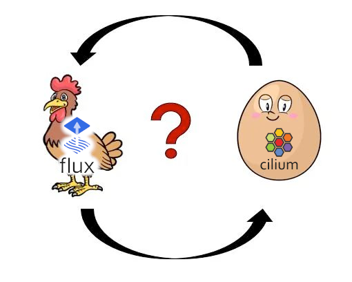

Here at [Cozystack](https://cozystack.io/), we're once again solving the chicken-and-egg problem: how to deploy CNI and kube-proxy through Flux, while ensuring Flux itself works without CNI and kube-proxy.

Flux can be started without CNI and kube-proxy using the [flux-aio](https://github.com/stefanprodan/flux-aio) project (by the creator of Flux), which runs a single deployment with all controllers configured to communicate with each other via localhost.

The specific challenge for Cozystack is that we deploy a small HTTP server with Helm charts and other assets used in the platform to each cluster. Flux reads these charts and installs them into the system.

But how do we organize access for Flux to the internal HTTP server running as a pod within the same cluster?

Obviously, without CNI and kube-proxy, it won't be able to reach this pod by its persistent name (CoreDNS also depends on CNI and kube-proxy).

There were several options, such as adding our HTTP server as a sidecar to Flux, or pinning it via nodeAffinity to the same node and forcing Flux to access it on localhost. But [@lllamnyp](https://github.com/lllamnyp) proposed a more elegant solution—routing Flux through the Kubernetes API.

The idea immediately seemed good to me, as it also addresses the need for an open port on the node (though it later turned out this wasn't the case).

Thus, we run a pod `cozystack-assets-0` and can access its contents via:

```
https://example.org:6443/api/v1/namespaces/cozy-system/pods/cozystack-assets-0/proxy
```

But here's the problem: we need to somehow authenticate, otherwise the Kubernetes API server won't let us through.

In theory, we could allocate a separate ServiceAccount and token for it, but Flux doesn't know how to inject headers and generally doesn't support anything other than basic HTTP auth or mTLS.

This led me to the idea: why not obtain a client certificate for Flux? Fortunately, we don't need cert-manager or any access to the Kubernetes CA for this.

And here we get acquainted with how the mechanism for obtaining client certificates works in Kubernetes—as it turns out, everything has already been thought out for us:

```bash
# Create a private key and CSR
openssl genrsa -out tls.key 2048
openssl req -new -key tls.key -subj "/CN=cozystack-assets-reader" -out tls.csr

# Register the CSR in Kubernetes
kubectl apply -f - <<EOF
apiVersion: certificates.k8s.io/v1
kind: CertificateSigningRequest
metadata:
  name: cozystack-assets-reader
spec:
  signerName: kubernetes.io/kube-apiserver-client
  request: $(base64 < tls.csr | tr -d '\n')
  usages:
    - client auth
EOF

# Approve it
kubectl certificate approve cozystack-assets-reader

# Retrieve the ready certificate, signed by our Kubernetes cluster's CA
kubectl get csr cozystack-assets-reader \
  -o jsonpath='{.status.certificate}' | base64 -d > tls.crt

# Retrieve the CA certificate
kubectl get -n kube-public configmap kube-root-ca.crt \
  -o jsonpath='{.data.ca\.crt}' > ca.crt

# Create a secret for Flux
kubectl create secret generic "cozystack-assets-tls" \
  --namespace='cozy-system' \
  --type='kubernetes.io/tls' \
  --from-file=tls.crt \
  --from-file=tls.key \
  --from-file=ca.crt
```

Add a role:

```yaml
---
apiVersion: rbac.authorization.k8s.io/v1
kind: Role
metadata:
  name: cozystack-assets-reader
  namespace: cozy-system
rules:
  - apiGroups: [""]
    resources:
      - pods/proxy
    resourceNames:
      - cozystack-assets-0
    verbs:
      - get
---
apiVersion: rbac.authorization.k8s.io/v1
kind: RoleBinding
metadata:
  name: cozystack-assets-reader
  namespace: cozy-system
subjects:
  - kind: User
    name: cozystack-assets-reader
    apiGroup: rbac.authorization.k8s.io
roleRef:
  kind: Role
  name: cozystack-assets-reader
  apiGroup: rbac.authorization.k8s.io
```

Now this secret can be used to access our server directly through the Kubernetes API. In the `HelmRepository` spec, we specify:

```yaml
apiVersion: source.toolkit.fluxcd.io/v1
kind: HelmRepository
metadata:
  name: cozystack-apps
spec:
  url: https://example.org:6443/api/v1/namespaces/cozy-system/pods/cozystack-assets-0/proxy/repos/extra
  certSecretRef:
    name: cozystack-assets-tls
```

And now Flux can download all the necessary assets.

In my opinion, this is a beautiful hack worth sharing, as it teaches us something new. However, I wouldn't recommend considering this idea as a best practice.

I think we'll get rid of it in the future. We're gradually transitioning to `source-watcher` and the ability to store artifacts directly in `OCIRepository`. This way, Flux will download and collect all necessary artifacts directly from the specified OCI image or Git repository.

You can view (and review) the full code of the PR here:

- https://github.com/cozystack/cozystack/pull/1698

