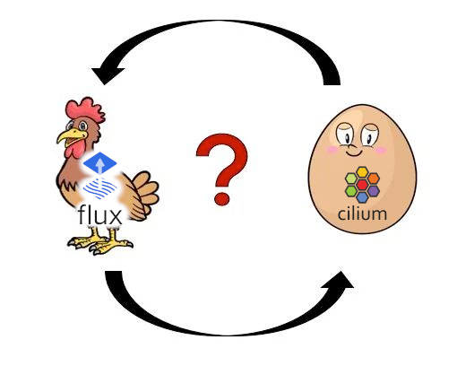

Здесь, в [Cozystack](https://cozystack.io/), мы вновь решаем проблему «курицы и яйца»: как развернуть CNI и kube-proxy через Flux, обеспечив при этом работу самого Flux без CNI и kube-proxy.

Flux можно запустить без CNI и kube-proxy с помощью проекта [flux-aio](https://github.com/stefanprodan/flux-aio) (от создателя Flux), который запускает одно развёртывание со всеми контроллерами, настроенными на взаимодействие друг с другом через localhost.

Особая сложность для Cozystack в том, что мы разворачиваем в каждом кластере небольшой HTTP-сервер с Helm-чартами и другими ресурсами, используемыми в платформе. Flux читает эти чарты и устанавливает их в систему.

Но как организовать доступ Flux к внутреннему HTTP-серверу, работающему как под в том же кластере?

Очевидно, что без CNI и kube-proxy он не сможет обратиться к этому поду по его постоянному имени (CoreDNS тоже зависит от CNI и kube-proxy).

Было несколько вариантов: например, добавить наш HTTP-сервер как sidecar к Flux или закрепить его через nodeAffinity на том же узле и заставить Flux обращаться к нему по localhost. Но [@lllamnyp](https://github.com/lllamnyp) предложил более элегантное решение — маршрутизацию Flux через Kubernetes API.

Идея сразу показалась мне удачной, так как она также решает вопрос с необходимостью открытого порта на узле (хотя позже выяснилось, что это не так).

Итак, мы запускаем под `cozystack-assets-0` и можем получить доступ к его содержимому по адресу:

```
https://example.org:6443/api/v1/namespaces/cozy-system/pods/cozystack-assets-0/proxy
```

Но вот в чём проблема: нам нужно как-то пройти аутентификацию, иначе Kubernetes API-сервер нас не пропустит.

Теоретически мы могли бы выделить для этого отдельный ServiceAccount и токен, но Flux не умеет добавлять заголовки и в целом не поддерживает ничего, кроме базовой HTTP-аутентификации или mTLS.

Это натолкнуло меня на мысль: почему бы не получить клиентский сертификат для Flux? К счастью, для этого нам не нужен ни cert-manager, ни какой-либо доступ к Kubernetes CA.

И здесь мы знакомимся с тем, как работает механизм получения клиентских сертификатов в Kubernetes — как оказывается, всё уже продумано за нас:

```bash
# Создаём приватный ключ и CSR
openssl genrsa -out tls.key 2048
openssl req -new -key tls.key -subj "/CN=cozystack-assets-reader" -out tls.csr

# Регистрируем CSR в Kubernetes
kubectl apply -f - <<EOF
apiVersion: certificates.k8s.io/v1
kind: CertificateSigningRequest
metadata:
  name: cozystack-assets-reader
spec:
  signerName: kubernetes.io/kube-apiserver-client
  request: $(base64 < tls.csr | tr -d '\n')
  usages:
    - client auth
EOF

# Одобряем его
kubectl certificate approve cozystack-assets-reader

# Получаем готовый сертификат, подписанный CA нашего Kubernetes-кластера
kubectl get csr cozystack-assets-reader \
  -o jsonpath='{.status.certificate}' | base64 -d > tls.crt

# Получаем CA-сертификат
kubectl get -n kube-public configmap kube-root-ca.crt \
  -o jsonpath='{.data.ca\.crt}' > ca.crt

# Создаём secret для Flux
kubectl create secret generic "cozystack-assets-tls" \
  --namespace='cozy-system' \
  --type='kubernetes.io/tls' \
  --from-file=tls.crt \
  --from-file=tls.key \
  --from-file=ca.crt
```

Добавляем роль:

```yaml
---
apiVersion: rbac.authorization.k8s.io/v1
kind: Role
metadata:
  name: cozystack-assets-reader
  namespace: cozy-system
rules:
  - apiGroups: [""]
    resources:
      - pods/proxy
    resourceNames:
      - cozystack-assets-0
    verbs:
      - get
---
apiVersion: rbac.authorization.k8s.io/v1
kind: RoleBinding
metadata:
  name: cozystack-assets-reader
  namespace: cozy-system
subjects:
  - kind: User
    name: cozystack-assets-reader
    apiGroup: rbac.authorization.k8s.io
roleRef:
  kind: Role
  name: cozystack-assets-reader
  apiGroup: rbac.authorization.k8s.io
```

Теперь этот secret можно использовать для доступа к нашему серверу напрямую через Kubernetes API. В спецификации `HelmRepository` указываем:

```yaml
apiVersion: source.toolkit.fluxcd.io/v1
kind: HelmRepository
metadata:
  name: cozystack-apps
spec:
  url: https://example.org:6443/api/v1/namespaces/cozy-system/pods/cozystack-assets-0/proxy/repos/extra
  certSecretRef:
    name: cozystack-assets-tls
```

И теперь Flux может загрузить все необходимые ресурсы.

На мой взгляд, это красивый хак, которым стоит поделиться, поскольку он учит нас чему-то новому. Однако я бы не рекомендовал считать эту идею лучшей практикой.

Думаю, в будущем мы от этого избавимся. Мы постепенно переходим на `source-watcher` и возможность хранить артефакты прямо в `OCIRepository`. Таким образом, Flux будет загружать и собирать все необходимые артефакты напрямую из указанного OCI-образа или Git-репозитория.

Посмотреть (и провести ревью) полный код PR можно здесь:

- https://github.com/cozystack/cozystack/pull/1698
