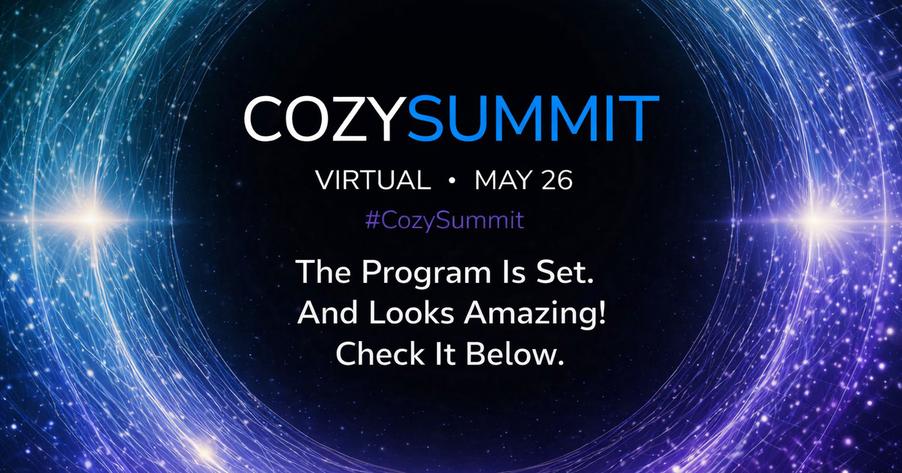

We are thrilled to announce the full lineup of talks for the new CozySummit Virtual 2026! The program is ready, and we can't wait to share it with you. Five outstanding sessions from practitioners building real cloud-native infrastructure — all in one free online event on May 26, 2026.

## 📌 SESSIONS

**Building a Multi-Cloud Service Mesh from the Ground Up with Kilo**
Lu Servén Marín — SRE @ AuthZed | Maintainer of Kilo, Thanos & Prometheus projects

**Treating Kubernetes as a Linux Distro: APT-Style Packaging with FluxCD**
Andrei Kvapil — CEO & Founder, Ænix | Kubernetes & Cloud Architecture Expert

**Building a Sustainable Edge PaaS for Education: The BeBy.cloud Journey with Cozystack**
Robert Galik — Founder, share-thinking s.r.o. / beby.cloud | Senior Architect, Cloud-Native Educator

**Building a Public Cloud Service on Cozystack**
Sergei Makarov — Technical Product Manager, Cloupard | 15+ yrs in Cloud & PaaS

**What If Every Cozystack Change Became a Commit?**
Simon Koudijs — Founder & Engineer, ConfigButler | Reverse GitOps Pioneer

---

A huge thank you to our Program Committee for their dedicated work reviewing and evaluating all submissions:

- Matthieu Robin — Founder and CEO, Hidora
- Kingdon Barrett — DevOps Engineer, Navteca
- Andrei Kvapil — CEO & Co-founder, Ænix Inc
- Timur Tukaev — COO & Co-founder, Ænix Inc

CozySummit Virtual 2026 is FREE. [Register now](https://community.cncf.io/events/details/cncf-virtual-project-events-hosted-by-cncf-presents-cozysummit-virtual-2026/) and save your spot.
