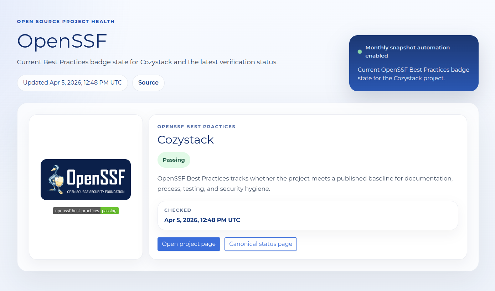
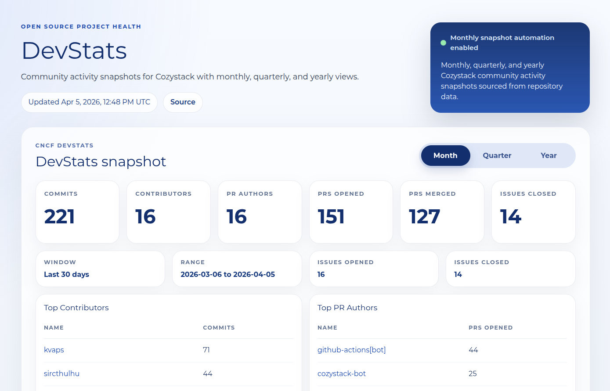

We have added a new [OSS health section](https://cozystack.io/oss-health/) to the Cozystack website, with project metrics refreshed once a month. The goal is simple: make Cozystack's open source activity easier to explore from several angles in one place.

## OSS Insight

[OSS Insight](https://cozystack.io/oss-health/oss-insight/) shows repository activity and public traction, including stars, forks, watchers, open issues, commits, and merged PRs.

## OpenSSF

[OpenSSF](https://cozystack.io/oss-health/openssf/) shows Cozystack's current status in OpenSSF Best Practices. In the April 5, 2026 snapshot, the project is marked as **Passing**.

## DevStats

[DevStats](https://cozystack.io/oss-health/devstats/) shows community activity and development rhythm, including commits, contributors, PR authors, opened and merged PRs, and related trends across month, quarter, and year views.

In the latest monthly snapshot covering 2026-03-06 through 2026-04-05, Cozystack shows:

- **221** commits
- **16** contributors
- **151** PRs opened
- **127** PRs merged
- **2,014** GitHub stars

---

If you are interested in Kubernetes, platform engineering, and open source infrastructure, take a look:

- Website: [cozystack.io](https://cozystack.io/)
- OSS Health: [cozystack.io/oss-health/](https://cozystack.io/oss-health/)
- GitHub: [github.com/cozystack/cozystack](https://github.com/cozystack/cozystack)
- Telegram community: [t.me/cozystack](https://t.me/cozystack/)
- Cozystack in Kubernetes Slack: [#cozystack](https://kubernetes.slack.com/messages/cozystack)

Support is always welcome — star the repository, contribute code, issues, or feedback, and share Cozystack with colleagues, friends, and the broader community.
