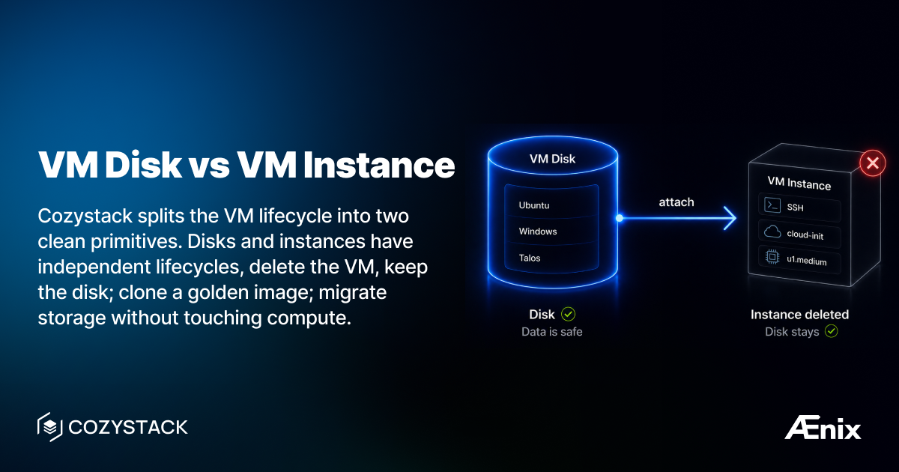

If you've used KubeVirt directly, you know the pain: VirtualMachine, VirtualMachineInstance, DataVolume, PVC — a maze of resources just to run a simple VM. And if you want to clone a VM, share a base image, or migrate storage independently of compute? Good luck wiring that together yourself.

Cozystack collapses that into two custom resources: **VMDisk** and **VMInstance**. They have independent lifecycles, and that's the whole point — delete the VM, the disk stays; attach the same disk to a beefier VM later; clone a golden image once and reuse it for every new VM. Immutable infrastructure and fast provisioning fall out for free.



## Side by side

|                 | VMDisk                                  | VMInstance                                            |
|-----------------|-----------------------------------------|-------------------------------------------------------|
| What it is      | Persistent block device                 | Running virtual machine                               |
| Lifecycle       | Independent, survives VM deletion       | Ephemeral — recreate any time without losing data     |
| KubeVirt analog | DataVolume + PVC                        | VirtualMachine + VirtualMachineInstance               |
| You configure   | Source image, size, storageClass        | Instance type, disks, SSH keys, cloud-init, GPU       |
| Used for        | Golden images, data disks, pre-provisioning | Compute, networking, user data                    |

## Create a VM Disk

**Via Dashboard:** **Catalog** -> **VM Disk** -> set name, pick source image (Ubuntu, Windows, etc.), set size and storageClass -> **Deploy**.

**Via kubectl:**

```yaml
apiVersion: apps.cozystack.io/v1alpha1
kind: VMDisk
metadata:
  name: ubuntu-base
  namespace: tenant-team1
spec:
  source:
    image:
      name: ubuntu
  storage: 50Gi
  storageClass: replicated
```

Sources also include `http.url` (download from a URL) and `disk.name` (clone an existing VMDisk for golden-image workflows).

## Create a VM Instance

**Via Dashboard:** **Catalog** -> **VM Instance** -> name, instance type (e.g., `u1.medium`), attach the VMDisk, add SSH key and optional cloud-init -> **Deploy**.

**Via kubectl:**

```yaml
apiVersion: apps.cozystack.io/v1alpha1
kind: VMInstance
metadata:
  name: dev-server
  namespace: tenant-team1
spec:
  instanceType: u1.medium
  instanceProfile: ubuntu
  disks:
    - name: ubuntu-base
  sshKeys:
    - "ssh-ed25519 AAAA... user@workstation"
  cloudInit: |
    #cloud-config
    packages:
      - nginx
```

The `disks[].name` field is the `metadata.name` of an existing VMDisk in the same namespace.

## Access your VM

```bash
# Serial console
virtctl console dev-server

# SSH
virtctl ssh ubuntu@dev-server

# VNC (graphical)
virtctl vnc dev-server
```

## Why these are separate CRs (and not Helm releases)

Under the hood Cozystack still uses Flux and Helm to roll resources out, but the user-facing API is the `apps.cozystack.io/v1alpha1` group. You write a `VMDisk` or `VMInstance`, the Cozystack operator handles the HelmRelease/KubeVirt/DataVolume plumbing for you. Same applies to every managed service in the catalog — Postgres, Kubernetes, VPC, OpenBao all have their own native CRs.

## Documentation

- [VM Instance](https://cozystack.io/docs/v1/virtualization/vm-instance/)
- [VM Disk](https://cozystack.io/docs/v1/virtualization/vm-disk/)
- [GPU Passthrough](https://cozystack.io/docs/v1/virtualization/gpu-passthrough/)

## Join the community

* GitHub: [cozystack/cozystack](https://github.com/cozystack/cozystack)
* Telegram: [@cozystack](https://t.me/cozystack)
* Slack: [#cozystack](https://kubernetes.slack.com/archives/C06L3CPRVN1) on the Kubernetes workspace ([invite](https://slack.kubernetes.io))
* [Subscribe to our community meetings calendar](https://zoom-lfx.platform.linuxfoundation.org/meetings/cozystack)
* [Add meetings to your calendar](https://webcal.prod.itx.linuxfoundation.org/lfx/lfsixxnFWxbvsyEuC2)
