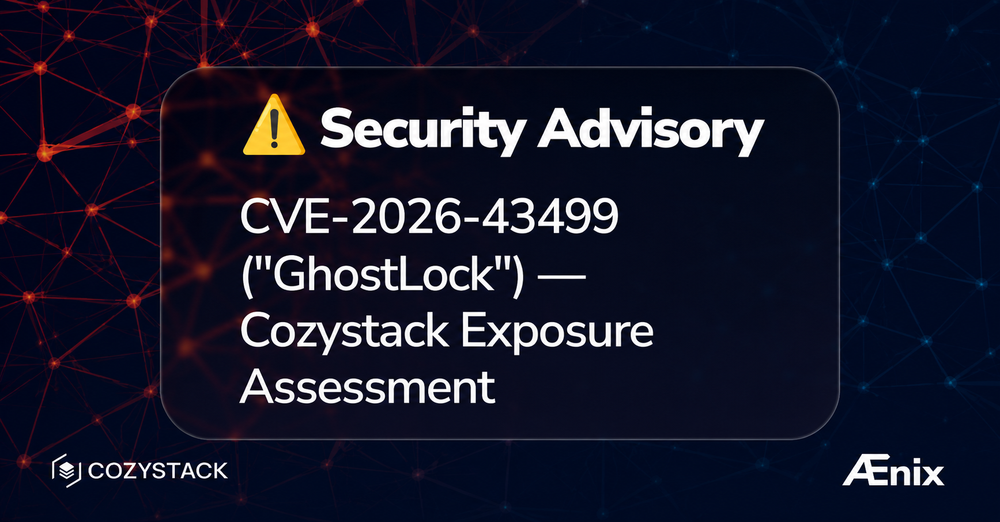

Третья CVE за эту неделю — но есть хорошая новость: Cozystack не подвержен уязвимости по своей архитектуре, а исправление — то же обновление до v1.13.6, которое вам уже знакомо. Подробности ниже.

**TL;DR:** [CVE-2026-43499 («GhostLock»)](https://nvd.nist.gov/vuln/detail/CVE-2026-43499) — это локальное повышение привилегий в ядре Linux. В силу архитектуры Cozystack мы в настоящее время не видим ни одного жизнеспособного пути атаки, по которому арендатор мог бы добраться до затронутой поверхности ядра хоста. Мы всё же рекомендуем исправление — и это то же **обновление до Talos v1.13.6**, которое закрывает [Januscape (CVE-2026-53359) и CVE-2026-46113](/blog/2026/07/fixing-cve-2026-53359-januscape-talos-linux/). Один переход на v1.13.6 закрывает все три.

## Обзор уязвимости

7 июля 2026 года было раскрыто критическое локальное повышение привилегий в ядре Linux — **CVE-2026-43499** («GhostLock») — вместе с рабочим proof-of-concept.

Это use-after-free на стеке в пути наследования приоритетов у мьютекса реального времени ядра (`rtmutex`), достижимом из `futex(2)`: при откате proxy-lock, происходящем из `futex_requeue()`, `remove_waiter()` очищает `pi_blocked_on` у не той задачи, оставляя висячий указатель на освобождённый кадр стека ядра. Появившись в Linux 2.6.39 (2011), она затрагивает каждое ядро вплоть до v7.1-rc1, требует лишь `CONFIG_FUTEX_PI=y` (без capabilities, без пользовательских пространств имён) и может быть развита до **выхода из контейнера (container escape)** — непривилегированный локальный процесс получает root в ядре хоста.

Исправление из upstream — это коммит `3bfdc63936dd`, вошедший в стабильные ядра **6.1.175, 6.6.140, 6.12.86, 6.18.27 и 7.0.4**.

## Подтверждено: не подвержены

GhostLock — это *локальное* повышение привилегий: оно предполагает, что атакующий уже может выполнять нативный код на поверхности системных вызовов ядра хоста. По своей архитектуре Cozystack не даёт арендаторам такой возможности.

- **Управляемые сервисы Kubernetes и VirtualMachine.** Все рабочие нагрузки арендаторов выполняются внутри гостевых виртуальных машин, работающих поверх непривилегированных контейнеров. Код арендатора не имеет прямого доступа к поверхности системных вызовов ядра хоста — последовательность futex, выданная внутри гостя, достигает гостевого ядра, а не хоста.
- **Управляемые базы данных** работают от имени пользователей без прав root и без прав суперпользователя, без доступа к Kubernetes API и без возможности выполнять произвольный код в серверном процессе, поэтому арендатор не может выдать последовательность системных вызовов, которую требует эксплойт.
- **Никакого произвольного кода арендатора на кластере управления.** Cozystack предоставляет только те управляемые сервисы, которые мы предлагаем — нет поверхности, на которой арендатор мог бы выполнять произвольный нативный код в контейнере на узле управления.

В силу архитектуры Cozystack мы в настоящее время не видим ни одного жизнеспособного пути атаки, который позволил бы арендатору добраться до поверхности ядра хоста, затронутой этой уязвимостью.

## Рекомендуемое действие — то же, что и для Januscape: обновить ядро

Уязвимость подтверждена в текущих релизах Talos Linux, и любая будущая регрессия в описанной выше изоляции могла бы снова сделать систему уязвимой — поэтому мы рекомендуем применить исправление ядра в любом случае.

GhostLock исправлен в Talos Linux **v1.13.6** (ядро **6.18.38-talos**, новее первого исправленного `6.18.27`). Это **то же обновление**, которое мы рекомендовали для CVE-2026-53359 («Januscape») и CVE-2026-46113 — один переход на v1.13.6 закрывает все три.

- **Уже обновились до v1.13.6 из-за Januscape? Вы защищены — дальнейших действий не требуется.**
- **Ещё нет?** Следуйте той же инструкции: соберите установщик Image Factory со своими расширениями, обновляйте узел за узлом до `v1.13.6` и проверьте, что `talosctl read /proc/sys/kernel/osrelease` показывает `6.18.38-talos`. Перемещайтесь по одному узлу за раз, дожидаясь кворума etcd и исправности хранилища между узлами control-plane.

Полная пошаговая инструкция по обновлению — в нашем [руководстве по исправлению Januscape](/blog/2026/07/fixing-cve-2026-53359-januscape-talos-linux/).

Если вы не можете обновиться немедленно, `kernel.randomize_kstack_offset=1` (через `machine.sysctls`) снижает надёжность эксплойта как мера эшелонированной защиты — но не заменяет исправление.

Мы будем обновлять этот бюллетень по мере подтверждения исправленных релизов и дополнительных мер по устранению.

## Ссылки

- [CVE-2026-43499 (GhostLock) — NVD](https://nvd.nist.gov/vuln/detail/CVE-2026-43499)
- [Исправление CVE-2026-53359 (Januscape) и CVE-2026-46113 на Talos Linux](/blog/2026/07/fixing-cve-2026-53359-januscape-talos-linux/)
- [Talos Image Factory](https://factory.talos.dev)

### Присоединяйтесь к сообществу

- Telegram [группа](https://t.me/cozystack)
- Slack [группа](https://kubernetes.slack.com/archives/C06L3CPRVN1) (получите приглашение на [https://slack.kubernetes.io](https://slack.kubernetes.io))
- [Календарь встреч сообщества](https://calendar.google.com/calendar?cid=ZTQzZDIxZTVjOWI0NWE5NWYyOGM1ZDY0OWMyY2IxZTFmNDMzZTJlNjUzYjU2ZGJiZGE3NGNhMzA2ZjBkMGY2OEBncm91cC5jYWxlbmRhci5nb29nbGUuY29t)
