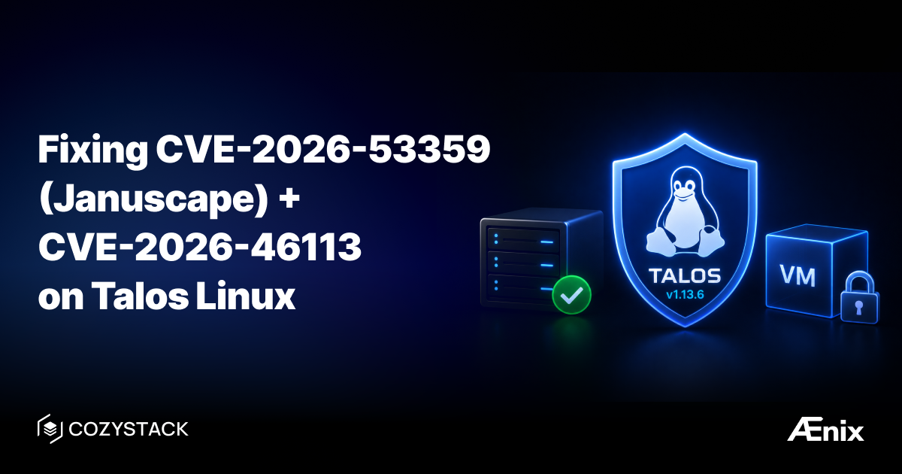

**Обновление по CVE-2026-53359 («Januscape»): правильное исправление доступно.**

Наши [ранее применённые меры по устранению](https://nvd.nist.gov/vuln/detail/CVE-2026-53359) были хотфиксом — временной, вынужденной мерой. Теперь доступно правильное исправление, поэтому хотфикс больше не нужен.

**TL;DR:** Отключать вложенную виртуализацию больше не нужно. Это был хотфикс, а для некоторых конфигураций он был вообще невозможен. Настоящее исправление — это обновление ядра. Если вы уже применили хотфикс, откатите его и вместо этого выполните обновление.

## Что изменилось

Когда [CVE-2026-53359 (Januscape)](https://nvd.nist.gov/vuln/detail/CVE-2026-53359) была раскрыта 6 июля 2026 года вместе с рабочим эксплойтом, ещё не существовало ни одного образа Talos Linux с исправленным ядром. Единственное, что операторы могли сделать в тот день, — уменьшить поверхность атаки, отключив вложенную виртуализацию в командной строке ядра.

Это окно закрылось. Исправленные стабильные ядра вышли, и Talos теперь поставляется с одним из них. **Исправление — это обновление ядра, а не настройка конфигурации** — как только вы перешли на безопасное ядро, уязвимый путь исчезает независимо от того, включена ли вложенная виртуализация.

CVE-2026-53359 (Januscape) и тесно связанная с ней [CVE-2026-46113](https://nvd.nist.gov/vuln/detail/CVE-2026-46113) — это ошибки use-after-free в механизме теневой трансляции страниц (shadow paging) KVM для x86, которые позволяют гостевой ВМ выйти из гостя в хост (guest-to-host escape). Обе затрагивают процессоры Intel и AMD. В контексте Cozystack это важно, потому что узлы кластеров Kubernetes арендаторов — это ВМ KubeVirt, поэтому вредоносный арендатор с правами root внутри собственной ВМ — это в точности та модель угроз, которую открывают эти ошибки.

## Правильное исправление: обновление ядра

Обе CVE исправлены в **Linux 6.18.38** и его бэкпортах. Убедитесь, что на каждом узле работает исправленное ядро.

Безопасные версии ядра во всех стабильных ветках:

```
6.1.177 · 6.6.144 · 6.12.95 · 6.18.38 · 7.1.3 · 7.2-rc1
```

- **Обычные хосты Linux (не Talos):** обновитесь до **Linux 6.18.38 или новее** (или до исправленной версии из вашей ветки выше), затем перезагрузитесь.
- **Talos Linux:** обновитесь до **Talos v1.13.6**, который поставляется с Linux 6.18.38. Следуйте руководству ниже.

Если вы применили хотфикс с отключением вложенной виртуализации, теперь после обновления его можно откатить. Вы можете оставить его как дополнительную меру усиления защиты, если рабочей нагрузке не нужна вложенная виртуализация, но для этой CVE он больше не требуется.

## Почему хотфикса было недостаточно

Часто предлагаемая мера по устранению через конфигурацию — `machine.install.extraKernelArgs: [kvm_intel.nested=0, kvm_amd.nested=0]` — **молча игнорируется на узлах с systemd-boot / UKI** (обычный случай bare-metal UEFI):

- `kvm_intel` / `kvm_amd` встроены в ядро Talos, поэтому `modprobe.d` и запись в `/sys` во время выполнения не действуют (`/sys/module/kvm_intel/parameters/nested` имеет режим `0444`); `nested=` можно задать только через командную строку ядра.
- На systemd-boot командная строка запекается в подписанный UKI, поэтому `extraKernelArgs` отбрасываются (Talos предупреждает: `extra kernel arguments are not supported when booting using SDBoot`). `grubUseUKICmdline: false` помогает только узлам с GRUB.

Именно поэтому «просто отключите вложенную виртуализацию» не было универсальным ответом, и именно поэтому обновление ядра — это настоящее исправление.

## Руководство для Talos

### 1. Соберите схему Image Factory с вашими расширениями

Если ваши узлы используют системные расширения (drbd, zfs, firmware, GPU, ucode), объявите их — [Image Factory](https://factory.talos.dev) собирает стандартный установщик вместе с официальными расширениями, без необходимости собирать собственный образ.

```yaml
customization:
  systemExtensions:
    officialExtensions:
      - siderolabs/drbd
      - siderolabs/zfs
      - siderolabs/amd-ucode
      - siderolabs/intel-ucode
      - siderolabs/amdgpu
      - siderolabs/i915
      - siderolabs/bnx2-bnx2x
      - siderolabs/intel-ice-firmware
      - siderolabs/qlogic-firmware
```

```bash
curl -sX POST --data-binary @schematic.yaml https://factory.talos.dev/schematics
# -> {"id":"<SCHEMATIC_ID>"}
```

Сократите список расширений до того, что фактически использует ваш кластер.

### 2. Обновляйте узел за узлом

```bash
talosctl -n <NODE_IP> upgrade \
  --image factory.talos.dev/installer/<SCHEMATIC_ID>:v1.13.6
```

Обновляйте по одному узлу за раз. На узлах control-plane между узлами дождитесь, пока etcd и ваше CSI/хранилище не станут работоспособными. Talos тестирует миграции только между соседними минорными версиями — со старого релиза обновляйтесь последовательно через последний патч каждой минорной версии, а не перескакивайте сразу.

### 3. Проверьте

```bash
talosctl -n <NODE_IP> version                          # Server: v1.13.6
talosctl -n <NODE_IP> read /proc/sys/kernel/osrelease  # 6.18.38-talos
talosctl -n <NODE_IP> get extensions                   # ваши расширения на месте
```

`kvm_intel.nested` может остаться `Y` — это ожидаемо. Уязвимый путь исправлен в ядре.

## Готовый установщик (набор расширений Cozystack)

Для стандартных расширений Cozystack (drbd, zfs, amd/intel-ucode, amdgpu, i915, bnx2-bnx2x, intel-ice-firmware, qlogic-firmware) вы можете напрямую использовать эту готовую схему:

```
factory.talos.dev/installer/be66fdc8a38c2f517f33cba0a6daa7ab97ff87d51e8ca7d2160e45911ba09cf5:v1.13.6
```

## Ссылки

- [CVE-2026-53359 (Januscape) — NVD](https://nvd.nist.gov/vuln/detail/CVE-2026-53359)
- [CVE-2026-46113 — NVD](https://nvd.nist.gov/vuln/detail/CVE-2026-46113)
- [Загрузчик Talos / командная строка UKI](https://docs.siderolabs.com/talos/v1.13/platform-specific-installations/bare-metal-platforms/bootloader)
- [Talos Image Factory](https://factory.talos.dev)

### Присоединяйтесь к сообществу

- Telegram [группа](https://t.me/cozystack)
- Slack [группа](https://kubernetes.slack.com/archives/C06L3CPRVN1) (получите приглашение на [https://slack.kubernetes.io](https://slack.kubernetes.io))
- [Календарь встреч сообщества](https://calendar.google.com/calendar?cid=ZTQzZDIxZTVjOWI0NWE5NWYyOGM1ZDY0OWMyY2IxZTFmNDMzZTJlNjUzYjU2ZGJiZGE3NGNhMzA2ZjBkMGY2OEBncm91cC5jYWxlbmRhci5nb29nbGUuY29t)
