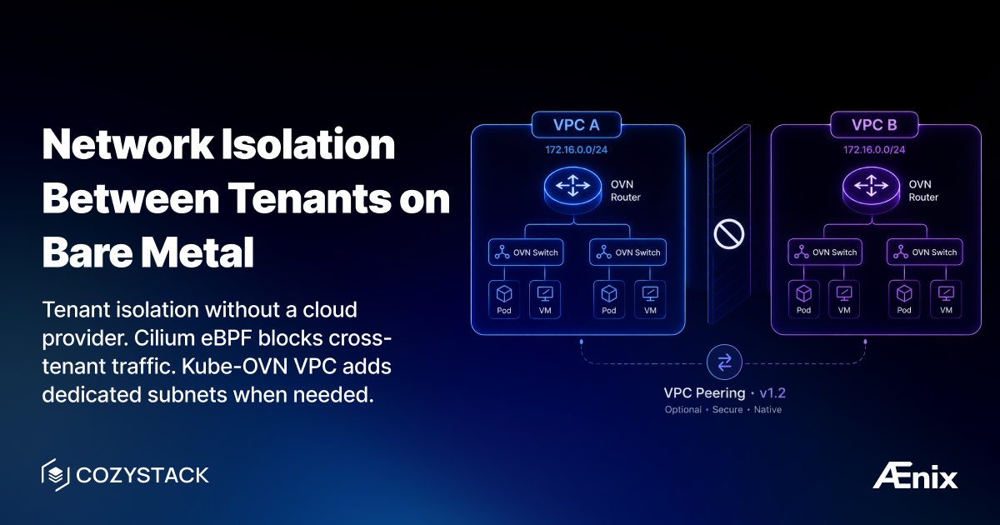

Multi-tenant infrastructure without network isolation is a ticking time bomb. One misconfigured service in Tenant A can scan, attack, or accidentally connect to Tenant B's databases. In AWS you get this by default — VPCs and security groups. On bare metal? You're usually left stitching together CNI policies, overlays, and hoping nobody makes a mistake.

Cozystack solves this out of the box with two complementary layers: **tenant isolation enforced by Cilium eBPF** (always on, zero config), and **optional Kube-OVN VPCs** for workloads that need their own dedicated subnets.

## Layer 1: Tenant isolation with Cilium eBPF (default, always on)

This is the part most people get wrong about Cozystack. Tenant-to-tenant isolation is **not** done by network segmentation. All tenants share a single Pod CIDR (`10.244.0.0/16`), and Kube-OVN allocates IPs centrally from that shared pool. Isolation is enforced by **Cilium eBPF network policies at the kernel level**.

How it works:

- Kube-OVN is the CNI — it handles pod networking and IPAM (centralized, no per-node CIDR splitting, GENEVE overlay). Its own network policy engine is disabled (`ENABLE_NP: false`).
- Cilium runs as a chained CNI (`generic-veth` mode) and owns all policy enforcement plus service load balancing (kube-proxy replacement).
- Cilium assigns each pod a **security identity** derived from its labels, then enforces policy on identities — not IPs — entirely in kernel space (no userspace bypass).

When you create a tenant, Cozystack **automatically applies** `CiliumNetworkPolicy` and `CiliumClusterwideNetworkPolicy` resources. These enforce namespace-level isolation and restrict access to system ports (etcd, kubelet, controllers). Same-tenant traffic is allowed; cross-tenant traffic is dropped. Policies match on hierarchical `tenant.cozystack.io/*` namespace labels, so a parent tenant can include its sub-tenant namespaces:

```yaml
apiVersion: cilium.io/v2
kind: CiliumNetworkPolicy
metadata:
  name: allow-internal-communication
  namespace: tenant-example
spec:
  endpointSelector: {}
  ingress:
    - fromEndpoints:
        - matchLabels:
            k8s:io.cilium.k8s.namespace.labels.tenant.cozystack.io/tenant-example: ""
  egress:
    - toEndpoints:
        - matchLabels:
            k8s:io.cilium.k8s.namespace.labels.tenant.cozystack.io/tenant-example: ""
    - toEntities:
        - kube-apiserver
        - cluster
```

You don't write these by hand — they come with the tenant. This is the isolation boundary between tenants.

## Layer 2: Dedicated subnets with Kube-OVN VPC (optional)

On top of tenant isolation, some workloads need their own dedicated networking space — separate subnets, multiple NICs on a VM. That's what VPC is for.

A VPC provides a set of dedicated subnets backed by Kube-OVN (OVN virtual routers and switches, with DHCP and IPAM). Multus provides multi-NIC capability, so a pod or VM can have two or more interfaces. Note the current scope: every workload still connects to a default management network with the default gateway, through which the majority of traffic flows — **VPC subnets are additional, dedicated networking spaces**. More isolation capabilities are planned as the feature evolves.

**Prerequisites:** VPC requires `kube-ovn` and `multus` CNI, so by default it only works on the **`paas-full`** bundle.

Create a VPC via kubectl:

```yaml
apiVersion: apps.cozystack.io/v1alpha1
kind: VirtualPrivateCloud
metadata:
  name: production
  namespace: tenant-team1
spec:
  subnets:
    app-subnet:
      cidr: 172.16.0.0/24
    db-subnet:
      cidr: 172.16.1.0/24
```

```bash
kubectl apply -f vpc-production.yaml
```

`subnets` is a map keyed by subnet name, not a list.

A VM or a pod may be connected to one or more of these subnets at once. Each connection shows up as an additional network interface, in addition to the default management interface.

Deployment notes (from the docs):

- A VPC name must be unique within its namespace; subnet name and CIDR must be unique within a VPC.
- Subnet CIDRs must not overlap with the default management network — subsets of `172.16.0.0/12` are recommended.
- Different VPCs may use overlapping subnet CIDRs.
- There are currently no fail-safe validation checks on these constraints (planned for the future), so pick ranges carefully.

## The bigger picture

Cozystack's default networking stack (`kubeovn-cilium` variant on Talos) layers MetalLB (external load balancing), Cilium eBPF (service load balancing + network policies), and Kube-OVN (pod networking + IPAM). Tenant isolation is a property of the platform you get for free; VPC is an opt-in tool for dedicated subnets on top of it.

## Documentation

- [Networking](https://cozystack.io/docs/networking/)
- [VPC](https://cozystack.io/docs/networking/vpc/)
- [VPN](https://cozystack.io/docs/networking/vpn/)

## Join the community

- [Cozystack on GitHub](https://github.com/cozystack/cozystack)
- Telegram [group](https://t.me/cozystack)
- Slack [group](https://kubernetes.slack.com/archives/C06L3CPRVN1) (Get invite at [https://slack.kubernetes.io](https://slack.kubernetes.io))
- [Community Meeting Calendar](https://calendar.google.com/calendar?cid=ZTQzZDIxZTVjOWI0NWE5NWYyOGM1ZDY0OWMyY2IxZTFmNDMzZTJlNjUzYjU2ZGJiZGE3NGNhMzA2ZjBkMGY2OEBncm91cC5jYWxlbmRhci5nb29nbGUuY29t)
