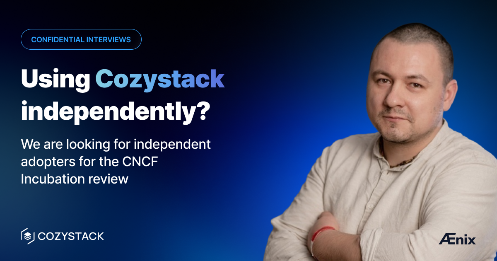

В рамках рассмотрения заявки на инкубацию CNCF Технический наблюдательный комитет (TOC) общается с пользователями Cozystack об их реальном опыте использования.

Мы особенно ищем команды и отдельных пользователей, использующих Cozystack **вне коммерческого взаимодействия с Ænix**. Если это про вас, мы будем рады узнать, как вы его используете, что работает хорошо, а что нет.

## Как принять участие

Если вы используете Cozystack самостоятельно, свяжитесь с моим партнёром Тимуром Тукаевым:

- E-mail: [timur.tukaev@aenix.io](mailto:timur.tukaev@aenix.io)
- Telegram: [@tym83](https://t.me/tym83)
- LinkedIn: [linkedin.com/in/tym83](https://www.linkedin.com/in/tym83/)

**Это не звонок с целью продажи. Интервью может оставаться конфиденциальным.**

## Присоединяйтесь к сообществу

- [Cozystack на GitHub](https://github.com/cozystack/cozystack)
- Группа в Telegram [group](https://t.me/cozystack_ru)
- Группа в Slack [group](https://kubernetes.slack.com/archives/C06L3CPRVN1) (получить приглашение можно на [https://slack.kubernetes.io](https://slack.kubernetes.io))
- [Календарь встреч сообщества](https://calendar.google.com/calendar?cid=ZTQzZDIxZTVjOWI0NWE5NWYyOGM1ZDY0OWMyY2IxZTFmNDMzZTJlNjUzYjU2ZGJiZGE3NGNhMzA2ZjBkMGY2OEBncm91cC5jYWxlbmRhci5nb29nbGUuY29t)
