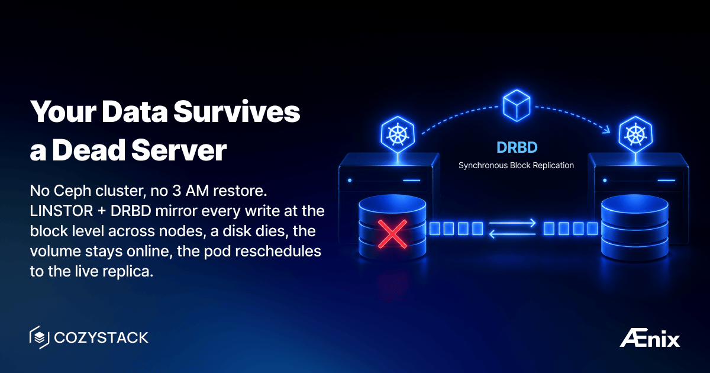

Every bare-metal operator's nightmare: a disk fails at 3 AM. If your storage is node-local (a `local-path` or `hostPath` volume pinned to one node), you're restoring from backup and praying it's recent. Ceph gives you replication but demands 3+ dedicated storage nodes, a PhD in CRUSH maps, and constant tuning. Most teams either over-invest in storage infrastructure or under-invest and pay the price in outages.

Cozystack uses LINSTOR + DRBD for replicated block storage. DRBD replicates at the block device level — below the filesystem, below the database, below everything. It's been battle-tested in Linux HA setups for over two decades. LINSTOR adds the Kubernetes-native orchestration layer on top.

## How it works

1. **DRBD** (Distributed Replicated Block Device) synchronously mirrors block devices between nodes. Every write to Node A is immediately written to Node B before the application gets an acknowledgment.
2. **LINSTOR** manages DRBD resources as Kubernetes StorageClasses. When a PVC requests storage, LINSTOR creates a DRBD volume, selects replica nodes, and handles the lifecycle.
3. **CSI driver** exposes LINSTOR volumes as standard Kubernetes PersistentVolumes.

Result: any pod or VM that uses a `replicated` StorageClass gets synchronous block-level replication across nodes — transparently.

## Setting up storage

**Step 1 — Prepare disks:**

```bash
# Set up LINSTOR CLI alias
alias linstor='kubectl exec -n cozy-linstor deploy/linstor-controller -- linstor'

# Check what LINSTOR sees
linstor node list
linstor physical-storage list
```

If disks don't appear, they likely have leftover metadata. Clean them:

```bash
# WARNING: never wipe the OS install disk (machine.install.disk) — only data disks.
talm -f nodes/node1.yaml wipe disk nvme0n1 nvme1n1
```

**Step 2 — Create storage pools (ZFS):**

```bash
linstor physical-storage create-device-pool \
  zfs node1 \
  /dev/nvme0n1 /dev/nvme1n1 \
  --pool-name data \
  --storage-pool data
```

Repeat for each node.

**Step 3 — Verify:**

```bash
linstor storage-pool list
```

You should see a `data` pool on each node with available capacity.

**Step 4 — Use it:**

Any application that specifies `storageClass: replicated` now gets DRBD-replicated volumes (three replicas by default). PostgreSQL, MongoDB, VM disks — all of them.

```yaml
# In any application config:
values:
  storageClass: replicated
  size: 50Gi
```

## What happens when a node fails

1. DRBD detects the node is gone.
2. The volume remains available on the surviving replica node.
3. Kubernetes reschedules the pod to a node that has the replica.
4. When the failed node comes back, DRBD automatically resyncs.

No manual intervention. No restore from backup. No data loss.

## Documentation

- [Storage overview](https://cozystack.io/docs/v1/storage/)
- [Disk Preparation](https://cozystack.io/docs/v1/storage/disk-preparation/)
- [Disk Encryption](https://cozystack.io/docs/v1/storage/disk-encryption/)
- [DRBD Tuning](https://cozystack.io/docs/v1/storage/drbd-tuning/)
- [NFS (RWX)](https://cozystack.io/docs/v1/storage/nfs/)
- [LINSTOR GUI](https://cozystack.io/docs/v1/storage/linstor-gui/)
- [Dedicated Storage Network](https://cozystack.io/docs/v1/storage/dedicated-network/)

## Join the community

- [Cozystack on GitHub](https://github.com/cozystack/cozystack)
- Telegram [group](https://t.me/cozystack)
- Slack [group](https://kubernetes.slack.com/archives/C06L3CPRVN1) (Get invite at [https://slack.kubernetes.io](https://slack.kubernetes.io))
- [Community Meeting Calendar](https://calendar.google.com/calendar?cid=ZTQzZDIxZTVjOWI0NWE5NWYyOGM1ZDY0OWMyY2IxZTFmNDMzZTJlNjUzYjU2ZGJiZGE3NGNhMzA2ZjBkMGY2OEBncm91cC5jYWxlbmRhci5nb29nbGUuY29t)
