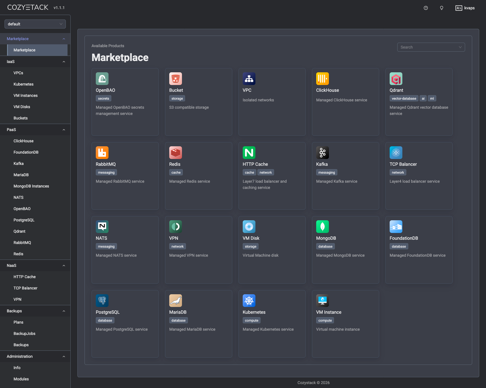
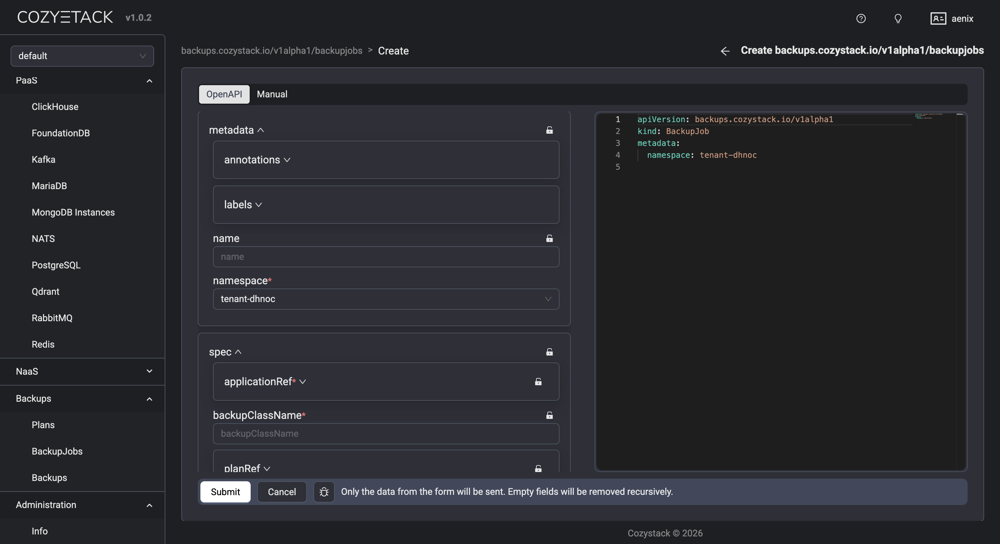

**Author**: Timur Tukaev (Ænix)

The last platform release was 0.41. So it came as a surprise when the next release, 0.42, turned out to be the answer to the ultimate question of life, the universe, and everything. The number of serious changes that had piled up was just too great—so much so that 0.42 had to be renamed to 1.0.

With the release of v1.0.0, Cozystack is undergoing a fundamental architectural transition. We’ve built a package system based on FluxCD and OCI artifacts — think of it like apt for Debian/Ubuntu, but made for Kubernetes (see “Package-based Deployment” below). This let us introduce a unique new approach: Build Your Own Platform (BYOP).

We’ve finally ditched the old bash scripts that used to handle platform logic, and replaced them with a fully-fledged operator. This operator now installs all system components of the platform.

The entire platform logic now revolves [around two CRDs](https://cozystack.io/docs/v1/guides/concepts/#packagesource-and-package): Package and PackageSource.

- PackageSource defines the source of a package by directly referencing a Git or OCI repository.
- Package reflects the user's wish to install a particular package.

Both resources are cluster-scoped (i.e., not bound to any specific namespace) and can be managed directly via cozypkg, kubectl, or through the platform’s Helm chart.

This new approach provides a more reliable way to install, customize, and manage platform components, while keeping the system logic simple and consistent.

Now you’ve got [two options](https://cozystack.io/docs/v1/install/cozystack/): 

- Use Cozystack as a ready-made platform with everything preinstalled (just like before). In this case, the platform chart installs all required Packages automatically.
- Build your own Cozystack. In this case, the platform chart only installs PackageSources for the current component versions, and you use cozypkg to pick and install the Packages you actually want.

Installation always starts with the cozystack-operator. Once it’s up and running, the user can install the core cozystack-platform package. After that, you can choose between several platform variants:


```text
PackageSource: cozystack.cozystack-platform
Available variants:
  1. default
  2. isp-full
  3. isp-full-generic
  4. isp-hosted
Select variant (1-4): 1
```

The isp-full, isp-full-generic, and isp-hosted options provide fully-featured Cozystack setups tailored to specific use cases. In the default option, only PackageSources are installed — not the actual Packages. The user can then explore available packages via cozypkg, select the needed ones, and install them with all their dependencies. Unlike Debian/Ubuntu, Cozystack packages come in different available flavors. For example, the cozystack.networking package — which most others depend on — comes bundled with either kubeovn-cilium, cilium, cilium-kilo, or noop. Noop does nothing but helps satisfy dependencies — handy for existing Kubernetes clusters.

You can also create your own repository, plug it to Cozystack, and install packages directly from it.

The package system now features Flux’s new Source Watcher mechanism. Essentially, Cozystack has become one of the early adopters of the new FluxCD API, enabling users to define and host custom repositories without the need to build their own charts. We’ve also eliminated the classic [“chicken-and-egg” problem](https://cozystack.io/blog/2025/12/flux-aio-kubernetes-mtls-and-the-chicken-and-egg-problem/) (Cozystack installs everything via Flux — including CNI and kube-proxy — while Flux itself requires a working network to fetch charts). Cozystack now relies on source-watcher (a part of the self-sufficient flux-aio tool), which automatically pulls chart sources from Git or OCI repositories, builds them into installation-ready artifacts, and then deploys them.

Ultimately, this brings us one step closer to what Cozystack has always aimed to be: a cozy, flexible tech stack you can make entirely your own (refer to the [documentation](https://cozystack.io/docs/v1/install/) for more details).

In addition to this core shift, this version debuts a comprehensive backup system, including a highly extensible API and a backup implementation for virtual machines [based on Velero](https://cozystack.io/docs/v1/operations/services/velero-backup-configuration/), as well as Flux sharding for improved tenant resource distribution. Users will also find expanded monitoring capabilities alongside various performance and workflow improvements for virtual machines, tenant management, and build processes. On top of that, you can now deploy a fully featured MongoDB database with autoscaling, backups, and fault tolerance out of the box.



## Breaking Changes
### FerretDB deprecation
We’ve completely removed this component from the platform. There’s no automatic migration, so make sure to back up your data before upgrading if you’re still using FerretDB!

### MySQL is now MariaDB
The “MySQL” package has been renamed to “MariaDB” — we’ve actually been using mariadb-operator all along.

### VirtualMachine (simple) replaced
This resource has been replaced by two separate ones — VMDisk and VMInstance — giving you more Kubernetes-native and fine-grained control over virtual machines.

### API Rename: CozystackResourceDefinition → ApplicationDefinition
To improve clarity and ensure consistency across the ecosystem, the CozystackResourceDefinition CRD has been renamed to ApplicationDefinition. 

To streamline the upgrade process for current users, we have included automated migration scripts that will convert your existing resources to the new format.

### Package-based deployment
This release marks a significant transition in how the platform manages deployments. We have moved away from traditional HelmRelease bundles in favor of Package resources, which are now orchestrated directly by cozystack-operator.

The following changes have been implemented:
- The values.yaml file has been completely restructured to provide comprehensive configuration options. It now includes full support for networking, publishing, authentication, scheduling, branding, and resource management.
- We have introduced values-isp-full.yaml and values-isp-hosted.yaml to provide specialized configurations for different deployment scenarios.
- Standard Package resources have replaced the HelmRelease templates throughout the platform.
- All configuration for Cozystack-as-platform is now carried out via the Package resource's parameters for cozystack-platform rather than through a ConfigMap

For existing installations, we have provided a migration script located at hack/migrate-to-version-1.0.sh. With it, you can convert your old ConfigMaps into the new Package format.

## Major Features and Improvements

### Cozystack operator
This release features cozystack-operator, a dedicated component designed to provide robust, declarative package management for the entire platform. To establish this new architecture, we have introduced the Package and PackageSource CRDs. The operator's core reconciliation logic and dedicated controllers have been fully implemented to handle the complete lifecycle management of these resources.

We have also included the necessary Kubernetes deployment manifests for running cozystack-operator in the cluster and integrated PackageSource definitions. Complementing this server-side logic, we have also released cozypkg, a new command-line utility specifically designed to simplify the manual management of Package and PackageSource resources.

### Backup system
Cozystack v1.0 introduces a comprehensive backup ecosystem featuring native Velero integration for robust application data management.

The foundation of this system is the new Plan controller, which orchestrates backup schedules and rotation. To support a modular approach, we have added a dedicated backup strategy API group, enabling a pluggable architecture for various backup implementations. On top of that, we have optimized resource management by adding indices to core backup resources, significantly improving query performance.

A Velero strategy controller has been integrated to provide enterprise-grade backup capabilities. Additionally, a basic implementation for a Job-based backup strategy has been added.

The backup controller currently undergoes production testing, with complete deployment infrastructure, container image builds, and Kubernetes manifests included in the release. For ease of use, we have also introduced a user-facing dashboard interface for managing backups and backup Jobs that provides full visibility into backup statuses and job history.




### AI/ML and complex workloads
We’ve added ReadWriteMany (RWX) volume support to tenant Kubernetes clusters. This lets users create shared storage with snapshots and cloning — exactly what’s needed for AI/ML workloads where GPUs and shared datasets are standard. GPU passthrough is [fully supported](https://cozystack.io/blog/2025/04/cozystack-now-offers-gpu-passthrough-for-ai-ml-virtual-machines/), too.

### Multi-distribution and flexible install options
While Talos Linux remains our recommended distribution, Cozystack now officially supports various Kubernetes distributions such as K3s, Kubeadm, and RKE. We also made the setup simpler with a full set of [Ansible playbooks](https://cozystack.io/docs/v1/install/ansible/). Tools like boot-to-talos, cozyhr, and talm got major updates. Boot-to-talos and talm now support bonding, VLANs, auto-discovery and configuration. Boot-to-talos works seamlessly with the latest Ubuntu releases and updated kernels and can automatically convert an existing system with pre-configured networking to Talos.

All our tools — cozypkg, boot-to-talos, talm — can be installed with a single command from [the Brew repo](https://github.com/cozystack/homebrew-tap).

### Networking
The BYOP mode now supports Kilo: Connect your K8s nodes into a secure WireGuard mesh, even if they’re scattered across different regions. Also, local-ccm, a tool for assigning ExternalIP and managing node lifecycle without relying on any particular cloud vendor, has been added. On top of that, cluster-autoscaler now works with Azure and Hetzner. Combined, these improvements make it easy to connect nodes and clusters across different data centers into one seamless network and provision new nodes dynamically — ideal for hybrid-cloud setups.


### Virtual machines
All virtual machines are now exposed via a headless service. This ensures that every VM is assigned a persistent in-cluster DNS name, allowing them to be seamlessly accessed from other pods within the cluster, even if the VM does not have a public IP address assigned.

### Windows and custom OS support
Cozystack continues to fully support the installation of Windows and other operating systems, including via ISO images.

### Harbor integration
A new package has been added to deploy the Harbor container image registry.

### OpenBAO, a managed secret storage
Cozystack now includes OpenBAO, an open-source fork of HashiCorp Vault for storing and managing secrets securely. Two modes are available — a basic single-replica setup or a high-availability one powered by the Raft consensus, with switching done automatically depending on your replicas field.

Each OpenBAO instance comes with TLS enabled (cert-manager’s self-signed certificates are used), with all service endpoints and pod IP addresses covered by DNS SANs. Note that after installation, you are supposed to manually initialize and unseal OpenBAO.

### SeaweedFS: tiered storage pools
Operators can now set up disk-type-specific pools (SSD, HDD, NVMe) using the volume.pools or volume.zones[name].pools fields. For each pool, an additional set of volume servers is created, along with the corresponding BucketClass and BucketAccessClass.

In MultiZone setups, each zone × pool combination gets its own set of volume servers (e.g., us-east-ssd, us-west-hdd), and nodes are matched via the topology.kubernetes.io/zone label. Existing deployments with no pools defined produce output identical to previous versions — no migration needed.

### WORM support 
The SeaweedFS and COSI driver now allow you to provision buckets with versioning enabled and lock support.

### New user model with S3 login
Instead of a single implicit BucketAccess resource, operators now define a users map. For each entry, a dedicated BucketAccess is created, with its own secret containing credentials and an optional readonly flag. The S3 Manager interface has been updated and now includes a login screen that allows users to log in with their access_key and secret_key.

Two new bucket parameters are available:

- locking — for -lock BucketClass (COMPLIANCE mode, 365-day retention) supporting write-once-read-many scenarios;
- storagePool — selects the BucketClass corresponding to a specific pool.

The COSI driver has been upgraded to v0.3.0, adding support for the new diskType parameter.

⚠️ Breaking change: The implicit default BucketAccess resource is no longer created. After upgrading, any existing buckets that relied on implicit auto-generated BucketAccess must explicitly define users in the users map.

### RabbitMQ Version Selection
You can now specify which RabbitMQ version to run — v4.2 (default), v4.1, v4.0, or v3.13. The Helm chart picks the right runtime image automatically based on this parameter during deployment. This way, operators can control the RabbitMQ release channel used by each instance. An automatic migration backfills the version field on all existing RabbitMQ resources to v4.2.

### Documentation
The website documentation has been updated: a [comprehensive guide](https://cozystack.io/docs/virtualization/cloneable-vms/) for virtual machine cloning and management is now available, and we’ve made the NFS driver setup [much easier to follow](https://cozystack.io/docs/storage/nfs/#enable-nfs-driver). We also polished Talos Linux installation guides for [Hetzner](https://cozystack.io/docs/install/providers/hetzner/) and [Servers.com](https://cozystack.io/docs/install/providers/servers-com/), added a [section](https://cozystack.io/docs/install/providers/hetzner/#32-create-a-load-balancer-with-robotlb) on Hetzner RobotLB public IP configuration.

Beyond the major architectural shifts, versions 1.0.0 & 1.1.0 bring a wide range of incremental updates to monitoring, tenant management, and core system components, as well as streamlined development and build processes and various stability fixes.

## Migration Guide
A [detailed guide](https://cozystack.io/docs/v1/operations/upgrades/) for migrating from v0.41 to v1.0 is available. ⚠️ Please note the [mandatory steps](https://cozystack.io/docs/v1/operations/upgrades/#step-1-protect-critical-resources).


Huge thanks to everyone who contributed to the bottom line:
- [@androndo](https://github.com/androndo)
- [@lllamnyp](https://github.com/lllamnyp)
- [@IvanHunters](https://github.com/IvanHunters)
- [@IvanStukov](https://github.com/IvanStukov)
- [@kvaps](https://github.com/kvaps)
- [@lexfrei](https://github.com/lexfrei)
- [@matthieu-robin](https://github.com/matthieu-robin)
- [@myasnikovdaniil](https://github.com/myasnikovdaniil)
- [@nbykov0](https://github.com/nbykov0)
- [@sircthulhu](https://github.com/sircthulhu)


Join our community
- [Telegram group](http://t.me/cozystack)
- [Slack](https://kubernetes.slack.com/archives/C06L3CPRVN1) group (Get invite at [https://slack.kubernetes.io](https://slack.kubernetes.io/))
