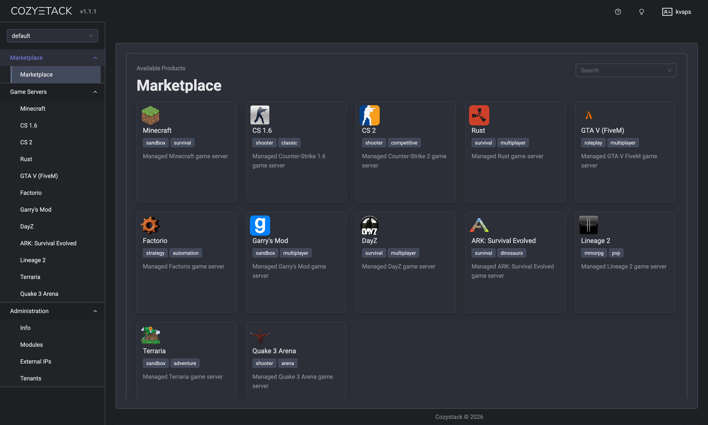

**Author**: Timur Tukaev (Ænix)

hello, world! We are the team behind [Cozystack](https://cozystack.io), an open-source platform for building clouds on your own hardware. We want to explain why we decided to target the game server space and what came of it.

## What Is Cozystack

Cozystack is a platform that turns ordinary servers into a full-fledged cloud. The project is part of CNCF Sandbox, is distributed under the Apache 2.0 license, and is deployed on bare-metal servers.

Out of the box, the platform provides more than 20 managed services: databases (PostgreSQL, MariaDB, MongoDB, and others), message queues (Kafka, RabbitMQ), caching (Redis), S3 storage, virtual machines, Kubernetes clusters, networking, and load balancers. Everything runs directly on hardware, with no extra virtualization layers.

## Why Game Servers

We did some research and saw steady demand: hosting providers and gaming communities are looking for alternatives with predictable performance, no lock-in to a specific provider, and no complicated licensing.

Game servers are one of the most demanding workloads: latency must be minimal, load fluctuates unpredictably, and servers must be reliably isolated from one another. That is exactly the scenario Cozystack is well suited for.

Anyone who has hosted game servers in the cloud knows the problem: noisy neighbors, unpredictable jitter, and latency spikes. Virtualization adds a layer that is invisible in business applications but immediately noticeable in games. Cozystack runs on bare metal: a server gets dedicated resources, network packets are processed as close to the hardware as possible, and data is replicated across nodes, so losing one server does not mean losing the game world.

We looked at what the platform already had and realized most of the infrastructure was ready. S3 for maps and assets. Databases for player data and statistics. Redis for sessions. Message queues for inter-server communication. Load balancers, VPN, scheduled backups. All that remained was to add the games themselves.

## How It Works

Cozystack has an `external-apps` mechanism for connecting external application repositories. After the [v1.0 release](https://cozystack.io/blog/2026/03/cozystack-1-0-release/), it was substantially reworked: the platform moved to a package-based architecture with `Package` and `PackageSource` resources managed by `cozystack-operator`. In essence, it works like `apt` in Debian, but for Kubernetes:

- Applications are packaged as Helm charts and published as OCI artifacts.
- Each application is described through `ApplicationDefinition`, a CRD that automatically appears in the dashboard.
- Users deploy a server via the UI or API, just like any other managed service.
- The platform manages the lifecycle: updates, backups, and monitoring.

Anyone can assemble their own application catalog and connect it to Cozystack without touching the core.

## Cozylex: The First Implementation

The first step was the [cozylex](https://github.com/lexfrei/cozylex) repository, prepared by our developer [Aleksei Sviridkin](https://github.com/lexfrei), which implements a managed Minecraft server:

- `MinecraftServer`: a CRD for PaperMC servers with automatic updates, backups, and resource limits.
- `MinecraftPlugin`: a CRD for installing plugins from Hangar with automatic updates.
- Plugins are attached to servers through label selectors, declaratively.

Connecting it to a cluster takes a couple of minutes, after which Minecraft appears in the Marketplace alongside PostgreSQL and Redis.

## What Comes Next

We plan to expand this approach and turn it into a separate line, `Game Server Edition`. In the near term, we plan to accept the Minecraft server as an official example of a pluggable application and update the documentation. Next up are Counter-Strike, Rust, FiveM, Factorio, and more.

## In Summary

Game servers are a good stress test for a platform. If it can reliably handle a workload with strict latency and I/O requirements, it can handle anything.

The Cozystack architecture makes it possible to add new service types without reinventing the infrastructure. Everything needed for operation - backups, monitoring, networking, and storage - is provided out of the box.

We welcome contributors. The `external-apps` mechanism lets you add applications without understanding the platform core; knowing Helm and Kubernetes is enough.

## Links

- [Cozystack](https://cozystack.io)
- [GitHub](https://github.com/aenix-io/cozystack)
- [Cozylex](https://github.com/lexfrei/cozylex)
- [Documentation](https://cozystack.io/docs/)
