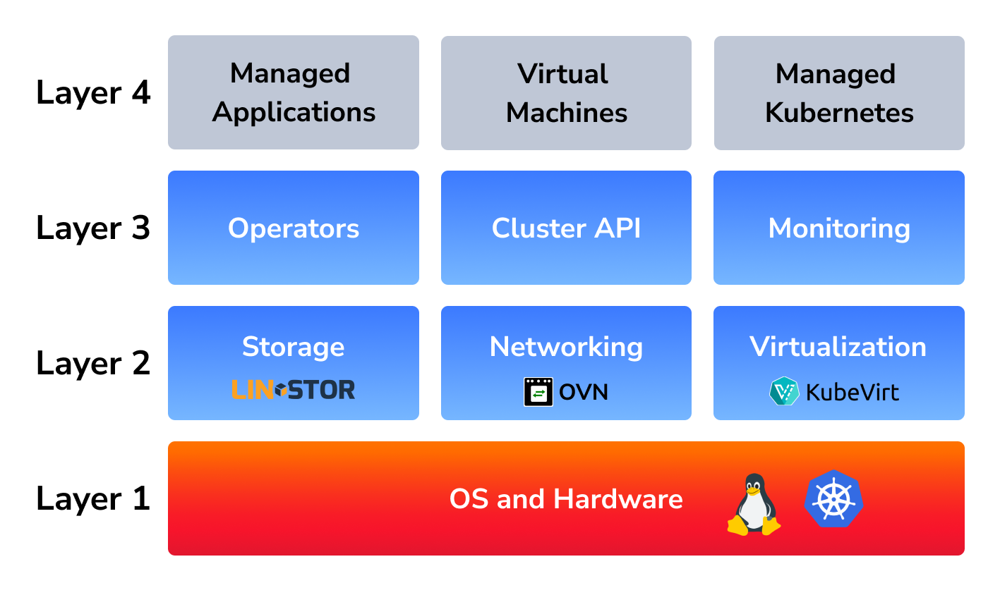

Cozystack is composed entirely of open-source components, layered from the operating system up to user-facing managed services.
This page describes each component, its role in the platform, and its upstream license.

## Overview

Components are organized by their role in the platform stack.
Cozystack-maintained charts, CRDs, controllers, and application APIs are licensed under **Apache-2.0** and are not listed individually below.

## Operating system and Kubernetes runtime






## Cluster provisioning and virtualization







## Networking














## Storage and backup











## GitOps and platform automation












## Observability












## Autoscaling and resource management






## GPU and accelerators






## Identity, registry, and secrets







## Managed database runtimes












## Managed messaging and caching runtimes







## Managed networking services







