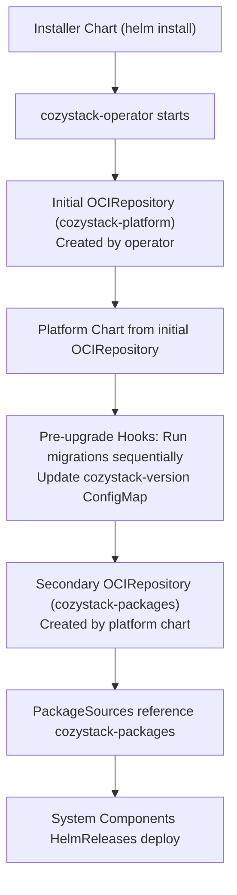
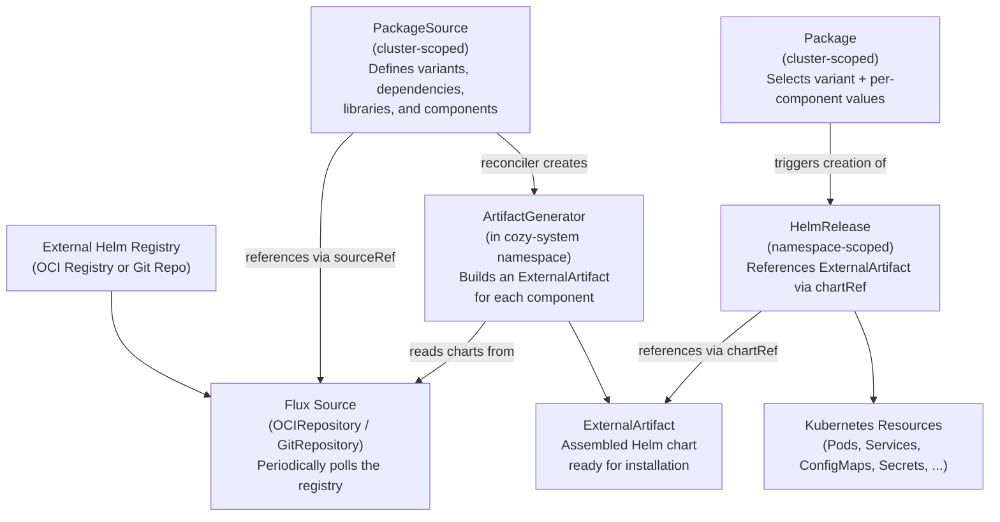
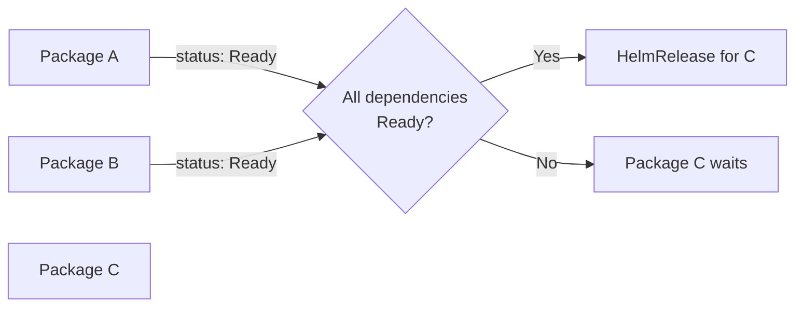
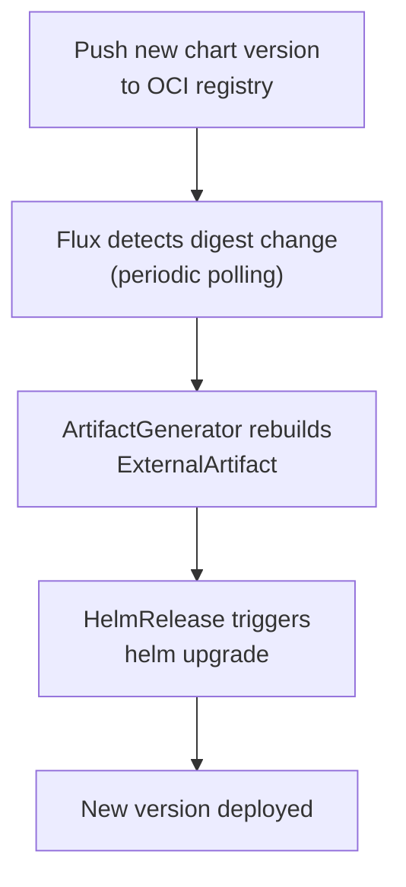
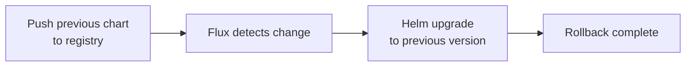
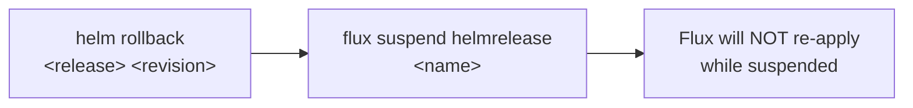
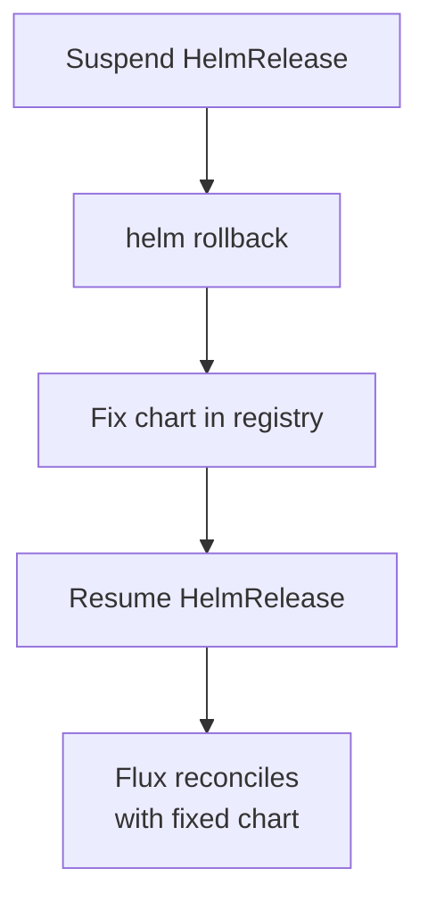
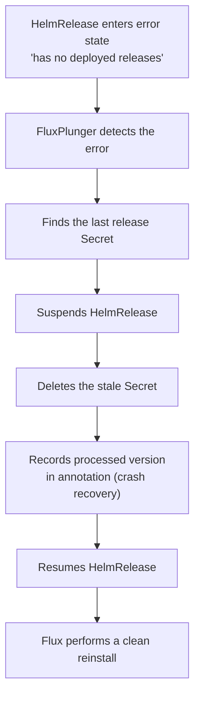
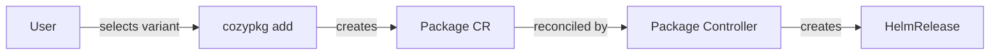

Cozystack is an open-source, Kubernetes-native platform that turns bare-metal or virtual infrastructure into a fully featured, multi-tenant cloud.
At its core are a few foundational building blocks:

- the **management cluster** that runs the platform itself;
- **tenants** that provide strict, hierarchical isolation;
- **tenant clusters** that give users their own Kubernetes control planes;
- rich catalog of **managed applications** and virtual machines;
- **variants** that assemble these components into a turnkey stack.

Understanding how these concepts fit together will help you plan, deploy, and operate Cozystack effectively, 
whether you are building an internal developer platform or a public cloud service.

## Management Cluster

Cozystack is a system of services working on a Kubernetes cluster, usually deployed on top of Talos Linux on bare metal or virtual machines.
This Kubernetes cluster is called the **management cluster** to highlight its role and distinguish it from tenant Kubernetes clusters.
Only Cozystack administrators have full access to the management cluster.

The management cluster is used to deploy preconfigured applications, such as tenants, system components, managed apps, VMs, and tenant clusters.
Cozystack users can interact with the management cluster through dashboard and API, and deploy managed applications.
However, they don't have administrative rights and may not deploy custom applications in the management cluster, but can use tenant clusters instead.

## Tenant

A **tenant** in Cozystack is the primary unit of isolation and security, analogous to a Kubernetes namespace but with enhanced scope.
Each tenant represents an isolated environment with its own resources, networking, and RBAC (role-based access control).
Some cloud providers use the term "projects" for a similar entity.

When Cozystack is used to build a private cloud and an internal development platform, a tenant usually belongs to a team or subteam.
In a hosting business, where Cozystack is the foundation of a public cloud, a tenant can belong to a customer.

Read more: [Tenant System]({}).

## Tenant Cluster

Users can deploy separate Kubernetes clusters in their own tenants.
These are not namespaces of the management cluster, but complete Kubernetes-in-Kubernetes clusters.

Tenant clusters are what many cloud providers call "managed Kubernetes".
They are used as development, testing, and production environments.

Read more: [tenant Kubernetes clusters]({}).

## Managed Applications

Cozystack comes with a catalog of **managed applications** (services) that can be deployed on the platform with minimal effort.
These include relational databases (PostgreSQL, MySQL/MariaDB), NoSQL/queues (Redis, NATS, Kafka, RabbitMQ), HTTP cache, load balancer, and others.

Tenants, tenant Kubernetes clusters, and VMs are also managed applications in terms of Cozystack.
They are created with the same user workflow and are managed with Helm and Flux, just as other applications.

Read more: [managed applications]({}).

## Cozystack API

Instead of a proprietary API or UI-only management, Cozystack exposes its functionality through 
[Kubernetes Custom Resources](https://kubernetes.io/docs/concepts/extend-kubernetes/api-extension/custom-resources/) 
and the standard Kubernetes API, accessible via REST API, `kubectl` client, and the Cozystack dashboard.

This approach combines well with role-based access control.
Non-administrative users can use `kubectl` to access the management cluster, 
but their kubeconfig will authorize them only to create custom resources in their tenants.

Read more: [Cozystack API]({}).

## Variants

Variants are pre-defined configurations of Cozystack that determine which bundles and components are enabled.
Each variant is tested, versioned, and guaranteed to work as a unit.
They simplify installation, reduce the risk of misconfiguration, and make it easier to choose the right set of features for your deployment.

Read more: [Variants]({}).

## PackageSource and Package

`PackageSource` and `Package` are the two Custom Resource Definitions (CRDs) that drive the entire application lifecycle in Cozystack.

- **PackageSource** (cluster-scoped) defines what is available: it references a Flux source (OCIRepository or GitRepository) that polls an external registry, lists variants, declares dependencies, and specifies the components that make up each application.
- **Package** (cluster-scoped) defines what is deployed: it selects a variant from a PackageSource, provides per-component value overrides, and triggers the creation of a HelmRelease that manages the actual Kubernetes resources.

Together, they form a declarative pipeline: external charts flow through Flux sources and artifact generators into ready-to-install Helm charts, which Packages then instantiate as running workloads.

### OCIRepositories: Platform and Packages

Cozystack uses two OCIRepository resources to manage the update flow and ensure migrations run before any component upgrades.

#### Initial OCIRepository (`cozystack-platform`)

Created by the cozystack-operator during bootstrap. The operator receives a platform source URL (e.g., `oci://ghcr.io/cozystack/cozystack/cozystack-packages`) and creates an OCIRepository named `cozystack-platform`. This repository points to the platform chart artifact, is configured via installer values (`platformSourceUrl`, `platformSourceRef`), and provides the platform chart that will create migrations and the secondary OCIRepository.

#### Secondary OCIRepository (`cozystack-packages`)

Created by the platform Helm chart (`packages/core/platform/templates/repository.yaml`). It copies the spec from `cozystack-platform` and creates a new OCIRepository named `cozystack-packages`. This repository is referenced by all PackageSources (networking, monitoring, postgres-operator, etc.), contains all system and application charts, and decouples the platform source from component PackageSources.

#### Migration Ordering

The two-repository design ensures that system migrations execute before any component updates:



When a new platform version is released and the cluster is upgraded:

1. The initial OCIRepository (`cozystack-platform`) provides the new platform chart.
2. During `helm upgrade`, the platform chart's `pre-upgrade` hooks execute migrations sequentially (from current to target version).
3. Each migration script performs necessary transformations and updates the `cozystack-version` ConfigMap.
4. After migrations complete, the platform chart creates or updates the `cozystack-packages` OCIRepository.
5. PackageSources reference `cozystack-packages` and trigger reconciliation of system components.

This guarantees migrations run before component upgrades, and the migration scripts come from the same chart version being deployed.

### Reconciliation Flow

The full reconciliation chain from an external registry to running Kubernetes resources:



The naming convention for ExternalArtifacts follows the pattern `<packagesource>-<variant>-<component>`, with dots replaced by dashes to comply with Kubernetes naming rules. For example, a PackageSource named `cozystack.keycloak` with variant `default` and component `keycloak` produces `cozystack-keycloak-default-keycloak`.

### Package Dependencies

PackageSource variants can declare `dependsOn` to gate HelmRelease creation until all dependencies are ready:



If all dependencies report a `Ready` status, the dependent Package proceeds to create its HelmRelease. Otherwise, the Package remains in a waiting state until the conditions are met.

Dependencies in PackageSource used at two levels:

- **Variant-level** (`spec.variants.dependsOn[]`): references other Package names. The PackageReconciler checks that all dependencies are ready before creating any HelmReleases. This ensures infrastructure packages (e.g., CNI, storage) are fully running before dependent packages attempt installation. The `spec.ignoreDependencies` field on a Package can override this check for specific dependencies.
- **Component-level** (`spec.variants.components.install.dependsOn[]`): translated into `spec.dependsOn[]` field on a HelmRelease resource. These dependencies enforce correct ordering of components during installation of package.

### Namespace and Values Management

When the PackageReconciler creates HelmReleases for a Package, it also:

- **Creates namespaces** declared in component `Install.namespace` fields, setting labels such as `cozystack.io/system=true` and `pod-security.kubernetes.io/enforce=privileged` where needed.
- **Injects cluster-wide configuration** via the `cozystack-values` Secret. The **CozyValuesReplicator** watches this Secret in `cozy-system` and replicates it to every namespace labeled `cozystack.io/system=true`. Each HelmRelease references this Secret through `valuesFrom`, ensuring all components receive consistent platform configuration.

### Update Flow

When a new chart version is pushed to the registry, updates propagate automatically through the reconciliation chain:



To speed up synchronization without waiting for the next polling interval (Flux sources live in the `cozy-system` namespace):

```text
flux reconcile source oci <source-name> --namespace cozy-system
```

To update application values without changing the chart version, patch the Package CR directly.
Values are scoped per component under `spec.components.<component-name>.values`:

```text
kubectl patch package <name> --type merge --patch '{"spec":{"components":{"<component-name>":{"values":{"key":"value"}}}}}'
```

### Rollback Strategies

There are three approaches to rolling back a Package, listed from most to least recommended:

**GitOps rollback (recommended):** Push the previous chart version to the OCI registry. Flux detects the change and triggers an upgrade to the "old" version through the standard reconciliation flow.



**Emergency rollback:** Run `helm rollback` directly and suspend the HelmRelease to prevent Flux from re-applying the newer version. This bypasses GitOps and should only be used in emergencies.



**Controlled rollback:** Suspend the HelmRelease first, then run `helm rollback`, fix the chart in the registry, and resume the HelmRelease.



### FluxPlunger Auto-Recovery

FluxPlunger is an automatic recovery component that handles the common "has no deployed releases" HelmRelease error. This error occurs when Helm's release state becomes inconsistent.



If FluxPlunger crashes mid-process, the `flux-plunger.cozystack.io/last-processed-version` annotation ensures it can resume correctly on the next reconciliation.

### Lifecycle Operations Summary

| Action | What to do | Handled by |
| --- | --- | --- |
| Update chart version | Push new chart to OCI registry | Flux + ArtifactGenerator |
| Update values | Patch the Package CR | Package controller + HelmRelease |
| Speed up sync | `flux reconcile source oci <name>` | Manual trigger |
| GitOps rollback | Push previous chart version to registry | Flux (standard flow) |
| Emergency rollback | `helm rollback` + suspend HelmRelease | Manual intervention |
| Recovery from error | Automatic via FluxPlunger | FluxPlunger controller |

## cozypkg CLI

`cozypkg` is a command-line tool for managing Package and PackageSource resources interactively.
It handles dependency resolution, variant selection, and safe deletion with cascade analysis, so you don't have to craft YAML manifests by hand.

### Installation

Pre-built binaries are available for Linux, macOS, and Windows (amd64 and arm64) as part of each Cozystack release.

### Commands

#### `cozypkg add` --- Install Packages

Installs one or more packages with automatic dependency resolution:

```text
cozypkg add cozystack.keycloak cozystack.monitoring
cozypkg add --file packages.yaml
```

For each package, `cozypkg add`:

1. Finds the corresponding PackageSource in the cluster.
2. Prompts you to select a variant if multiple are available.
3. Resolves all transitive dependencies (topological sort).
4. Creates Package resources in dependency-first order, skipping already-installed packages.

#### `cozypkg list` --- List Packages

```text
cozypkg list                          # Available PackageSources
cozypkg list --installed              # Installed Packages
cozypkg list --installed --components # Installed Packages with component details
```

Example output:

```text
NAME                  VARIANT   READY   STATUS
cozystack.networking  cilium    True    reconciliation succeeded, generated 2 helmrelease(s)
cozystack.keycloak    default   False   DependenciesNotReady
```

#### `cozypkg del` --- Delete Packages

Safely removes packages with reverse-dependency analysis:

```text
cozypkg del cozystack.keycloak
```

Before deletion, `cozypkg del` shows which other installed packages depend on the target and asks for confirmation. Packages are deleted in reverse topological order (dependents first).

#### `cozypkg dot` --- Visualize Dependencies

Generates a dependency graph in GraphViz DOT format:

```text
cozypkg dot | dot -Tpng > dependencies.png
cozypkg dot --installed --components   # Component-level graph of installed packages
```

Missing dependencies are highlighted in red, making it easy to spot incomplete installations.

### How cozypkg Fits into the Lifecycle



`cozypkg` operates exclusively on `Package` and `PackageSource` custom resources.
It does not interact with HelmReleases, ArtifactGenerators, or Flux sources directly --- those are managed by the controllers described above.

You can always manage Package resources with `kubectl` instead of `cozypkg`.
The CLI simply automates variant selection, dependency ordering, and cascade analysis.
