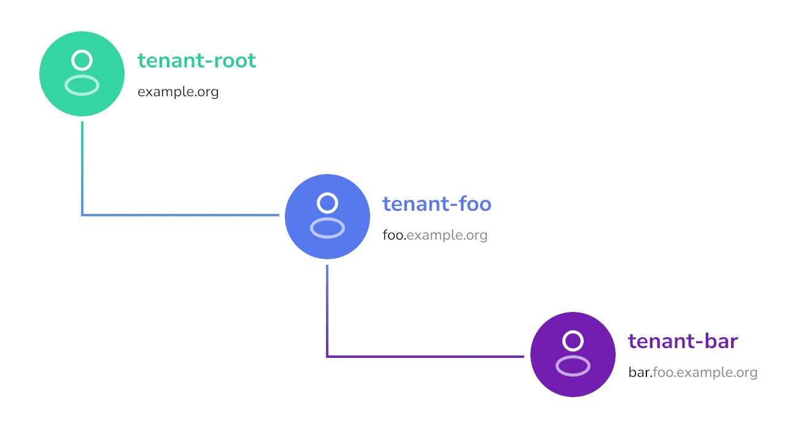
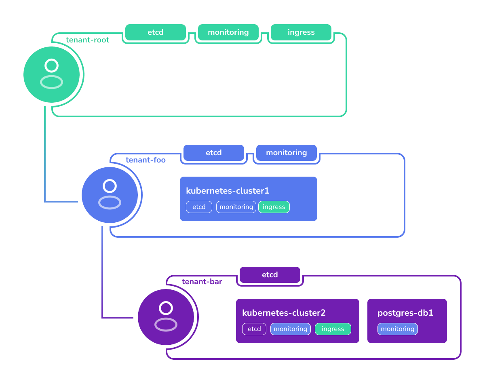

## Введение

**Tenant** в Cozystack — основная единица изоляции и безопасности, похожая на Kubernetes namespace, но с расширенной областью действия.
Каждый tenant представляет изолированную среду со своими ресурсами, сетью и RBAC (role-based access control).
Некоторые cloud providers используют для похожей сущности термин "projects".

Администраторы и пользователи Cozystack создают tenants с помощью [приложения Tenant]({})
из application catalog.
Tenants можно создавать через Cozystack dashboard (UI), `kubectl` или напрямую через Cozystack API.

### Вложенность tenants

Все пользовательские tenants принадлежат базовому tenant'у `root`.
Tenant `root` используется только для развертывания пользовательских tenants и системных компонентов.
Все пользовательские приложения разворачиваются в соответствующих tenants.

Tenants могут быть вложенными: администратор tenant'а может создавать sub-tenants как приложения из каталога Cozystack.
Parent tenants могут делиться ресурсами с children и наблюдать за их приложениями.
В свою очередь, children могут использовать сервисы parent tenant.



### Совместное использование cluster services

В tenants могут быть развернуты [cluster services]({}).
Cluster services — это middleware services, предоставляющие базовую функциональность tenants и user-facing applications.

В tenant `root` по умолчанию есть набор сервисов вроде `etcd`, `ingress` и `monitoring`.
Tenants нижнего уровня могут запускать собственные cluster services или использовать сервисы parent tenant.

Например, пользователь Cozystack создает следующие tenants и services:

- Tenant `foo` внутри tenant `root`, со своими экземплярами `etcd` и `monitoring`.
- Tenant `bar` внутри tenant `foo`, со своим экземпляром `etcd`.
- [Tenant Kubernetes cluster]({}) и
  [Postgres database]({}) в tenant `bar`.

Всем приложениям нужны сервисы вроде `ingress` и `monitoring`.
Так как у tenant `bar` этих сервисов нет, приложения будут использовать сервисы parent tenant.

Эта конфигурация будет разрешена так:

-   Tenant Kubernetes cluster будет хранить данные в собственном `etcd` сервиса tenant `bar`.
-   Все metrics будут собираться в monitoring stack parent tenant `foo`.
-   Доступ к приложениям будет идти через общий `ingress`, развернутый в tenant `root`.



### Сетевая изоляция между tenants

Каждый namespace tenant'а изолирован от sibling tenants с помощью Cilium network
policies, автоматически устанавливаемых chart'ом `tenant`. Отключить это для отдельного tenant нельзя:
предыдущее поле `isolated` было удалено в Cozystack v1.0. Pod'ы внутри namespace tenant'а также
по умолчанию не могут обращаться к `kube-apiserver`, а также к собственному `etcd` tenant'а, если tenant
создан с `etcd: true`. Для доступа им нужно явно включить одну из двух labels pod'а:

-   `policy.cozystack.io/allow-to-apiserver: "true"` — доступ к in-cluster Kubernetes API (для operators, dashboards и т. д.).
-   `policy.cozystack.io/allow-to-etcd: "true"` — доступ к собственному etcd tenant'а (применимо только если tenant создан с `etcd: true`).

См. [Tenant `isolated` flag removed]({})
в upgrade notes, где приведен полный пример.

### Настройка tenant services

Флаги tenant `etcd`, `monitoring`, `ingress` и `seaweedfs` устанавливают
*default* конфигурацию каждого сервиса. После запуска сервиса вы можете изменить его spec:
добавить storage pools, настроить resource quotas, переключить topology SeaweedFS на `MultiZone` и т. д.,
редактируя underlying application CR. Такие ручные изменения **не перезаписываются** при reconciliation parent `Tenant`.

Workflow состоит из двух шагов:

1. Включите flag в tenant (checkbox в Dashboard или `etcd: true` /
   `seaweedfs: true` / ... в `spec.values` manifest'а Tenant `HelmRelease`,
   который вы применяете через `kubectl`). Cozystack создаст соответствующий
   application CR со значениями по умолчанию.
2. Отредактируйте application CR на месте. Например, чтобы добавить pool в
   экземпляр SeaweedFS tenant-root:

   ```bash
   kubectl edit -n tenant-root seaweedfses.apps.cozystack.io seaweedfs
   ```

   Или patch'ите его non-interactively:

   ```bash
   kubectl patch -n tenant-root seaweedfses.apps.cozystack.io seaweedfs \
     --type=merge -p '{"spec":{"volume":{"pools":{"ssd":{"diskType":"ssd","size":"50Gi"}}}}}'
   ```

Та же схема применяется к каждому tenant-level application CR: `etcd`,
`monitoring`, `ingress`, `seaweedfs`. См.
[SeaweedFS storage pools]({})
как подробный пример полного flow: включение SeaweedFS в tenant и последующая настройка созданного CR.

{}
Не пытайтесь предварительно настроить tenant-level service, применяя его CR manifest
*до* создания tenant — вы получите ошибку "namespace not found". Редактирование самого ресурса `Tenant`
с попыткой вложить service-specific поля (например, SeaweedFS `pools`) в spec `Tenant` тоже не сработает:
tenant-level flags являются booleans, а per-service spec находится в отдельном resource. Сначала включите flag,
затем редактируйте downstream CR.
{}

### Уникальные доменные имена

У каждого tenant есть собственный домен.
По умолчанию, если не указано иное, он наследует домен parent tenant с префиксом из своего имени.
Например, если у tenant `root` домен `example.org`, то tenant `foo` по умолчанию получает домен `foo.example.org`.
Однако его можно переопределить и указать другой домен, например `example.com`.

Kubernetes-кластеры, созданные в namespace этого tenant, получат домены вида `kubernetes-cluster.foo.example.org`.

### Ограничения имен tenants

Имена tenants должны быть alphanumeric.
Использовать дефисы (`-`) в именах tenants нельзя, в отличие от других сервисов.
Это ограничение нужно, чтобы сохранить согласованное именование tenants, nested tenants и сервисов, развернутых внутри них.

Например:

-   Root tenant называется `root`, но внутри он представлен как `tenant-root`.
-   Пользовательский tenant называется `foo`, что дает `tenant-foo`.
-   Однако tenant нельзя назвать `foo-bar`, потому что разбор имен вроде `tenant-foo-bar` может быть неоднозначным.

### Namespace layout tenant'ов

Каждый tenant соответствует Kubernetes workload namespace. Tenant `root` — особый случай: его namespace жестко задан как `tenant-root`.
Для каждого nested tenant namespace выводится из workload namespace его parent и собственного имени по двум правилам:

- Tenant, созданный напрямую внутри `tenant-root`, получает namespace
  `tenant-<name>`. Prefix parent `tenant-root-` **не** включается.
- Tenant, созданный на любой более глубокой вложенности, получает namespace
  `<parent-workload-namespace>-<name>`, где имя child добавляется к полному namespace parent.

Например, начиная с `tenant-root`:

| Tenant path             | Workload namespace         |
| ---                     | ---                        |
| `root`                  | `tenant-root`              |
| `root/alpha`            | `tenant-alpha`             |
| `root/alpha/beta`       | `tenant-alpha-beta`        |
| `root/alpha/beta/gamma` | `tenant-alpha-beta-gamma`  |

И Helm chart `tenant`, и aggregated API реализуют эти правила при создании нового tenant:

- helper Helm chart в
  [`packages/apps/tenant/templates/_helpers.tpl`](https://github.com/cozystack/cozystack/blob/main/packages/apps/tenant/templates/_helpers.tpl)
  вычисляет namespace для устанавливаемого child release;
- функция `computeTenantNamespace` в
  [`pkg/registry/apps/application/rest.go`](https://github.com/cozystack/cozystack/blob/main/pkg/registry/apps/application/rest.go)
  публикует то же значение как `status.namespace` в Tenant CR.

Так как сами имена tenants ограничены alphanumeric-символами (см.
*Ограничения имен tenants* выше), фрагменты namespace никогда не содержат
tenant-internal дефисов.

{}
Имена Kubernetes namespaces являются RFC 1123 labels и не могут превышать **63
символа**. Так как глубокие tenants накапливают всю цепочку ancestors
в имени workload namespace (`tenant-alpha-beta-gamma`), длинные имена tenants
в сочетании с глубокой вложенностью могут упереться в этот лимит. Планируйте
иерархию заранее: короткие имена tenants на глубоких уровнях или более плоские
trees, если длинные имена неизбежны. Kubernetes отклонит создание namespace,
если вычисленное имя превысит 63 символа, а содержащий `tenant` Helm release
покажет это отклонение как reconcile failure.
{}

### Определение parent и child relationships

Downstream integrations — custom dashboards, audit tooling, cost-allocation
jobs, policy engines — иногда должны обходить tenant tree, чтобы показывать
breadcrumbs, вычислять inherited settings или ограничивать scope запросов. Может
показаться удобным выводить parent namespace, разбивая workload namespace по `-`
и собирая его обратно без последнего segment. Сегодня это работает только потому,
что имена tenants ограничены alphanumeric-символами, поэтому символ `-` однозначно
разделяет ancestor segments; кроме того, такой способ предполагает, что текущие
правила генерации namespace никогда не изменятся. Оба предположения являются
implementation details, а не стабильным контрактом.

Стабильный контракт — сам custom resource `Tenant`. Cozystack хранит каждый
Tenant CR в workload namespace его parent, поэтому:

- **`metadata.namespace`** Tenant CR равен workload namespace **parent**.
  Это надежный указатель на parent без string parsing.
- **`status.namespace`** Tenant CR равен **собственному** workload namespace tenant
  (там живут приложения tenant, nested tenants и `HelmRelease`).
- Чтобы получить direct children tenant с workload namespace `N`, перечислите
  Tenant CRs, у которых `metadata.namespace == N`. Через `kubectl` это одна команда
  к workload namespace parent:

  ```bash
  kubectl get tenants --namespace <parent-workload-namespace>
  ```

  Ресурс `tenants` обслуживается Cozystack aggregated API
  (`apps.cozystack.io/v1alpha1`), поэтому `cozystack-api` должен быть запущен и
  доступен клиенту. Выполните `kubectl api-resources --api-group apps.cozystack.io`,
  чтобы убедиться, что ресурс виден в вашем kubeconfig context.

Этот подход стабилен независимо от того, является tenant direct child `tenant-root`
или более глубоким descendant, и переживет будущие изменения namespace layout,
потому что вообще от него не зависит.

### Справочник

См. справочник по приложению, реализующему управление tenants: [`tenant`]({})
