## Обзор

Cozystack использует многослойный сетевой стек, разработанный для bare-metal-кластеров Kubernetes. Архитектура объединяет несколько компонентов, каждый из которых отвечает за свой уровень сети:

| Уровень | Компонент | Назначение |
| --- | --- | --- |
| Внешняя балансировка нагрузки | MetalLB | Публикация сервисов во внешние сети |
| Балансировка нагрузки сервисов | Cilium eBPF | Замена kube-proxy, DNAT внутри ядра |
| Сетевые политики | Cilium eBPF | Изоляция тенантов и обеспечение безопасности |
| Сеть подов (CNI) | Kube-OVN | Централизованный IPAM, оверлейная сеть |
| Проброс IP в ВМ | [cozy-proxy](https://github.com/cozystack/cozy-proxy/) | Проброс внешних IP-адресов внутрь виртуальных машин |
| Вторичные интерфейсы ВМ | [Multus CNI](https://github.com/k8snetworkplumbingwg/multus-cni) | Подключение вторичных L2-интерфейсов к виртуальным машинам |
| Наблюдаемость | Hubble (опционально) | Видимость сетевого трафика (по умолчанию отключено) |

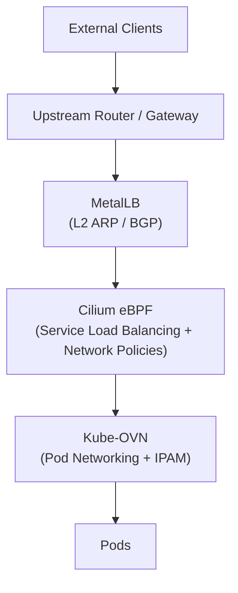

## Сетевая конфигурация кластера

| Параметр | Значение по умолчанию |
| --- | --- |
| Pod CIDR | 10.244.0.0/16 |
| Service CIDR | 10.96.0.0/16 |
| Join CIDR | 100.64.0.0/16 |
| Домен кластера | cozy.local |
| Тип оверлея | GENEVE |
| CNI | Kube-OVN |
| Замена kube-proxy | Cilium eBPF |

### Варианты сетевого стека

Cozystack поддерживает несколько вариантов сетевого стека для разных
типов кластеров. Вариант выбирается через `bundles.system.variant` в
конфигурации платформы.

| Вариант | Компоненты | Целевая платформа |
| --- | --- | --- |
| `kubeovn-cilium` | Kube-OVN + Cilium (по умолчанию) | Talos Linux |
| `kubeovn-cilium-generic` | Kube-OVN + Cilium | kubeadm, k3s, RKE2 |
| `cilium` | Только Cilium | Talos Linux |
| `cilium-generic` | Только Cilium | kubeadm, k3s, RKE2 |
| `cilium-kilo` | Cilium + Kilo | Talos Linux |
| `noop` | Нет (используйте собственный CNI) | Любая |

В вариантах с Kube-OVN Cilium работает как цепочечный CNI (режим `generic-veth`):
Kube-OVN отвечает за сеть подов и IPAM, а Cilium обеспечивает балансировку
нагрузки сервисов, применение сетевых политик и опциональную наблюдаемость через Hubble.

В вариантах только с Cilium он выступает одновременно и как CNI, и как балансировщик
нагрузки сервисов.

{}
Далее в этом документе описывается вариант по умолчанию `kubeovn-cilium`.
{}

### Выделение Pod CIDR (Kube-OVN)

Kube-OVN использует модель **общего Pod CIDR**:

- Все поды получают адреса из единого общего пула IP-адресов (10.244.0.0/16)
- IP-адреса выделяются централизованно через IPAM Kube-OVN
- Нет разбиения CIDR по узлам (в отличие от Calico или Flannel)
- Поскольку IP-адреса не привязаны к CIDR-блокам конкретных узлов, поды можно переносить на другие узлы с сохранением адресов
- Взаимодействие подов между узлами использует туннели GENEVE (Join CIDR: 100.64.0.0/16)

## Приём внешнего трафика через MetalLB

MetalLB - реализация балансировщика нагрузки для bare-metal-кластеров Kubernetes. Он назначает внешние IP-адреса сервисам типа `LoadBalancer`, позволяя внешнему трафику достигать кластера.

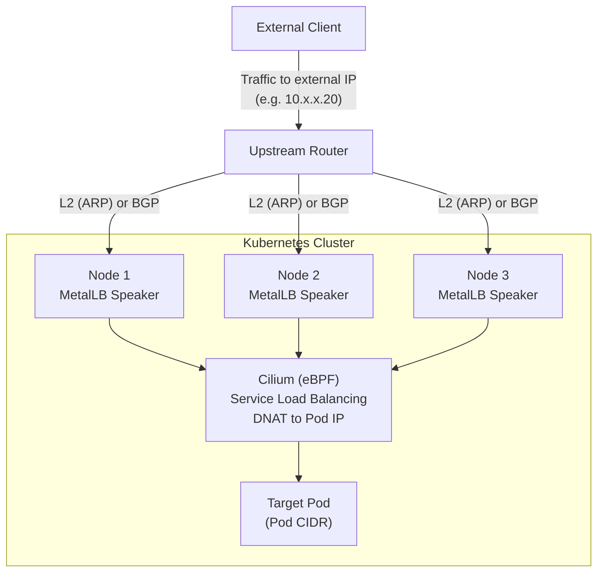

### Режим Layer 2 (ARP)

В режиме L2 MetalLB отвечает на ARP-запросы для внешнего IP-адреса сервиса. Один узел становится «лидером» для этого IP и принимает весь трафик.

Как это работает:

1. Спикер MetalLB на одном из узлов забирает внешний IP себе
2. Спикер отвечает на ARP-запросы: «IP X находится по MAC-адресу aa:bb:cc:dd:ee:ff»
3. Весь трафик для этого IP идёт на узел-лидер
4. Cilium на узле выполняет DNAT к нужному поду

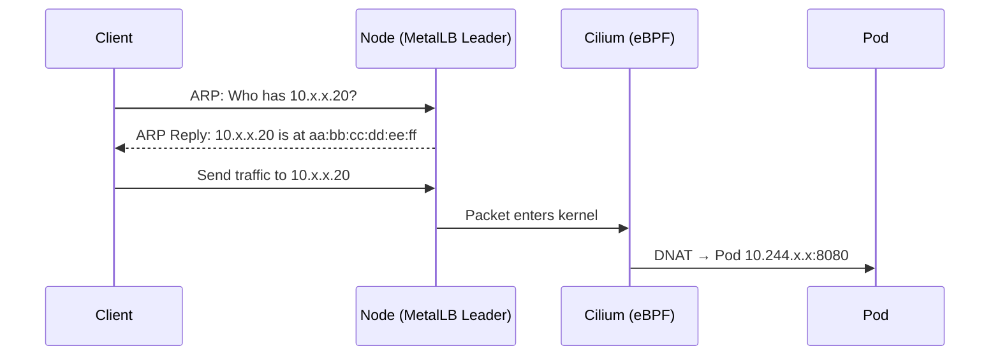

{}
В режиме L2 трафик для конкретного IP сервиса обрабатывает только один узел. При отказе узла-лидера происходит переключение, но настоящей балансировки нагрузки между узлами для одного сервиса нет.
{}

### Режим BGP

В режиме BGP MetalLB устанавливает BGP-сессии с вышестоящими маршрутизаторами и анонсирует маршруты /32 для IP-адресов сервисов. Это обеспечивает настоящую балансировку нагрузки ECMP между узлами.

Как это работает:

1. Спикеры MetalLB устанавливают BGP-сессии с вышестоящими маршрутизаторами
2. Каждый спикер анонсирует IP сервиса как маршрут /32
3. У маршрутизатора появляется несколько next-hop для одного префикса
4. ECMP распределяет трафик между узлами
5. Cilium на принимающем узле выполняет DNAT к нужному поду

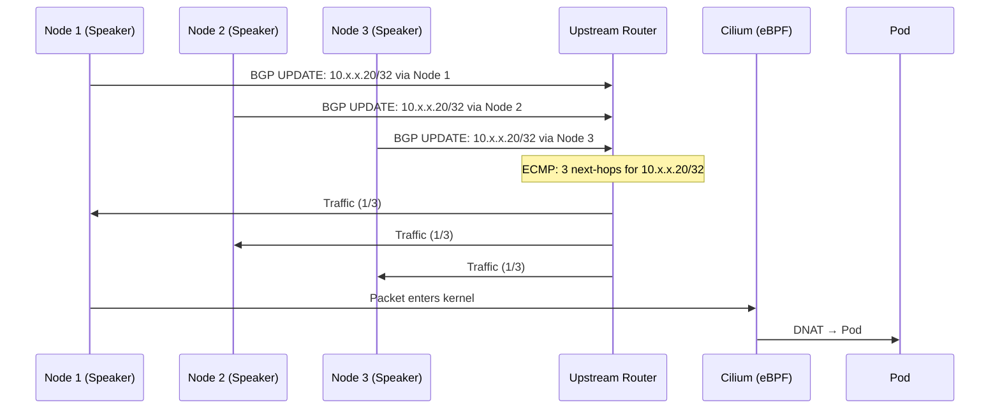

### Интеграция VLAN для внешнего трафика

Внешний трафик может доставляться в кластер через дополнительные VLAN (клиентские VLAN, DMZ, публичные сети и т.п.), откуда он направляется к сервисам через MetalLB и Cilium.

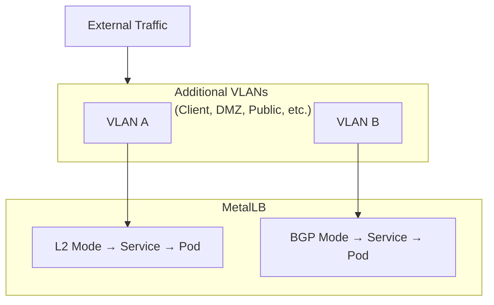

## Cilium как замена kube-proxy

Cilium заменяет kube-proxy, подключая программы eBPF непосредственно в ядре Linux. Это обеспечивает более эффективную обработку пакетов и расширенные возможности.

### Традиционный kube-proxy (iptables) против Cilium eBPF

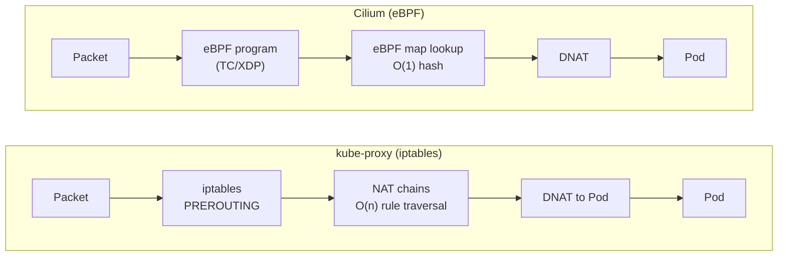

Ключевые отличия:

| Аспект | kube-proxy (iptables) | Cilium (eBPF) |
| --- | --- | --- |
| Сложность поиска | Обход правил за O(n) | Поиск по хешу за O(1) |
| Контекст выполнения | Накладные расходы в пользовательском пространстве | Нативно в ядре |
| Переключения контекста | Требуются | Отсутствуют |
| Масштабируемость | Деградирует с ростом числа сервисов | Постоянная производительность |

### Архитектура eBPF

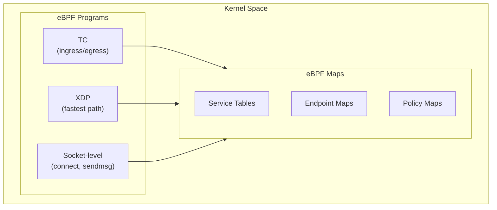

## Изоляция тенантов с Kube-OVN и Cilium

В мультитенантном кластере Cozystack все тенанты используют общий Pod CIDR. Это безопасно, потому что изоляция обеспечивается политиками Cilium eBPF на уровне ядра, а не сегментацией сети. Тенанты не могут взаимодействовать друг с другом, хотя используют общий пул IP-адресов. Kube-OVN выделяет IP-адреса из этого общего пула централизованно, без разбиения CIDR по узлам.

### Архитектура CNI

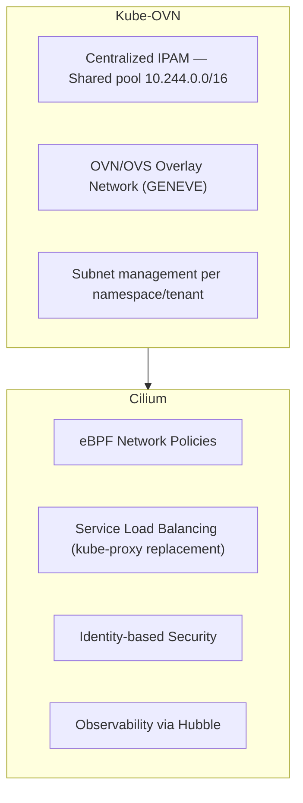

Kube-OVN является основным CNI-плагином для сети подов и IPAM. Собственный
механизм сетевых политик Kube-OVN отключён (`ENABLE_NP: false`), и всё
применение политик делегировано Cilium. Cilium работает как цепочечный CNI-компонент
(режим `generic-veth`), который применяет сетевые политики через eBPF и заменяет
kube-proxy для балансировки нагрузки сервисов.

### Модель изоляции тенантов

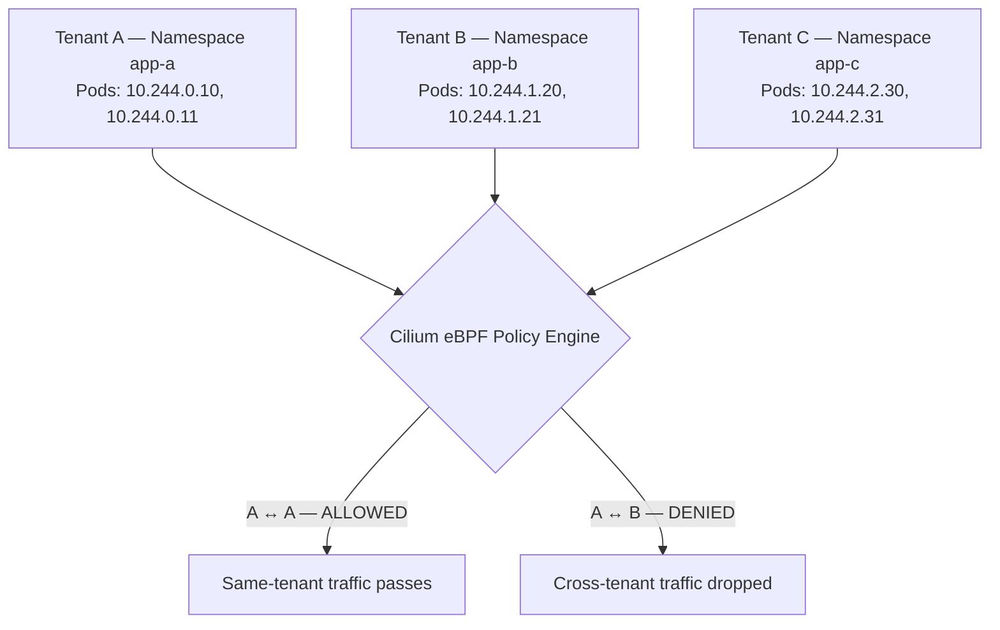

### Безопасность на основе идентичностей

Cilium присваивает каждой конечной точке (поду) **идентичность безопасности** на основе её меток. Политики применяются с использованием этих идентичностей, а не IP-адресов.

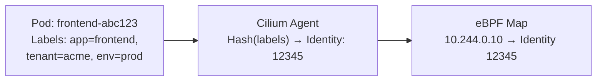

### Применение политик в ядре

Когда пакет передаётся между подами, Cilium применяет политики полностью в пространстве ядра:

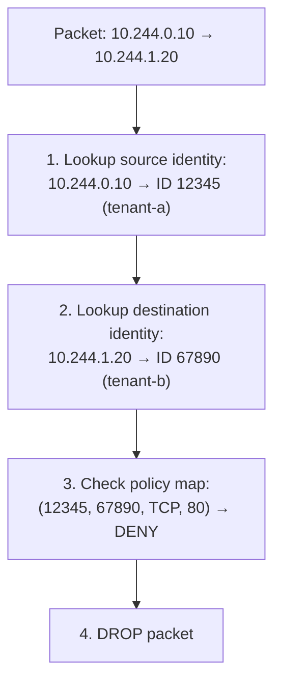

Всё это происходит в пространстве ядра примерно за 100 наносекунд.

### Почему применение политик через eBPF безопасно

| Свойство | Описание |
| --- | --- |
| **Верификатор** | Программы eBPF проверяются перед загрузкой - без сбоев и бесконечных циклов |
| **Изоляция** | Программы выполняются в ограниченном контексте ядра |
| **Нет обхода из пользовательского пространства** | Весь сетевой трафик обязан проходить через хуки eBPF |
| **Атомарные обновления** | Изменения политик атомарны - без состояний гонки |
| **Внутри ядра** | Не нужны переключения контекста, быстрее, чем в пользовательском пространстве |

### Применение на уровне ядра

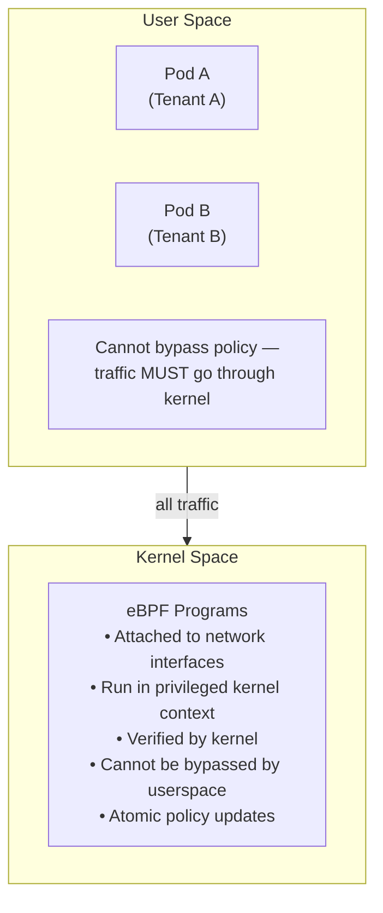

### Запрет по умолчанию и изоляция пространств имён

{}
По умолчанию Kubernetes разрешает весь трафик между подами. Cozystack автоматически
применяет ресурсы CiliumNetworkPolicy и CiliumClusterwideNetworkPolicy
при создании тенанта. Эти политики обеспечивают изоляцию на уровне пространств имён и
ограничивают доступ к системным портам (etcd, kubelet, контроллеры).
{}

Для изоляции Cozystack использует иерархические метки тенантов. Политики сопоставляются
по меткам пространств имён `tenant.cozystack.io/*`, что позволяет родительским тенантам
включать пространства имён дочерних тенантов. Пример:

```yaml
apiVersion: cilium.io/v2
kind: CiliumNetworkPolicy
metadata:
  name: allow-internal-communication
  namespace: tenant-example
spec:
  endpointSelector: {}
  ingress:
    - fromEndpoints:
        - matchLabels:
            k8s:io.cilium.k8s.namespace.labels.tenant.cozystack.io/tenant-example: ""
  egress:
    - toEndpoints:
        - matchLabels:
            k8s:io.cilium.k8s.namespace.labels.tenant.cozystack.io/tenant-example: ""
    - toEntities:
        - kube-apiserver
        - cluster
```

## Наблюдаемость с Hubble

Hubble обеспечивает видимость сетевого трафика для плоскости данных Cilium. Он
входит в сетевой стек Cozystack, но **по умолчанию отключён**, чтобы
минимизировать потребление ресурсов.

Во включённом состоянии Hubble предоставляет:

- Журналы потоков в реальном времени для всего трафика между подами и внешнего трафика
- Видимость DNS-запросов
- Метрики уровня запросов HTTP/gRPC
- Интеграцию с метриками Prometheus
- Веб-интерфейс для визуализации трафика

Чтобы включить Hubble, задайте следующее в конфигурации Cilium:

```yaml
cilium:
  hubble:
    enabled: true
    relay:
      enabled: true
    ui:
      enabled: true
```

Полные сведения о настройке см. в разделе [Enabling Hubble](https://docs.cilium.io/en/stable/observability/hubble/).

## Сводка потоков трафика

### Внешний доступ

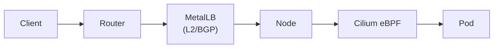

### Изоляция тенантов

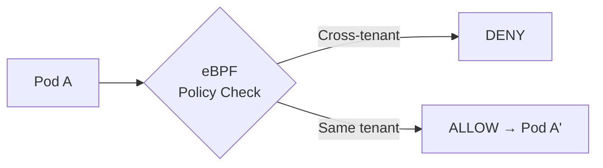
