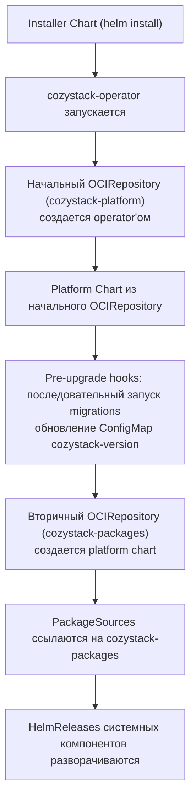
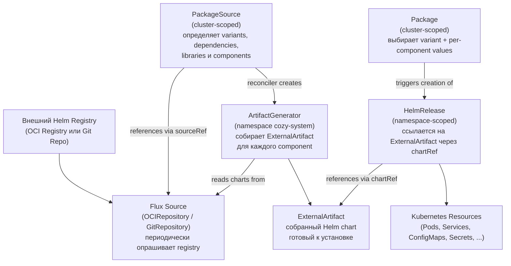
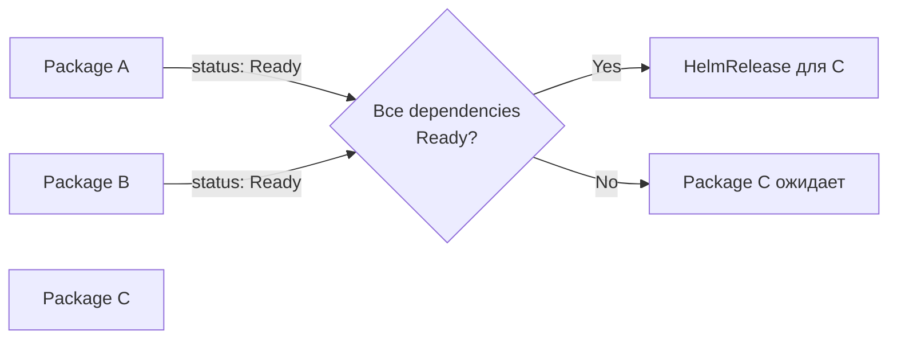
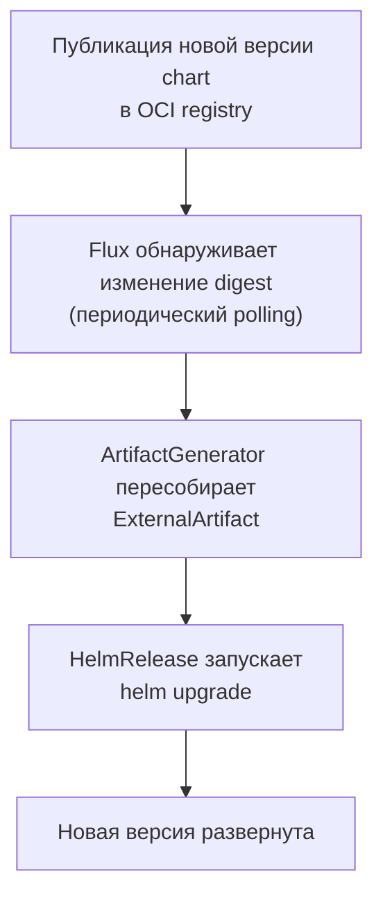
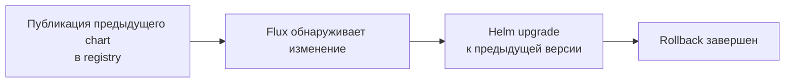
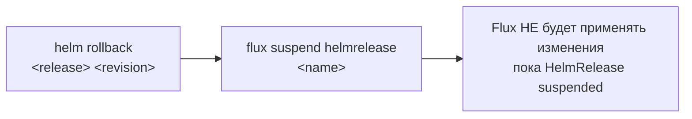
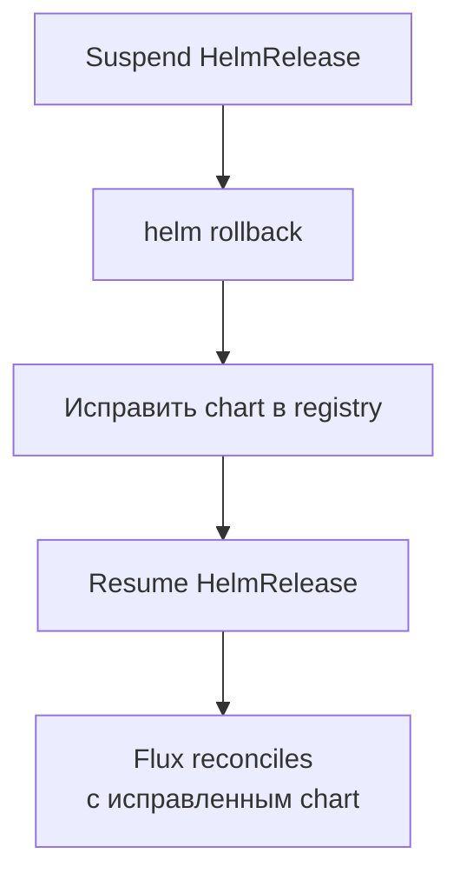
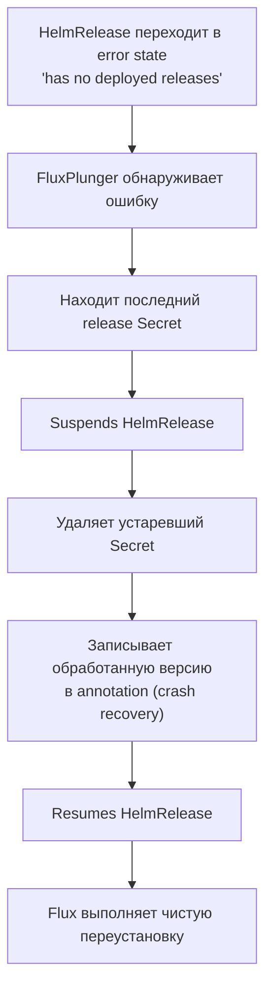
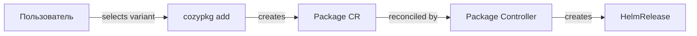

Cozystack — open-source, Kubernetes-native платформа, которая превращает bare-metal или виртуальную инфраструктуру в полноценное multi-tenant cloud.
В основе платформы лежит несколько базовых building blocks:

- **management cluster**, в котором работает сама платформа;
- **tenants**, обеспечивающие строгую иерархическую изоляцию;
- **tenant clusters**, дающие пользователям собственные Kubernetes control planes;
- богатый каталог **managed applications** и виртуальных машин;
- **variants**, собирающие эти компоненты в готовый stack.

Понимание того, как эти концепции связаны друг с другом, поможет планировать, разворачивать и эксплуатировать Cozystack,
независимо от того, строите ли вы внутреннюю developer platform или public cloud service.

## Management Cluster

Cozystack — это система сервисов, работающих в Kubernetes-кластере, обычно развернутом поверх Talos Linux на bare metal или виртуальных машинах.
Такой Kubernetes-кластер называется **management cluster**, чтобы подчеркнуть его роль и отличить от tenant Kubernetes clusters.
Полный доступ к management cluster есть только у администраторов Cozystack.

Management cluster используется для развертывания заранее настроенных приложений: tenants, системных компонентов, managed apps, ВМ и tenant clusters.
Пользователи Cozystack могут взаимодействовать с management cluster через dashboard и API, а также разворачивать managed applications.
Однако у них нет административных прав, и они не могут разворачивать произвольные приложения в management cluster; для этого используются tenant clusters.

## Tenant

**Tenant** в Cozystack — основная единица изоляции и безопасности, похожая на Kubernetes namespace, но с расширенной областью действия.
Каждый tenant представляет изолированную среду со своими ресурсами, сетью и RBAC (role-based access control).
Некоторые cloud providers используют для похожей сущности термин "projects".

Когда Cozystack используется для построения private cloud и внутренней development platform, tenant обычно принадлежит команде или подкоманде.
В hosting business, где Cozystack является основой public cloud, tenant может принадлежать клиенту.

Подробнее: [Tenant System]({}).

## Tenant Cluster

Пользователи могут разворачивать отдельные Kubernetes-кластеры в своих tenants.
Это не namespaces management cluster, а полноценные Kubernetes-in-Kubernetes кластеры.

Tenant clusters — это то, что многие cloud providers называют "managed Kubernetes".
Они используются как development, testing и production environments.

Подробнее: [tenant Kubernetes clusters]({}).

## Managed Applications

Cozystack поставляется с каталогом **managed applications** (services), которые можно разворачивать на платформе с минимальными усилиями.
В него входят relational databases (PostgreSQL, MySQL/MariaDB), NoSQL/queues (Redis, NATS, Kafka, RabbitMQ), HTTP cache, load balancer и другие сервисы.

Tenants, tenant Kubernetes clusters и ВМ также являются managed applications с точки зрения Cozystack.
Они создаются тем же пользовательским workflow и управляются через Helm и Flux, как и другие приложения.

Подробнее: [managed applications]({}).

## Cozystack API

Вместо proprietary API или управления только через UI Cozystack предоставляет функциональность через
[Kubernetes Custom Resources](https://kubernetes.io/docs/concepts/extend-kubernetes/api-extension/custom-resources/)
и стандартный Kubernetes API, доступный через REST API, клиент `kubectl` и Cozystack dashboard.

Такой подход хорошо сочетается с role-based access control.
Неадминистративные пользователи могут использовать `kubectl` для доступа к management cluster,
но их kubeconfig разрешает им создавать custom resources только в своих tenants.

Подробнее: [Cozystack API]({}).

## Variants

Variants — это заранее определенные конфигурации Cozystack, которые задают, какие bundles и components включены.
Каждый variant тестируется, версионируется и гарантированно работает как единое целое.
Они упрощают установку, снижают риск неправильной конфигурации и помогают выбрать подходящий набор функций для вашего развертывания.

Подробнее: [Variants]({}).

## PackageSource и Package

`PackageSource` и `Package` — две Custom Resource Definitions (CRDs), которые управляют всем lifecycle приложений в Cozystack.

- **PackageSource** (cluster-scoped) определяет, что доступно: он ссылается на Flux source (OCIRepository или GitRepository), который опрашивает внешний registry, перечисляет variants, объявляет dependencies и задает components, из которых состоит каждое приложение.
- **Package** (cluster-scoped) определяет, что развернуто: он выбирает variant из PackageSource, передает per-component value overrides и запускает создание HelmRelease, который управляет реальными Kubernetes resources.

Вместе они образуют declarative pipeline: external charts проходят через Flux sources и artifact generators в готовые к установке Helm charts, после чего Packages создают из них работающие workloads.

### OCIRepositories: Platform и Packages

Cozystack использует два ресурса OCIRepository, чтобы управлять update flow и гарантировать выполнение migrations до обновления любых компонентов.

#### Начальный OCIRepository (`cozystack-platform`)

Создается cozystack-operator во время bootstrap. Operator получает platform source URL (например, `oci://ghcr.io/cozystack/cozystack/cozystack-packages`) и создает OCIRepository с именем `cozystack-platform`. Этот repository указывает на artifact platform chart, настраивается через значения installer (`platformSourceUrl`, `platformSourceRef`) и предоставляет platform chart, который создаст migrations и вторичный OCIRepository.

#### Вторичный OCIRepository (`cozystack-packages`)

Создается Helm chart платформы (`packages/core/platform/templates/repository.yaml`). Он копирует spec из `cozystack-platform` и создает новый OCIRepository с именем `cozystack-packages`. Этот repository используется всеми PackageSources (networking, monitoring, postgres-operator и т. д.), содержит все system и application charts и отделяет platform source от component PackageSources.

#### Порядок миграций

Схема с двумя repositories гарантирует, что system migrations выполняются до обновления любых компонентов:



Когда выходит новая версия платформы и кластер обновляется:

1. Начальный OCIRepository (`cozystack-platform`) предоставляет новый platform chart.
2. Во время `helm upgrade` `pre-upgrade` hooks из platform chart последовательно выполняют migrations (от текущей версии к целевой).
3. Каждый migration script выполняет необходимые преобразования и обновляет ConfigMap `cozystack-version`.
4. После завершения migrations platform chart создает или обновляет OCIRepository `cozystack-packages`.
5. PackageSources ссылаются на `cozystack-packages` и запускают reconciliation системных компонентов.

Это гарантирует, что migrations выполняются до обновления компонентов, а migration scripts берутся из той же версии chart, которая разворачивается.

### Reconciliation Flow

Полная цепочка reconciliation от внешнего registry до работающих Kubernetes resources:



Имена ExternalArtifacts строятся по шаблону `<packagesource>-<variant>-<component>`, при этом точки заменяются дефисами, чтобы соответствовать правилам именования Kubernetes. Например, PackageSource `cozystack.keycloak` с variant `default` и component `keycloak` создает `cozystack-keycloak-default-keycloak`.

### Package Dependencies

Variants в PackageSource могут объявлять `dependsOn`, чтобы отложить создание HelmRelease до готовности всех dependencies:



Если все dependencies имеют статус `Ready`, dependent Package продолжает создание своего HelmRelease. Иначе Package остается в состоянии ожидания, пока условия не будут выполнены.

Dependencies в PackageSource используются на двух уровнях:

- **Variant-level** (`spec.variants.dependsOn[]`): ссылается на имена других Packages. PackageReconciler проверяет, что все dependencies готовы, прежде чем создавать HelmReleases. Это гарантирует, что infrastructure packages (например, CNI, storage) полностью запущены до установки dependent packages. Поле `spec.ignoreDependencies` в Package может отключить эту проверку для отдельных dependencies.
- **Component-level** (`spec.variants.components.install.dependsOn[]`): преобразуется в поле `spec.dependsOn[]` ресурса HelmRelease. Эти dependencies обеспечивают правильный порядок установки components внутри package.

### Управление namespaces и values

Когда PackageReconciler создает HelmReleases для Package, он также:

- **Создает namespaces**, объявленные в полях component `Install.namespace`, и задает labels вроде `cozystack.io/system=true` и `pod-security.kubernetes.io/enforce=privileged`, где это необходимо.
- **Передает cluster-wide configuration** через Secret `cozystack-values`. **CozyValuesReplicator** следит за этим Secret в `cozy-system` и копирует его в каждый namespace с label `cozystack.io/system=true`. Каждый HelmRelease ссылается на этот Secret через `valuesFrom`, чтобы все компоненты получали согласованную конфигурацию платформы.

### Update Flow

Когда новая версия chart публикуется в registry, обновления автоматически проходят через reconciliation chain:



Чтобы ускорить синхронизацию и не ждать следующего polling interval (Flux sources находятся в namespace `cozy-system`):

```text
flux reconcile source oci <source-name> --namespace cozy-system
```

Чтобы изменить values приложения без смены версии chart, patch'ите Package CR напрямую.
Values задаются отдельно для каждого component в `spec.components.<component-name>.values`:

```text
kubectl patch package <name> --type merge --patch '{"spec":{"components":{"<component-name>":{"values":{"key":"value"}}}}}'
```

### Rollback Strategies

Есть три подхода к rollback Package, от наиболее до наименее рекомендуемого:

**GitOps rollback (рекомендуется):** опубликуйте предыдущую версию chart в OCI registry. Flux обнаружит изменение и запустит upgrade к "старой" версии через стандартный reconciliation flow.



**Emergency rollback:** выполните `helm rollback` напрямую и suspend HelmRelease, чтобы Flux не применил снова более новую версию. Это обходит GitOps и должно использоваться только в emergency-ситуациях.



**Controlled rollback:** сначала suspend HelmRelease, затем выполните `helm rollback`, исправьте chart в registry и resume HelmRelease.



### Автоматическое восстановление FluxPlunger

FluxPlunger — компонент автоматического восстановления, который обрабатывает распространенную ошибку HelmRelease "has no deployed releases". Такая ошибка возникает, когда состояние release в Helm становится неконсистентным.



Если FluxPlunger аварийно завершится в середине процесса, annotation `flux-plunger.cozystack.io/last-processed-version` позволит ему корректно продолжить работу при следующей reconciliation.

### Summary lifecycle operations

| Действие | Что сделать | Кто обрабатывает |
| --- | --- | --- |
| Обновить версию chart | Опубликовать новый chart в OCI registry | Flux + ArtifactGenerator |
| Обновить values | Patch Package CR | Package controller + HelmRelease |
| Ускорить синхронизацию | `flux reconcile source oci <name>` | Ручной trigger |
| GitOps rollback | Опубликовать предыдущую версию chart в registry | Flux (standard flow) |
| Emergency rollback | `helm rollback` + suspend HelmRelease | Ручное вмешательство |
| Восстановиться после ошибки | Автоматически через FluxPlunger | FluxPlunger controller |

## cozypkg CLI

`cozypkg` — command-line tool для интерактивного управления ресурсами Package и PackageSource.
Он выполняет dependency resolution, выбор variant и безопасное удаление с cascade analysis, чтобы вам не приходилось вручную писать YAML manifests.

### Установка

Готовые binaries для Linux, macOS и Windows (amd64 и arm64) доступны в составе каждого релиза Cozystack.

### Команды

#### `cozypkg add` --- установка packages

Устанавливает один или несколько packages с автоматическим dependency resolution:

```text
cozypkg add cozystack.keycloak cozystack.monitoring
cozypkg add --file packages.yaml
```

Для каждого package команда `cozypkg add`:

1. Находит соответствующий PackageSource в кластере.
2. Предлагает выбрать variant, если доступно несколько вариантов.
3. Разрешает все transitive dependencies (topological sort).
4. Создает Package resources в порядке dependencies-first, пропуская уже установленные packages.

#### `cozypkg list` --- список packages

```text
cozypkg list                          # доступные PackageSources
cozypkg list --installed              # установленные Packages
cozypkg list --installed --components # установленные Packages с деталями components
```

Пример вывода:

```text
NAME                  VARIANT   READY   STATUS
cozystack.networking  cilium    True    reconciliation succeeded, generated 2 helmrelease(s)
cozystack.keycloak    default   False   DependenciesNotReady
```

#### `cozypkg del` --- удаление packages

Безопасно удаляет packages с анализом reverse dependencies:

```text
cozypkg del cozystack.keycloak
```

Перед удалением `cozypkg del` показывает, какие другие установленные packages зависят от целевого, и запрашивает подтверждение. Packages удаляются в reverse topological order (сначала dependents).

#### `cozypkg dot` --- визуализация dependencies

Генерирует dependency graph в формате GraphViz DOT:

```text
cozypkg dot | dot -Tpng > dependencies.png
cozypkg dot --installed --components   # component-level graph установленных packages
```

Отсутствующие dependencies подсвечиваются красным, что помогает быстро находить неполные установки.

### Как cozypkg вписывается в lifecycle



`cozypkg` работает исключительно с custom resources `Package` и `PackageSource`.
Он не взаимодействует с HelmReleases, ArtifactGenerators или Flux sources напрямую — ими управляют controllers, описанные выше.

Вы всегда можете управлять Package resources через `kubectl` вместо `cozypkg`.
CLI лишь автоматизирует выбор variant, порядок dependencies и cascade analysis.
