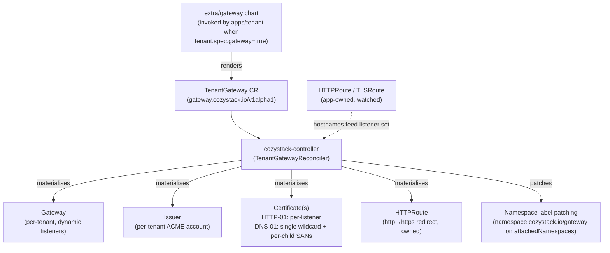
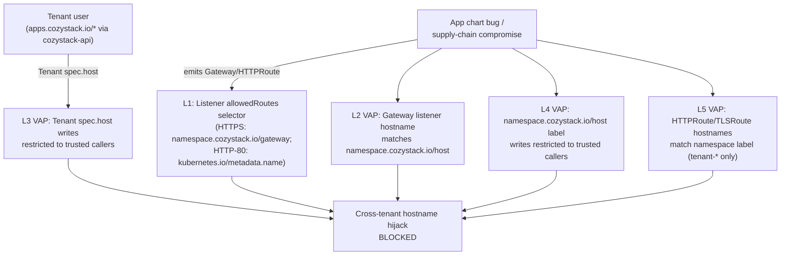

## Обзор

Cozystack поставляет поддержку Gateway API как опциональную альтернативу ingress-nginx. Когда она включена, тенант, явно выбравший её через `tenant.spec.gateway: true`, получает собственный `Gateway` (собственный сервис LoadBalancer, собственный IP балансировщика, собственные Issuer и Certificate для тенанта), материализованный в его собственном пространстве имён. Все остальные тенанты дерева публикуются через Gateway ближайшего предка, владеющего им, - по той же схеме, что и существующее наследование `_namespace.ingress`.

Чарт не рендерит ресурсы `Gateway`, `Issuer` или `Certificate` напрямую. Вместо этого он рендерит один CR `gateway.cozystack.io/v1alpha1 TenantGateway` на каждый включивший опцию тенант, а `cozystack-controller` согласует из него все нижестоящие объекты Gateway API и cert-manager. Это устраняет гонку между Helm и контроллером за `Gateway.spec.listeners`, которую иначе вызывала бы динамическая материализация слушателей на основе маршрутов.

Эта страница описывает архитектуру, модель наследования, выбор режима сертификатов (HTTP-01 по умолчанию или wildcard DNS-01 по выбору), двухуровневую модель безопасности и сценарий миграции с ingress-nginx.

Gateway API и ingress-nginx сосуществуют в одном кластере - режимы выбираются для каждого сервиса / тенанта, а не глобально. Существующие кластеры обновляются с `gateway.enabled=false` и не видят изменений в поведении.

### Поверхность API для тенантов

Тенанты в Cozystack взаимодействуют с платформой исключительно через ресурсы `apps.cozystack.io/*`, обслуживаемые `cozystack-api`; RBAC тенанта не даёт права записи в `gateway.networking.k8s.io/*`, базовые `Namespaces` или `cozystack.io/Package`. В разделе [Безопасность](#безопасность) объясняется, как уровни допуска (admission) выстроены с учётом этого ограничения.

## Архитектура

### Поток согласования



Контроллер:

- Материализует `Gateway`, Issuer тенанта, HTTPRoute для перенаправления и Certificate(ы) из `TenantGateway.spec`.
- Наблюдает за ресурсами `HTTPRoute` и `TLSRoute` по всему кластеру. Для каждого маршрута, прикреплённого к его Gateway, он собирает имена хостов и (в режиме HTTP-01) добавляет HTTPS-слушатель и `Certificate` для каждого приложения.
- В режиме DNS-01 расширяет wildcard-`Certificate` SAN-записями `<child-apex>` + `*.<child-apex>` для каждого тенанта, наследующего через этот Gateway (они обнаруживаются перечислением пространств имён с `namespace.cozystack.io/gateway = <owner>` и чтением их `namespace.cozystack.io/host`), и добавляет по одному HTTPS-слушателю `*.<child-apex>` на каждого наследующего потомка.
- Проставляет метку `namespace.cozystack.io/gateway = <owner>` на каждое пространство имён из `TenantGateway.spec.attachedNamespaces` (системные пространства имён cozy-*, публикуемые через Gateway). Патч сопровождается аннотацией `cozystack.io/gateway-attached-by`, чтобы контроллер знал, какие метки записал он сам, а какие принадлежат чарту `apps/tenant` - метки, записанные чартом, никогда не трогаются. Метки, записанные контроллером, вычищаются, когда пространство имён удаляется из `attachedNamespaces`.
- Разрешает межпространственные конфликты имён хостов: пространства имён `cozy-*` (платформенные сервисы под управлением администратора кластера) выигрывают у пространств имён тенантов; проигравший получает условие `HostnameConflict` под именем контроллера в `Status.Parents`.
- Отказывается молча присваивать уже существующие объекты `Gateway`, `Issuer`, `Certificate` или `HTTPRoute` перенаправления, которые носят выведенное контроллером имя, но не имеют `OwnerReference` на TenantGateway. Вместо перезаписи вручную закреплённой конфигурации операторы видят явное условие `Ready=False/ReconcileError`.

### Путь трафика

```mermaid
flowchart LR
    CLIENT["External client"]
    LB["Cluster LB allocator<br/>(MetalLB / Cilium LB-IPAM /<br/>robotlb / externalIPs)"]
    ENV["cilium-envoy DaemonSet<br/>(L7 termination / L4 passthrough)"]
    GW["Gateway 'cozystack'<br/>(owning tenant namespace)"]
    HTR["HTTPRoute<br/>dashboard, keycloak, harbor, bucket, ..."]
    TLR["TLSRoute<br/>kubernetes-api, vm-exportproxy,<br/>cdi-uploadproxy"]
    CM["cert-manager<br/>(per-tenant Issuer + Certificate(s))"]
    SVC["Service<br/>(backend)"]

    CLIENT -->|DNS → LB IP| LB
    LB --> ENV
    ENV --> GW
    GW --> HTR
    GW --> TLR
    HTR --> SVC
    TLR --> SVC
    CM -.->|issues Certificate(s)| GW
```

- **`GatewayClass`** задаётся для каждого TenantGateway через настраиваемое оператором поле чарта `gatewayClassName` (по умолчанию `cilium`). У тенантов нет RBAC на запись CR `TenantGateway`, поэтому самостоятельно выбрать класс они не могут.
- **Один `Gateway` на тенанта-владельца** в пространстве имён этого тенанта. HTTPRoute / TLSRoute всех наследующих потомков прикрепляются к тому же Gateway через межпространственный ParentRef; слияния между разными Gateway нет.
- **Envoy** работает как DaemonSet Cilium (`cilium.envoy.enabled=true`) и обеспечивает как терминацию TLS (HTTPS-слушатели), так и сквозную передачу TLS (выделенные слушатели для kubeapiserver и прокси экспорта ВМ KubeVirt / загрузки CDI). `envoy.enabled=true` - значение по умолчанию для новых установок Cozystack; операторам, обновляющим существующий кластер, где значения Cilium были заданы явно, стоит убедиться, что флаг включён, прежде чем включать `gateway.enabled`.
- **IP LoadBalancer** выделяется тем механизмом балансировки, который администратор кластера настроил на уровне платформы, - так же, как сегодня у ingress-nginx. Cozystack поставляет установленный MetalLB, но не рендерит из чарта тенанта никаких `IPAddressPool` / `L2Advertisement` / `BGPAdvertisement` / `CiliumLoadBalancerIPPool`. Администраторы подключают тот аллокатор, который подходит их окружению (пул MetalLB с L2 / BGP, Cilium LB-IPAM с анонсированием, [robotlb](https://github.com/aenix-io/robotlb) для парка Hetzner Robot или `Service.spec.externalIPs` как способ ручного закрепления). API тенанта остаётся независимым от механизма - поля `gatewayIP` в CR Tenant нет. Чтобы закрепить конкретный адрес, оператор заранее создаёт сервис LoadBalancer с заданным `loadBalancerIP` или выдаёт тенанту ссылку на именованный пул, управляемый администратором.
- **`externalTrafficPolicy`**: сервис LoadBalancer, обслуживающий Gateway, создаётся Cilium и использует значение Kubernetes по умолчанию (`Cluster`). Поэтому исходные IP внешних клиентов транслируются (NAT) в адрес принимающего узла. Это отличается от прежней публикации через ingress-nginx (`publishing.exposure: loadBalancer`), которая устанавливает `externalTrafficPolicy: Local` и ограничивает IP балансировщика узлами с подами ingress. Операторы, которым нужно сохранение исходного IP для трафика Gateway API, должны самостоятельно пропатчить сервис или поставить перед ним вышестоящий балансировщик с поддержкой PROXY-protocol.

### Раскладка слушателей на Gateway тенанта

Gateway тенанта всегда материализует HTTP-слушатель:

| # | Имя | Протокол | Порт | Имя хоста | Назначение |
| --- | --- | --- | --- | --- | --- |
| 1 | `http` | `HTTP` | 80 | нет (wildcard) | ACME `/.well-known/acme-challenge/*` + HTTPRoute перенаправления HTTP→HTTPS |

Плюс HTTPS-слушатели, зависящие от режима сертификатов:

- **Режим HTTP-01 (по умолчанию):** по одному HTTPS-слушателю на каждое имя хоста прикреплённого HTTPRoute, с именем `https-<first-label>-<8-hex>`. Шестнадцатеричный суффикс - это первые 32 бита `sha256(hostname)`, поэтому два разных имени хоста с одинаковой первой меткой (`harbor.foo.example.com` и `harbor.alice.example.com`) получают разные имена слушателей. `tls.certificateRefs` каждого слушателя указывает на его собственный `Certificate` с именем `<tgw>-<first-label>-<8-hex>-tls`, также выпускаемый автоматически.
- **Режим DNS-01 (по выбору):** слушатели `https` (`*.<owner apex>`) и `https-apex` (`<owner apex>`), использующие один wildcard-Certificate, плюс по одному слушателю `https-child-<first-label>-<8-hex>` на apex каждого наследующего потомка (ссылающемуся на тот же wildcard-сертификат, чьи dnsNames расширены SAN-записями `<child-apex>` + `*.<child-apex>`).

Плюс по одному дополнительному слушателю на каждый сервис со сквозной передачей TLS (см. [TLSRoute (TLS passthrough)](#tlsroute-tls-passthrough)).

`allowedRoutes.namespaces` слушателей использует два разных селектора в зависимости от роли слушателя:

- **HTTPS-слушатели и слушатели сквозного TLS** сопоставляются по метке `namespace.cozystack.io/gateway` и допускают маршруты из любого пространства имён, чья метка равна имени пространства имён тенанта-владельца (например, `tenant-root`, `tenant-alice` - имя пространства имён, а не «голое» имя тенанта). Это точка опоры наследования - пространство имён каждого наследующего потомка несёт то же значение метки (записанное чартом `apps/tenant`), а системные пространства имён cozy-* из `attachedNamespaces` получают ту же метку от контроллера.
- **Простой HTTP-слушатель (порт 80)** использует строго более узкий белый список по встроенной метке `kubernetes.io/metadata.name` - только само пространство имён тенанта-владельца (где живёт принадлежащий контроллеру HTTPRoute перенаправления) и `cozy-cert-manager` (HTTPRoute для проверок ACME HTTP-01). Поэтому HTTPRoute приложений, прикрепляющиеся к Gateway по имени хоста, не могут привязаться к порту 80 и отдавать незашифрованный трафик.

HTTPS-слушатели дополнительно ограничивают `allowedRoutes.kinds` до `HTTPRoute` (а слушатели сквозного TLS - до `TLSRoute`), не позволяя GRPCRoute / TCPRoute / UDPRoute прикрепляться вне зоны покрытия VAP по именам хостов маршрутов.

## Включение Gateway API

Gateway API включается на двух уровнях. Оба значения по умолчанию остаются `false`; обновления не переключают тенантов незаметно.

### 1. Флаг на уровне платформы

Установите `gateway.enabled: true` в Package `cozystack.cozystack-platform`. Полные таблицы значений `gateway.*` и `publishing.certificates.dns01.*` см. в [справочнике Platform Package]({}).

```yaml
apiVersion: cozystack.io/v1alpha1
kind: Package
metadata:
  name: cozystack.cozystack-platform
spec:
  variant: isp-full
  components:
    platform:
      values:
        publishing:
          host: example.org
        gateway:
          enabled: true
          attachedNamespaces:
            - cozy-cert-manager
            - cozy-dashboard
            - cozy-keycloak
            - cozy-system
            - cozy-harbor
            - cozy-bucket
            - cozy-kubevirt
            - cozy-kubevirt-cdi
            - cozy-monitoring
            - cozy-linstor-gui
            - default
```

Пространство имён `default` включено потому, что `TLSRoute` Kubernetes API (поставляемый пакетом cozystack-api) живёт рядом с сервисом `kubernetes`, на который он указывает, а тот всегда находится в `default`.

Включение `gateway.enabled=true` задействует три вещи:

- `ClusterIssuer.spec.acme.solvers` в cert-manager переключается с `http01.ingress.ingressClassName` на `http01.gatewayHTTPRoute`, прикрепляющийся к Gateway публикующего тенанта.
- Шаблоны публикуемых сервисов (dashboard, keycloak, grafana, alerta) перестают рендерить свой `Ingress` и начинают рендерить свой `HTTPRoute`.
- Сервисы со сквозной передачей TLS (cozystack-api, vm-exportproxy, cdi-uploadproxy) перестают рендерить свой `Ingress` и начинают рендерить `TLSRoute`, прикреплённый к выделенному слушателю Passthrough.

Список `attachedNamespaces` перечисляет системные пространства имён `cozy-*`, маршруты которых должны публиковаться через Gateway тенанта-владельца. Контроллер проставляет `namespace.cozystack.io/gateway = <owner>` на каждую запись, чтобы её маршруты проходили селектор `allowedRoutes` слушателя. Пространства имён тенантов (`tenant-*`) тоже могут быть в списке - они просто получают ту же метку наряду с записями `cozy-*`. Статический список не является вектором межтенантного перехвата; эту роль закрывают уровни 1, 2, 4 и 5 в разделе [Безопасность](#безопасность).

### 2. Gateway для отдельного тенанта

Тенант получает собственный CR `TenantGateway` (а через контроллер - собственные `Gateway`, `Issuer`, `Certificate`(ы) и сервис `LoadBalancer`) только тогда, когда явно запросил это через `tenant.spec.gateway: true`. Все остальные тенанты дерева публикуются через Gateway ближайшего предка, владеющего им, - по той же схеме, что и нынешнее наследование `_namespace.ingress`. По умолчанию `gateway` не задан, что трактуется как `false` (наследовать).

Отдельный Gateway имеет смысл, когда:

- тенанту нужен собственный IP балансировщика (DNS уже закреплён за конкретным адресом, правило межсетевого экрана на этот адрес);
- apex тенанта не выводится из родительского (оператор задал собственный `tenant.spec.host`, например `customer1.example`, а не поддомен - wildcard-сертификат / Issuer предка не может его покрыть);
- тенант хочет собственную учётную запись ACME / Issuer (отдельный бюджет ограничений частоты, отдельный удостоверяющий центр).

В остальных случаях оставьте `gateway` незаданным и наследуйте.

```yaml
# Tenant 'alice' under tenant-root: apex is derived as alice.<parent apex>,
# inherits the parent's Gateway. No separate LB IP, no separate Issuer.
apiVersion: apps.cozystack.io/v1alpha1
kind: Tenant
metadata:
  name: alice
  namespace: tenant-root
spec: {}
```

```yaml
# Tenant 'acme' with a fully independent apex: must opt in to own a
# Gateway, because the parent's cert/Issuer can't cover customer1.example.
apiVersion: apps.cozystack.io/v1alpha1
kind: Tenant
metadata:
  name: acme
  namespace: tenant-root
spec:
  host: customer1.example
  gateway: true
```

```yaml
# Tenant 'bob' under tenant-root: derived apex, but wants its own
# LB IP and ACME account (DNS pinned to a specific address).
apiVersion: apps.cozystack.io/v1alpha1
kind: Tenant
metadata:
  name: bob
  namespace: tenant-root
spec:
  gateway: true
```

Установка собственного значения `tenant.spec.host` зарезервирована за администраторами кластера и сервисными учётными записями cozystack/Flux (обеспечивается во время выполнения политикой `cozystack-tenant-host-policy`, см. [Безопасность](#безопасность)).

### Наследование

Чарт `apps/tenant` записывает `namespace.cozystack.io/gateway: <owner-namespace>` на каждое пространство имён тенанта, где значение - либо имя собственного пространства имён этого тенанта (когда `gatewayEffective` разрешается в `true`), либо имя пространства имён наследуемого предка (при наследовании). То же значение попадает в `_namespace.gateway` внутри секрета `cozystack-values` тенанта, поэтому вендоренные приложения (harbor, bucket, …) рендерят свои HTTPRoute с `parentRefs.namespace`, указывающим на пространство имён владельца.

Чтобы проверить, через какой Gateway сейчас наследуется данное пространство имён тенанта:

```bash
kubectl get namespace <tenant-ns> \
  -o jsonpath='{.metadata.labels.namespace\.cozystack\.io/gateway}{"\n"}'
```

Пустое значение означает, что ни у одного предка в цепочке нет `tenant.spec.gateway: true`, и маршруты в этом пространстве имён не прикрепятся ни к какому Gateway.

Селектор `allowedRoutes.namespaces.selector` слушателя Gateway-владельца сопоставляется ровно с этой меткой, поэтому один и тот же селектор допускает маршруты из каждого пространства имён дерева владельца - как потомков, так и записей cozy-* из `attachedNamespaces`. Отдельного ReferenceGrant на каждого потомка нет: селектор по метке и есть межпространственный шлюз.

В режиме DNS-01 контроллер расширяет wildcard-`Certificate` Gateway-владельца SAN-записями `<child-apex>` + `*.<child-apex>` для каждого наследующего потомка (они обнаруживаются перечислением пространств имён с тем же значением `namespace.cozystack.io/gateway` и чтением их `namespace.cozystack.io/host`) и добавляет HTTPS-слушатель `*.<child-apex>` на каждый apex потомка. Без этого расширения одноуровневый wildcard родителя не может покрыть имя хоста маршрута потомка (`harbor.alice.example.org` на две метки глубже родительского `*.example.org`).

Проверка ACME DNS-01 должна пройти для каждой SAN-записи, а значит, настроенная учётная запись DNS-провайдера должна уметь записывать TXT-записи под каждым уровнем apex, который обслуживает родитель. Для глубоко вложенных наследующих потомков это требует либо делегирования зоны, либо учётных данных провайдера с правами на все уровни apex. Режим HTTP-01 не затронут - каждая проверка на отдельный слушатель выполняется для конкретного имени хоста.

Тенант, включивший собственный Gateway, становится отдельной границей: отдельный `Gateway`, отдельные `Issuer` и учётная запись ACME, отдельные `Certificate`(ы), собственное подмножество наследующих потомков. Дочерние тенанты под ним не разделяют состояние проверок HTTP-01 с прародителем.

## Режим сертификатов: HTTP-01 (по умолчанию) или DNS-01 (по выбору)

`publishing.certificates.solver` определяет, как Issuer тенанта получает TLS-сертификаты. Полный набор ключей провайдеров `publishing.certificates.dns01.*` см. в [справочнике Platform Package]({}).

### HTTP-01 (по умолчанию)

Работает из коробки, дополнительная настройка не требуется. Контроллер:

- Рендерит ACME `Issuer` в пространстве имён тенанта с солвером `http01.gatewayHTTPRoute`, указывающим на собственный Gateway тенанта / слушатель `http`.
- Наблюдает за HTTPRoute / TLSRoute, прикреплёнными к Gateway (с parentRefs на него). Для каждого нового имени хоста он добавляет HTTPS-слушатель и `Certificate` этого приложения (dnsNames содержит ровно это имя хоста).
- Именование слушателей приложений: `https-<first-label>-<8-hex>` (например, `https-harbor-deadbeef`).
- Именование сертификатов приложений: `<tgw>-<first-label>-<8-hex>-tls`.

Добавление приложения тенанта - будь то под тенантом-владельцем или под любым наследующим потомком - сводится к развёртыванию его HTTPRoute. Правки платформенного Package не нужны. Платформенные сервисы cozy-* (dashboard, keycloak, grafana, alerta, cozystack-api, vm-exportproxy, cdi-uploadproxy) по-прежнему управляются `publishing.exposedServices`, как и в схеме с ingress, - при `gateway.enabled=true` свой HTTPRoute / TLSRoute рендерят только сервисы из этого списка.

### DNS-01 (по выбору)

Установите `publishing.certificates.solver: dns01` и выберите провайдера:

| `publishing.certificates.dns01.provider` | Чарт проверяет заранее | Оператор должен предоставить |
| --- | --- | --- |
| `cloudflare` (по умолчанию) | (ничего - чарт никогда не падает) | Secret с именем из `cloudflare.secretName` (по умолчанию `cloudflare-api-token-secret`), содержащий API-токен Cloudflare под ключом из `cloudflare.secretKey` (по умолчанию `api-token`) |
| `route53` | `route53.region` (чарт падает на рендере, если пусто) | Либо IRSA / instance profile, либо `route53.secretName`, указывающий на Secret с секретным ключом доступа IAM под `route53.secretKey` (по умолчанию `secret-access-key`); опционально `route53.accessKeyID` |
| `digitalocean` | (ничего) | Secret с именем из `digitalocean.secretName` (по умолчанию `digitalocean-api-token-secret`), содержащий API-токен DigitalOcean под `digitalocean.secretKey` (по умолчанию `access-token`) |
| `rfc2136` | `rfc2136.nameserver` (чарт падает на рендере, если пусто) | `rfc2136.tsigKeyName` и `rfc2136.secretName`; Secret содержит материал ключа TSIG под `rfc2136.secretKey` (по умолчанию `tsig-secret-key`); `rfc2136.tsigAlgorithm` по умолчанию `HMACSHA256` |

Чарт вызывает `fail()` на этапе рендера только для ключей из второго столбца; остальное проверяется cert-manager во время проверки ACME, поэтому неправильно настроенный провайдер даёт `Challenge`, застрявший в `Pending`, а не ошибку рендера чарта.

Режим DNS-01 рендерит один wildcard-`Certificate`, покрывающий `<owner apex>` и `*.<owner apex>`, плюс соответствующие слушатели `https` (`*.<owner apex>`) и `https-apex` (`<owner apex>`). Новые приложения, публикуемые под apex, используют существующий wildcard-сертификат без выпуска отдельного сертификата на слушатель. Для каждого наследующего дочернего тенанта контроллер расширяет dnsNames wildcard-сертификата SAN-записями `<child-apex>` + `*.<child-apex>` и добавляет слушатель `*.<child-apex>`.

Платформенный чарт записывает конфигурацию провайдера в ключи `_cluster.dns01-*`, которые используются и чартом gateway отдельного тенанта (рендерящим CR TenantGateway), и общекластерными ClusterIssuer `letsencrypt-prod` / `letsencrypt-stage`, применяемыми в прежней схеме с ingress. Оба пути согласованы в том, какой провайдер активен.

Выбирайте DNS-01, когда вам нужен именно wildcard-сертификат - долгоживущий кластер со множеством приложений под одним apex, глубокие деревья наследования или жёсткие ограничения частоты Let's Encrypt. Gateway API ограничивает `Gateway.spec.listeners` 64 записями; HTTP-01 добавляет по одному HTTPS-слушателю на каждое публикуемое имя хоста (плюс обязательный слушатель `http` и слушатели сквозного TLS), поэтому развёртывание с одним тенантом, приближающееся к 60+ опубликованным приложениям на HTTP-01, упрётся в лимит, и отрендеренный `Gateway` не пройдёт допуск. DNS-01 сворачивает все имена хостов под apex в небольшое фиксированное число слушателей.

## Маршрутизация по сервисам

При `gateway.enabled=true` следующие сервисы переключаются с `Ingress` на ресурсы Gateway API. Столбец **Условие рендера** отличает сервисы, которые всегда рендерят свой маршрут при включённом флаге платформы, от тех, которым дополнительно нужна запись в `publishing.exposedServices` (и от приложений тенантов, зависящих от заполненности `_namespace.gateway`).

### HTTPRoute (терминация TLS на Gateway)

| Сервис | Пространство имён | Имя `HTTPRoute` | Бэкенд | Слушатель | Условие рендера |
| --- | --- | --- | --- | --- | --- |
| dashboard | `cozy-dashboard` | `dashboard` | `incloud-web-gatekeeper:8000` | свой `https-dashboard-...` (HTTP-01) или `https` (DNS-01) | `gateway.enabled` И `dashboard` в `publishing.exposedServices` |
| keycloak | `cozy-keycloak` | `keycloak` | `keycloak-http:80` | так же | `gateway.enabled` |
| grafana | `cozy-monitoring` | `grafana` | `grafana-service:3000` | так же | `gateway.enabled` |
| alerta | `cozy-monitoring` | `alerta` | `alerta:80` | так же | `gateway.enabled` |
| harbor | пространство имён тенанта | `<release-name>` | `<release-name>:80` | Gateway тенанта-владельца | задан `_namespace.gateway` (любой предок включил опцию) |
| bucket | пространство имён тенанта | `<bucket-name>-ui` | `<bucket-name>-ui:8080` | Gateway тенанта-владельца | задан `_namespace.gateway` |

Солвер HTTP-01 cert-manager размещает свой короткоживущий `HTTPRoute` на слушателе `http` того же Gateway с сопоставлением по пути `/.well-known/acme-challenge/`. Более специфичное сопоставление пути выигрывает у общего HTTPRoute перенаправления HTTP→HTTPS.

### TLSRoute (TLS passthrough)

Сервисы, которым нужна сквозная передача на основе SNI (клиенты предъявляют сертификаты, TLS терминируется на бэкенде), используют `TLSRoute` на выделенном слушателе Passthrough. По одному слушателю на сервис, имя хоста ограничено FQDN этого сервиса:

| Сервис | Пространство имён | Имя `TLSRoute` | Бэкенд | Слушатель | Условие рендера |
| --- | --- | --- | --- | --- | --- |
| Kubernetes API | `default` | `kubernetes-api` | `kubernetes:443` | `tls-api` | `gateway.enabled` И `api` в `publishing.exposedServices` |
| Экспорт ВМ KubeVirt | `cozy-kubevirt` | `vm-exportproxy` | `vm-exportproxy:443` | `tls-vm-exportproxy` | `gateway.enabled` И `vm-exportproxy` в `publishing.exposedServices` |
| Загрузка CDI KubeVirt | `cozy-kubevirt-cdi` | `cdi-uploadproxy` | `cdi-uploadproxy:443` | `tls-cdi-uploadproxy` | `gateway.enabled` И `cdi-uploadproxy` в `publishing.exposedServices` |

Все три слушателя Passthrough (`tls-api`, `tls-vm-exportproxy`, `tls-cdi-uploadproxy`) рендерятся на Gateway всегда - контроллер материализует по одному на каждую запись в значении чарта `tlsPassthroughServices` (по умолчанию: `[api, vm-exportproxy, cdi-uploadproxy]`). `publishing.exposedServices` на самом деле управляет соответствующим шаблоном `TLSRoute` в каждом вышестоящем чарте: если сервис удалён из `publishing.exposedServices`, его слушатель по-прежнему существует, но к нему ничего не прикрепляется, и трафик не допускается.

`TLSRoute` в v1.5.x поставляется из экспериментального канала Gateway API (CRD `gateway.networking.k8s.io/v1alpha2`). В апстриме он переходит в `v1`; Cozystack последует за переименованием, когда оно выйдет.

## Безопасность

Тенанты в Cozystack взаимодействуют с платформой исключительно через ресурсы `apps.cozystack.io/*` (Tenant, Bucket, Kubernetes, …), обслуживаемые `cozystack-api`. RBAC тенанта (`cozy:tenant:*`, агрегируемый в RoleBinding в собственном пространстве имён тенанта) не даёт права записи в `gateway.networking.k8s.io/*`, базовые `Namespaces` или `cozystack.io/Package`. Описанные ниже защиты делятся на две группы по тому, от кого они защищают: большинство из пяти уровней не защищают от ввода пользователя-тенанта (соответствующий RBAC ему изначально не выдан); они защищают от ошибок в cozystack-controller / Flux, компрометации цепочки поставки чарта приложения и ошибок типа «сбитый с толку помощник» со стороны администратора кластера. Все проверки на этапе допуска работают по принципу fail-closed (`failurePolicy: Fail`, `validationActions: [Deny]`).

**Шлюз для ввода пользователя-тенанта** - уровень 3 (`cozystack-tenant-host-policy`). `Tenant.spec.host` - то самое задаваемое пользователем поле, которое проявляется как граница безопасности на уровне имён хостов; оно проверяется при каждом Create / Update через цепочку допуска `cozystack-api`.

**Эшелонированная защита** - уровни 1, 2, 4, 5. Сегодняшняя модель угроз - ошибки чартов, ошибки контроллера, компрометация цепочки поставки чарта приложения и ошибки администратора кластера; у тенантов нет RBAC для прямой записи Gateway или HTTPRoute. Если этот RBAC когда-нибудь расширится (будущий RoleBinding, агрегированная через CRD роль, включающая `gateway.networking.k8s.io/*`, чарт приложения, выдающий своей ServiceAccount права записи маршрутов), эти уровни продолжат применять те же ограничения имён хостов к новому вызывающему - они не обходятся вводом тенанта, просто сейчас им не задействуются.

Записи `tenant-*` в `gateway.attachedNamespaces` разрешены намеренно: вектор межтенантного перехвата - это селектор меток слушателя (закрытый уровнями 1, 2, 4 и 5), а не статический список прикрепления, поэтому пространства имён `tenant-*` в списке просто получают метку прикрепления к gateway наряду с записями cozy-*.



### Уровень 1 - селектор пространств имён `allowedRoutes` слушателя

Каждый слушатель на Gateway тенанта закрепляет `allowedRoutes.namespaces.from: Selector`. Механика селектора различается по роли слушателя:

- **HTTPS-слушатели и слушатели сквозного TLS** используют `matchLabels: { namespace.cozystack.io/gateway: <owner-namespace> }`. Значение метки - пространство имён TenantGateway: для `tenant-root` это `tenant-root`, для `tenant-alice` - `tenant-alice` (то есть имя пространства имён, а не «голое» имя тенанта). Метку записывает чарт `apps/tenant` на каждое пространство имён тенанта (имя собственного пространства имён при владении Gateway, имя пространства имён наследуемого предка в остальных случаях) и проставляет контроллер на каждое пространство имён из `attachedNamespaces`. Пространства имён без совпадающего значения не могут прикрепить к этим слушателям ни один HTTPRoute / TLSRoute.
- **Простой HTTP-слушатель (порт 80)** использует строго более узкий белый список `matchExpressions` по встроенной метке `kubernetes.io/metadata.name` - только собственное пространство имён тенанта-владельца (где живёт принадлежащий контроллеру HTTPRoute перенаправления) и `cozy-cert-manager` (HTTPRoute проверок ACME HTTP-01). Поэтому HTTPRoute приложений, прикрепляющиеся по имени хоста, не могут привязаться к порту 80 и незаметно отдавать незашифрованный трафик.

HTTPS-слушатели дополнительно ограничивают `allowedRoutes.kinds` до `HTTPRoute` (слушатели сквозного TLS - до `TLSRoute`), не позволяя `GRPCRoute` / `TCPRoute` / `UDPRoute` прикрепляться вне зоны покрытия VAP уровня 5.

### Уровень 2 - `cozystack-gateway-hostname-policy`

`ValidatingAdmissionPolicy`, ограниченная операциями CREATE/UPDATE `Gateway` группы `gateway.networking.k8s.io` в версиях `v1` и `v1beta1` (так что кластер, всё ещё обслуживающий Gateway `v1beta1`, тоже покрыт). CEL читает `namespaceObject.metadata.labels["namespace.cozystack.io/host"]` и отклоняет любой слушатель, чьё имя хоста не равно этому значению и не является его поддоменом. `matchConditions` ограничивают VAP только пространствами имён `tenant-*` - Gateway в посторонних пространствах имён (например, `kube-system`) не затрагиваются.

Поскольку VAP читает метку пространства имён (а не общекластерный ConfigMap), тенант с полностью независимым apex-доменом (например, `customer1.example`, не поддомен apex платформы) валидируется корректно - VAP не предполагает иерархию поддоменов.

### Уровень 3 - `cozystack-tenant-host-policy`

`ValidatingAdmissionPolicy`, ограниченная операциями CREATE/UPDATE `apps.cozystack.io/v1alpha1 Tenant`. Отклоняет установку или изменение `spec.host`, если вызывающий не входит в группу `system:masters` и не является одним из `system:serviceaccounts:cozy-system`, `system:serviceaccounts:cozy-cert-manager`, `system:serviceaccounts:cozy-fluxcd`, `system:serviceaccounts:kube-system`. Тенанты по-прежнему могут создавать тенантов с пустым `spec.host` (обычный поток наследования).

Это закрывает путь, при котором пользователь-тенант создаёт Tenant с `spec.host=dashboard.example.org`, чтобы чарт тенанта записал перехваченную метку в его пространство имён.

`cozystack-api` - это агрегированный APIServer с собственной реализацией. REST-обработчик CR Tenant в `pkg/registry/apps/application/rest.go` явно вызывает колбэки `createValidation` / `updateValidation` / `deleteValidation` в Create / Update / Delete - в отличие от `genericregistry.Store`, пользовательские REST-обработчики должны подключать эти хуки сами. С подключёнными хуками каждая ValidatingAdmissionPolicy и ValidatingWebhook, ограниченная `apps.cozystack.io/*`, срабатывает на всех трёх операциях, как того требует контракт apiserver.

### Уровень 4 - `cozystack-namespace-host-label-policy`

`ValidatingAdmissionPolicy`, ограниченная операциями CREATE/UPDATE базового `v1 Namespace`. Считает `namespace.cozystack.io/host` фактически неизменяемой: отклоняет любое **изменение** значения (включая переход от пустого к заданному, что покрывает первые записи и на CREATE, и на UPDATE), если вызывающий не входит в тот же белый список доверенных вызывающих, что и на уровне 3. Идемпотентные повторные применения **того же** значения разрешены любому вызывающему - фактическое сообщение об ошибке CEL («namespace label namespace.cozystack.io/host is immutable once set») это отражает. Устанавливать или менять значение метки могут только сервисные учётные записи cozystack/Flux (которые применяют чарт тенанта).

В сочетании с уровнем 3 пользователь-тенант не может установить или изменить свой хост ни через CR Tenant, ни через метку пространства имён.

### Уровень 5 - `cozystack-route-hostname-policy` (HTTPRoute) и `cozystack-route-hostname-policy-tls` (TLSRoute)

Пара объектов `ValidatingAdmissionPolicy` с одинаковым CEL-выражением. `cozystack-route-hostname-policy` нацелена на CREATE/UPDATE `HTTPRoute` группы `gateway.networking.k8s.io` (`v1` и `v1beta1`); `cozystack-route-hostname-policy-tls` - на `TLSRoute` в `v1alpha2`. Обе ограничены пространствами имён `tenant-*` (cozy-* управляются администратором кластера, и им доверено публиковаться под любым apex) и отклоняют любую запись `spec.hostnames`, которая не равна метке `namespace.cozystack.io/host` пространства имён и не является её поддоменом. **Fail-closed при отсутствии метки** - пространство имён `tenant-*` без `namespace.cozystack.io/host` отклоняется, а не молча пропускается. Операторы, выполняющие `kubectl get validatingadmissionpolicy`, увидят оба объекта.

Это эшелонированная защита от ошибки чарта приложения или компрометации цепочки поставки, генерирующей ресурсы Gateway API вне apex тенанта, - тенанты в Cozystack по замыслу не имеют RBAC `gateway.networking.k8s.io/*`, так что это не защита от пользователя-тенанта. Внутриapex-ный межпространственный случай (чарт тенанта, претендующий на имя хоста, принадлежащее приложению `cozy-*`) обрабатывается контроллером на этапе согласования - см. [Разрешение HostnameConflict](#разрешение-hostnameconflict) ниже.

Допустимый суффикс хоста - всегда значение метки `namespace.cozystack.io/host` самого пространства имён: у уровня 5 нет особого случая для `tenant-root` и нет жёстко заданного правила выведения. Что бы чарт apps/tenant ни записал в эту метку (выведенное `<name>.<parent apex>` для наследующих потомков, `publishing.host` кластера для `tenant-root`, заданный оператором `tenant.spec.host` для тенантов с собственным apex), - именно этим должен оканчиваться каждый маршрут в этом пространстве имён. Тенант с независимым apex (`customer1.example` вместо поддомена) обрабатывается корректно, потому что VAP читает метку, а не предполагает иерархию поддоменов.

### Разрешение HostnameConflict

Когда два маршрута из разных пространств имён претендуют на одно имя хоста, контроллер выбирает победителя детерминированно:

- Маршрут из пространства имён `cozy-*` (платформенный сервис под управлением администратора кластера) выигрывает у маршрута из любого другого пространства имён.
- В пределах одного приоритетного уровня выигрывает маршрут с лексикографически наименьшей парой `<namespace>/<name>`.

Проигравший маршрут получает `Accepted=False` с `Reason=HostnameConflict` в `Status.Parents` под именем контроллера (`gateway.cozystack.io/tenantgateway-controller`). Записи статуса других контроллеров (Cilium и т.д.) не затрагиваются.

### Защита от захвата чужих объектов

Шесть путей согласования отказываются молча перезаписывать или присваивать уже существующее состояние, которое носит выведенное контроллером имя / аннотацию, но не происходит от этого `TenantGateway`:

- `Gateway` (именуется по TenantGateway)
- `HTTPRoute` перенаправления (`<tgw>-http-redirect`)
- `Issuer` тенанта (`<tgw>-gateway`)
- wildcard-`Certificate` (`<tgw>-gateway-tls`, режим DNS-01)
- `Certificate` на слушатель (`<tgw>-<first-label>-<8-hex>-tls`, режим HTTP-01)
- Метка пространства имён `namespace.cozystack.io/gateway` - контроллер записывает или снимает эту метку только на пространствах имён, которые он аннотировал `cozystack.io/gateway-attached-by`. Метки, записанные чартом `apps/tenant` (без аннотации), никогда не трогаются, поэтому наследование для пространств имён тенантов переживает каждое согласование.

Для путей с именованными объектами оператор, вручную закрепивший Certificate или Issuer под выведенным контроллером именем (частный УЦ, ручное закрепление сертификата, внутренний ACME), получает явное условие `Ready=False/ReconcileError` на TenantGateway вместо молчаливого уничтожения его конфигурации и перевыпуска ресурса из другой учётной записи ACME. Сообщение об ошибке указывает на конфликтующий объект, чтобы оператор мог либо удалить его (передав владение контроллеру), либо переименовать.

### От чего это НЕ защищает

Эти остаточные риски - осознанные проектные решения, а не пробелы в реализации:

- **Учётные данные администратора кластера.** Любой в `system:masters` или с подходящей SA cozystack/Flux может задать любой хост. Изоляция Gateway API - не самое слабое звено на этом уровне доверия.
- **Контроль DNS.** Тенант, чьё допущенное VAP имя хоста не резолвится в IP балансировщика кластера, не сможет пройти ACME HTTP-01. Сертификат не выпускается; перехвата нет, даже если бы допуск как-то пропустил Gateway. Доказательство владения через DNS в ACME - последний рубеж.
- **Общий аллокатор балансировщиков.** Несколько тенантов-владельцев, берущих адреса из одного пула, управляемого администратором (MetalLB, Cilium LB-IPAM и т.д.), конкурируют за адреса по правилам этого аллокатора. Уникальность IP на сервис - ответственность аллокатора, как и для любого другого сервиса LoadBalancer в кластере.

## Сертификаты

Каждый тенант с `spec.gateway: true` получает собственный `Issuer` cert-manager (в пространстве имён, не `ClusterIssuer`) с именем `<tgw>-gateway`. Issuer несёт собственную учётную запись ACME через `privateKeySecretRef: <tgw>-acme-account`. Сертификаты ссылаются на `issuerRef.kind: Issuer, name: <tgw>-gateway`.

В **режиме HTTP-01** - по одному Certificate на имя хоста опубликованного приложения (с именем `<tgw>-<first-label>-<8-hex>-tls`). В **режиме DNS-01** один wildcard-Certificate (с именем `<tgw>-gateway-tls`) покрывает `<owner apex>` и `*.<owner apex>`, плюс SAN-записи на apex каждого потомка (`<child-apex>` и `*.<child-apex>`) для каждого наследующего тенанта.

Из коробки поддерживаются два сервера ACME:

- `publishing.certificates.issuerName: letsencrypt-prod` → `https://acme-v02.api.letsencrypt.org/directory`
- `publishing.certificates.issuerName: letsencrypt-stage` → `https://acme-staging-v02.api.letsencrypt.org/directory`

Любое другое значение приводит к ошибке рендера чарта. Чтобы поддержать нового провайдера ACME: добавьте константу `letsencrypt*Server` (или аналогичную) рядом с существующими в `internal/controller/tenantgateway/reconciler.go`, затем добавьте ветку в `acmeServerForIssuer` в `internal/controller/tenantgateway/renderers.go`, сопоставляющую имя издателя с этой константой.

### Ограничения частоты

Let's Encrypt применяет квоты на учётную запись и на зарегистрированный домен:

- 50 новых сертификатов на зарегистрированный домен в неделю
- 5 дублирующих сертификатов в неделю для одного и того же набора имён хостов
- 300 новых заказов на учётную запись за 3 часа

Кластер, где много тенантов делят один apex-домен, может быстро их исчерпать, особенно в режиме HTTP-01, где каждое опубликованное приложение добавляет один сертификат. Меры:

- `publishing.certificates.issuerName: letsencrypt-stage` для непроизводственных кластеров (квоты staging не влияют на prod).
- `tenant.spec.resourceQuotas.count/certificates.cert-manager.io`, чтобы ограничить создание сертификатов на тенанта.
- Переход на DNS-01, чтобы объединить приложения каждого тенанта под одним wildcard-сертификатом (сокращает количество сертификатов с N приложений до 1 на тенанта-владельца; наследующие потомки сворачиваются в wildcard родителя через расширение SAN).
- Для изолированных развёртываний используйте поставляемый `selfsigned-cluster-issuer` или внутренний сервер ACME.

Рекомендуемая квота на уровне тенанта, сдерживающая тенанта, ведущего себя некорректно:

```yaml
apiVersion: apps.cozystack.io/v1alpha1
kind: Tenant
spec:
  gateway: true
  resourceQuotas:
    count/certificates.cert-manager.io: "10"
```

## Миграция с ingress-nginx

Два режима сосуществуют. Переключение выполняется на уровне кластера (`gateway.enabled`) и на уровне тенанта (`tenant.spec.gateway`), а не глобально.

### Для нового кластера

Установите `gateway.enabled: true` при установке. Ingress-nginx можно полностью отключить, когда каждый тенант-владелец получит `spec.gateway: true` и каждое опубликованное приложение под этими тенантами мигрирует.

Тенанты-владельцы затем объявляют `spec.gateway: true` при создании. Их потомки наследуют через метку пространства имён без явного включения.

### Для существующего кластера

Порядок важен - включение `gateway.enabled: true` до появления хоть одного Gateway вызывает простой платформенных публикуемых сервисов. HTTPRoute cozy-* начинают рендериться, а соответствующие Ingress удаляются, но Gateway, на который они ссылаются через ParentRef, ещё не существует, поэтому внешний трафик к dashboard / keycloak / Kubernetes API / экспорту ВМ / загрузке CDI теряется, пока Gateway не станет `Programmed`, а его сертификаты - `Ready`. Сначала выполните включение на тенантах, **потом** - на платформе.

Каждый TenantGateway тенанта, его отрендеренный Gateway, его Issuer и (в режиме DNS-01) его wildcard-Certificate выводятся из фиксированного имени - чарт жёстко задаёт имя `TenantGateway` как `cozystack`, а контроллер выводит из него `cozystack-gateway` (Issuer), `cozystack-gateway-tls` (wildcard-сертификат DNS-01) и `cozystack-http-redirect` (маршрут перенаправления HTTP→HTTPS). Все команды kubectl ниже используют эти буквальные имена независимо от того, какому тенанту принадлежит Gateway.

1. Для каждого тенанта, который должен владеть Gateway (как минимум обычно `tenant-root`), установите `tenant.spec.gateway: true`. Чарт тенанта материализует CR `TenantGateway`, а контроллер согласует Gateway, Issuer и Certificate(ы). Потомки тенанта-владельца автоматически подхватывают родительский Gateway через метку пространства имён.
2. Дождитесь Gateway и сертификатов. Gateway всегда называется `cozystack`:

   ```bash
   kubectl -n <owner-tenant-ns> wait gateway/cozystack --for=condition=Programmed --timeout=5m
   ```

   В **режиме DNS-01** есть один wildcard-сертификат с именем `cozystack-gateway-tls`:

   ```bash
   kubectl -n <owner-tenant-ns> wait certificate/cozystack-gateway-tls --for=condition=Ready --timeout=10m
   ```

   В **режиме HTTP-01** каждый Certificate на слушатель несёт метку `cozystack.io/per-listener-cert=true` (проставляется контроллером), поэтому их можно ждать как набор:

   ```bash
   kubectl -n <owner-tenant-ns> wait certificate \
     --selector cozystack.io/per-listener-cert=true \
     --for=condition=Ready --timeout=10m
   ```

3. Включите `gateway.enabled: true` в Package платформы. Это перерендеривает ClusterIssuer cert-manager и шаблоны публикуемых сервисов. Существующие объекты `Ingress` для dashboard / keycloak / grafana / alerta / cozystack-api (Kubernetes API) / vm-exportproxy / cdi-uploadproxy удаляются Flux по мере замены на `HTTPRoute` / `TLSRoute`, которые теперь прикрепляются к уже готовому (`Programmed`) Gateway без окна простоя.
4. Когда все деревья тенантов мигрируют, ingress-nginx больше не нужен для сервисов, встроенных в Cozystack. Механизм отключения источника пакета `cozystack.ingress-application` на уровне платформы отслеживается отдельно; сегодня бандл всё ещё рендерит его, и контроллер может оставаться установленным вхолостую для тенантов, которые ещё не мигрировали.

Приложения из вендоренных вышестоящих чартов (harbor, bucket) прикрепляются к Gateway своего тенанта-владельца через `_namespace.gateway`, который чарт тенанта заполняет автоматически, как только владелец устанавливает `spec.gateway: true` (и распространяет на наследующих потомков).

#### Откат

Чтобы откатиться в течение окна миграции, верните `gateway.enabled` в `false` в Package платформы. HTTPRoute / TLSRoute cozy-* перестают рендериться, и Flux удаляет их; исходные объекты `Ingress` для dashboard / keycloak / grafana / alerta / cozystack-api / vm-exportproxy / cdi-uploadproxy перерендериваются теми же чартами при следующем согласовании, и ingress-nginx их подхватывает. Для сервисов cozy-* окно простоя такое же, как при движении вперёд, - HTTPRoute исчезает раньше, чем возвращается Ingress, - поэтому ожидайте краткий перерыв плюс время согласования Flux. Оставшиеся от `tenant.spec.gateway: true` TenantGateway, Gateway, Issuer и сертификаты тенантов не мешают пути ingress-nginx, и их можно оставить; чтобы полностью свернуть тенанта, установите также `tenant.spec.gateway: false` - чарт удалит HelmRelease gateway (контроллер вычистит принадлежащие ему Gateway и Issuer).

## Известные ограничения

- **Общий IP балансировщика для нескольких тенантов.** Несколько тенантов-владельцев не могут разделить один IP балансировщика на текущем Cilium: Gateway каждого тенанта-владельца занимает `443/TCP`, а `lbipam.cilium.io/sharing-key` не действует при коллизии портов ([cilium#21270](https://github.com/cilium/cilium/issues/21270), [cilium#42756](https://github.com/cilium/cilium/issues/42756)). Поэтому каждому Gateway-владельцу нужен собственный IP из аллокатора, управляемого администратором, пока Cilium не выпустит ListenerSet. Внутри одного Gateway наследование (родитель и все наследующие потомки на одном IP) работает уже сейчас.
- **TLSRoute v1alpha2.** Gateway API v1.5 поставляет TLSRoute в `v1alpha2`. В апстриме он переходит в `v1`; Cozystack последует за переименованием, когда оно выйдет.
- **Wildcard в DNS-01 требует доступа к DNS-провайдеру для каждого уровня apex.** Когда глубоко вложенное дерево тенантов (например, `tenant-root` → `alice` → `alice-bob`) наследует режим DNS-01 через корень, SAN `*.alice.example.org` родителя требует, чтобы проверка ACME родителя записала TXT-запись под `_acme-challenge.alice.example.org`. Если оператор не делегировал эту подзону учётной записи DNS-провайдера родителя, выпуск сертификата для apex «внука» застревает. Режим HTTP-01 не затронут.
- **Поддерживаемые издатели ACME.** `publishing.certificates.issuerName` должен быть `letsencrypt-prod` или `letsencrypt-stage` (контроллер сопоставляет их с URL серверов ACME). Чтобы поддержать другого провайдера ACME, расширьте рендерер контроллера дополнительной веткой.
- **Контроль `tenant.spec.host`.** Тенант не может задать собственный хост (блокируется во время выполнения), но администратор кластера, неправильно его настроивший, получает тенанта, публикующего имя хоста, которым тот не владеет. ACME завершится неудачей (нет контроля над DNS), поэтому сертификат не выпускается и перехвата не происходит, но диагностика останавливается на «Certificate застрял в Pending».
- **Возможности вышестоящих приложений.** Некоторые возможности уровня чарта в harbor / bucket в апстриме всё ещё полагаются на аннотации ingress-nginx. Cozystack ведёт их как PR в апстрим; именно из-за них некоторые команды эксплуатации какое-то время будут держать ingress-nginx рядом с Gateway API.
- **Пространство имён cert-manager жёстко задано** для ACME HTTP-01. Белый список `allowedRoutes` слушателя порта 80 явно называет `cozy-cert-manager`. Операторы, запускающие cert-manager в нестандартном пространстве имён, сегодня не могут использовать HTTP-01 с Gateway API - HTTPRoute проверки ACME будет отклонён без очевидной диагностики. Режим DNS-01 не затронут (внутрикластерный HTTPRoute проверки не участвует).

## Устранение неполадок

### Начните отсюда: выведите список TenantGateway

```bash
kubectl get tenantgateway --all-namespaces
# or, using the short name
kubectl get tgw --all-namespaces
```

TenantGateway тенанта-владельца появляется здесь после согласования `tenant.spec.gateway: true`. Отсутствие строки означает, что чарт apps/tenant ещё не отрендерил CR (проверьте `tenant.spec.gateway` и что HelmRelease gateway в пространстве имён тенанта в состоянии Ready); существующая строка с `Ready=False` - отправная точка для рецептов ниже.

### TenantGateway застрял в `Ready=False` с `ReconcileError`

```bash
kubectl -n <tenant-ns> describe tenantgateway cozystack
```

Сообщение условия статуса называет неудавшийся шаг. Типичные случаи:

- `gateway <ns>/cozystack exists but is not owned by TenantGateway ...` - найден уже существующий Gateway с выведенным контроллером именем, и он был отвергнут. Переименуйте или удалите чужой Gateway либо вручную установите его `OwnerReference` на TenantGateway, если намерены передать владение.
- `issuer <ns>/<tgw>-gateway exists but is not owned ...` - то же самое для чужого Issuer.
- `certificate <ns>/... exists but is not owned ...` - то же для чужого Certificate.

### Gateway застрял в `Programmed=False`

```bash
kubectl -n cozy-cilium logs deploy/cilium-operator --tail=100 | grep -i gateway
```

Типичные причины: опечатка в `gatewayClassName` (должно быть ровно `cilium`), слушатель, конфликтующий с другим слушателем (одинаковые порт + протокол + имя хоста), или HTTPS-слушатель, чей `certificateRefs` указывает на ещё не существующий Secret.

### Certificate застрял в `Ready=False`

```bash
kubectl -n <tenant-ns> describe certificate <cert-name>
kubectl -n <tenant-ns> describe challenge
```

Если у `HTTPRoute` проверки `Accepted=False`, белый список `allowedRoutes` HTTP-слушателя не включает пространство имён проверки - ожидается `cozy-cert-manager`, всегда неявно входящий в список. Если проверка сообщает об ошибках сервера ACME, проверьте DNS: `<host>` (HTTP-01) либо `<apex>`, `*.<apex>` и SAN-записи потомков (DNS-01) должны резолвиться в IP балансировщика Gateway / обслуживаться настроенным провайдером DNS-01.

### HTTPRoute отклонён с `HostnameConflict`

```bash
kubectl -n <tenant-ns> describe httproute <route-name>
```

Найдите в `Status.Parents` запись с `controllerName: gateway.cozystack.io/tenantgateway-controller` и `Reason: HostnameConflict`. Сообщение называет конфликтующие имена хостов и маршрут, который ими владеет. Конфликты внутри одного apex разрешаются с приоритетом `cozy-*`; проигравший должен использовать другое имя хоста.

### Отказ допуска: «Gateway listener hostname must equal...»

Уровень 2 (`cozystack-gateway-hostname-policy`) отклонил Gateway, потому что имя хоста слушателя не соответствует `namespace.cozystack.io/host` пространства имён Gateway. Исправьте имя хоста слушателя или (если метка пространства имён неверна) обновите `spec.host` тенанта через доверенного вызывающего.

### Отказ допуска: «HTTPRoute hostnames must equal...»

Уровень 5 (`cozystack-route-hostname-policy`) отклонил HTTPRoute или TLSRoute, потому что имя хоста выходит за пределы apex метки `namespace.cozystack.io/host` пространства имён. Либо измените имя хоста так, чтобы оно находилось под apex, либо перенесите маршрут в пространство имён, чья метка покрывает нужное имя хоста.

### Отказ допуска: «tenant.spec.host can only be set...»

Недоверенный вызывающий попытался задать `tenant.spec.host`. Используйте пустой `spec.host` (наследование от родителя) или попросите администратора кластера применить Tenant.

### HTTPRoute наследующего потомка не принят на Gateway родителя

```bash
kubectl get namespace <child-tenant-ns> -o jsonpath='{.metadata.labels.namespace\.cozystack\.io/gateway}{"\n"}'
kubectl -n <owner-tenant-ns> describe gateway cozystack
```

Если метка `namespace.cozystack.io/gateway` пространства имён потомка пуста или не совпадает с именем пространства имён тенанта-владельца (например, `tenant-root`, `tenant-alice` - пространство имён, а не «голое» имя тенанта), селектор `allowedRoutes` слушателя не допустит маршрут. Метку записывает чарт `apps/tenant`; убедитесь, что ресурс тенанта существует, чарт согласован и у родителя (или любого предка выше) задан `spec.gateway: true`.

### У сервиса Gateway IP LoadBalancer в состоянии `<pending>`

Автоматически создаваемый сервис LoadBalancer Gateway тенанта получает IP из того аллокатора, который настроил администратор кластера. Состояние `<pending>` означает, что аллокатор не назначил адрес. Типичные причины:

- В кластере не подключён аллокатор (нет пула MetalLB, нет пула Cilium LB-IPAM, нет предварительного закрепления externalIP). Cozystack не рендерит манифесты аллокатора автоматически - ожидается, что оператор настроит его на уровне платформы.
- Аллокатор подключён, но исчерпан (все адреса пула уже заняты).
- Сервис запросил конкретный адрес (`loadBalancerIP`, заданный оператором), которым аллокатор не управляет.

`kubectl -n <tenant-ns> describe svc cilium-gateway-cozystack` показывает события; используемый аллокатор записывает туда свои решения.

## См. также

- Спецификация Gateway API: [gateway-api.sigs.k8s.io](https://gateway-api.sigs.k8s.io/)
- Документация Cilium по Gateway API: [docs.cilium.io/.../gateway-api](https://docs.cilium.io/en/stable/network/servicemesh/gateway-api/gateway-api/)
- Ключи совместного использования Cilium LB-IPAM: [docs.cilium.io/.../lb-ipam](https://docs.cilium.io/en/stable/network/lb-ipam/#sharing-keys)
- KEP-5707 (устаревание `Service.spec.externalIPs`): [kubernetes/enhancements#5707](https://github.com/kubernetes/enhancements/issues/5707)
- Ограничения частоты Let's Encrypt: [letsencrypt.org/docs/rate-limits](https://letsencrypt.org/docs/rate-limits/)
