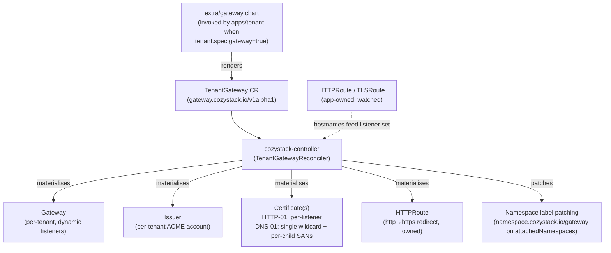
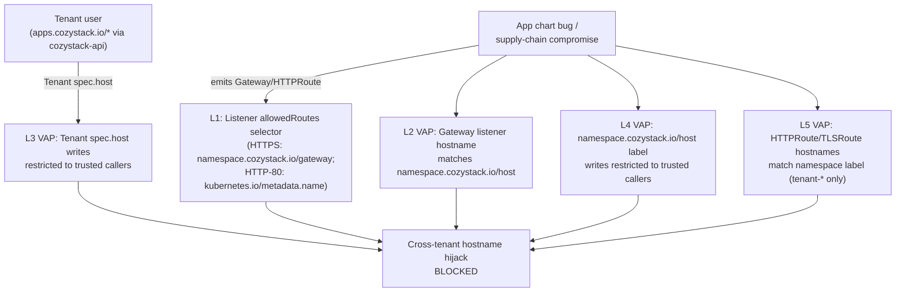

## Overview

Cozystack ships Gateway API support as an opt-in alternative to ingress-nginx. When enabled, a tenant that explicitly opts in via `tenant.spec.gateway: true` gets its own `Gateway` (own LoadBalancer Service, own LB IP, own per-tenant Issuer and Certificate) materialised in its own namespace. Every other tenant in the tree publishes through the Gateway of the nearest ancestor that owns one — same shape as the existing `_namespace.ingress` inheritance.

The chart does not render `Gateway`, `Issuer`, or `Certificate` resources directly. Instead it renders one `gateway.cozystack.io/v1alpha1 TenantGateway` CR per opted-in tenant, and `cozystack-controller` reconciles all the downstream Gateway API and cert-manager objects from there. This avoids the Helm-vs-controller race on `Gateway.spec.listeners` that route-driven dynamic listener materialization would otherwise cause.

This page documents the architecture, the inheritance model, the cert-mode choice (HTTP-01 default vs DNS-01 wildcard opt-in), the two-group security model, and the migration story from ingress-nginx.

Gateway API and ingress-nginx coexist on the same cluster — the two modes are selected per service / per tenant, not globally. Existing clusters upgrade with `gateway.enabled=false` and see no behavioural change.

### Tenant API surface

Tenants in Cozystack interact with the platform exclusively through `apps.cozystack.io/*` resources served by `cozystack-api`; tenant RBAC does not grant write access to `gateway.networking.k8s.io/*`, core `Namespaces`, or `cozystack.io/Package`. The [Security](#security) section explains how the admission layers are shaped by that constraint.

## Architecture

### Reconciliation flow



The controller:

- Materialises the `Gateway`, the per-tenant `Issuer`, the redirect HTTPRoute, and the Certificate(s) from `TenantGateway.spec`.
- Watches `HTTPRoute` and `TLSRoute` resources cluster-wide. For each route attached to its Gateway, it picks up the hostnames and (in HTTP-01 mode) appends a per-app HTTPS listener + a per-app `Certificate`.
- In DNS-01 mode, extends the wildcard `Certificate` with `<child-apex>` + `*.<child-apex>` SANs for every tenant inheriting through this Gateway (discovered by listing namespaces with `namespace.cozystack.io/gateway = <owner>` and reading their `namespace.cozystack.io/host`), and adds one `*.<child-apex>` HTTPS listener per inheriting child.
- Patches `namespace.cozystack.io/gateway = <owner>` onto every namespace in `TenantGateway.spec.attachedNamespaces` (the cozy-* system namespaces published through the Gateway). The patch is annotated with `cozystack.io/gateway-attached-by` so the controller knows which labels it wrote and which are owned by the `apps/tenant` chart — labels written by the chart are never touched. Labels written by the controller are garbage-collected when the namespace is removed from `attachedNamespaces`.
- Resolves cross-namespace hostname conflicts: `cozy-*` namespaces (cluster-admin-managed platform services) win over tenant namespaces; the loser receives a `HostnameConflict` condition under the controller's name in `Status.Parents`.
- Refuses to silently take over pre-existing `Gateway`, `Issuer`, `Certificate`, or redirect `HTTPRoute` objects that share the controller-derived name but carry no `OwnerReference` back to the TenantGateway. Operators see an explicit `Ready=False/ReconcileError` condition instead of having their hand-pinned config rewritten.

### Traffic path

```mermaid
flowchart LR
    CLIENT["External client"]
    LB["Cluster LB allocator<br/>(MetalLB / Cilium LB-IPAM /<br/>robotlb / externalIPs)"]
    ENV["cilium-envoy DaemonSet<br/>(L7 termination / L4 passthrough)"]
    GW["Gateway 'cozystack'<br/>(owning tenant namespace)"]
    HTR["HTTPRoute<br/>dashboard, keycloak, harbor, bucket, ..."]
    TLR["TLSRoute<br/>kubernetes-api, vm-exportproxy,<br/>cdi-uploadproxy"]
    CM["cert-manager<br/>(per-tenant Issuer + Certificate(s))"]
    SVC["Service<br/>(backend)"]

    CLIENT -->|DNS → LB IP| LB
    LB --> ENV
    ENV --> GW
    GW --> HTR
    GW --> TLR
    HTR --> SVC
    TLR --> SVC
    CM -.->|issues Certificate(s)| GW
```

- **`GatewayClass`** is set per TenantGateway via the operator-configurable `gatewayClassName` field on the chart (default `cilium`). Tenants do not hold RBAC to write `TenantGateway` CRs, so they cannot pick a class on their own.
- **One `Gateway` per owning tenant** in that tenant's namespace. Every inheriting child's HTTPRoutes / TLSRoutes attach to the same Gateway via cross-namespace ParentRef; there is no cross-Gateway merge.
- **Envoy** runs as a Cilium DaemonSet (`cilium.envoy.enabled=true`) and handles both TLS termination (HTTPS listeners) and TLS passthrough (dedicated per-service listeners for the kubeapiserver and the KubeVirt VM export / CDI upload proxies). `envoy.enabled=true` is the default for fresh Cozystack installations; operators upgrading an existing cluster where the Cilium values were set explicitly should verify the flag is on before flipping `gateway.enabled`.
- **LoadBalancer IP** is allocated by whichever LB mechanism the cluster admin has configured at the platform layer — same shape as ingress-nginx today. Cozystack ships MetalLB installed but does not render any `IPAddressPool` / `L2Advertisement` / `BGPAdvertisement` / `CiliumLoadBalancerIPPool` from the tenant chart. Admins wire up the allocator that fits their environment (MetalLB pool with L2 / BGP, Cilium LB-IPAM with announcer, [robotlb](https://github.com/aenix-io/robotlb) against a Hetzner Robot fleet, or `Service.spec.externalIPs` as a manual pinning mechanism). The tenant API stays mechanism-agnostic — there is no `gatewayIP` field on the Tenant CR. To pin a specific address, the operator pre-creates the LoadBalancer Service with `loadBalancerIP` set, or hands the tenant a reference to a named admin-managed pool.
- **`externalTrafficPolicy`**: the LoadBalancer Service that backs the Gateway is created by Cilium and uses the Kubernetes default (`Cluster`). Source IPs of external clients are therefore NAT'd to the receiving node. This differs from the legacy ingress-nginx `loadBalancer` exposure (`publishing.exposure: loadBalancer`), which sets `externalTrafficPolicy: Local` and constrains the LB IP to nodes hosting ingress pods. Operators who need source IP preservation for Gateway-API traffic must patch the Service themselves or front it with a PROXY-protocol-capable upstream LB.

### Listener layout on a tenant Gateway

A tenant Gateway always materialises an HTTP listener:

| # | Name | Protocol | Port | Hostname | Purpose |
| --- | --- | --- | --- | --- | --- |
| 1 | `http` | `HTTP` | 80 | none (wildcard) | ACME `/.well-known/acme-challenge/*` + HTTP→HTTPS redirect HTTPRoute |

Plus HTTPS listeners that depend on cert mode:

- **HTTP-01 mode (default):** one HTTPS listener per attached HTTPRoute hostname, named `https-<first-label>-<8-hex>`. The hex suffix is the first 32 bits of `sha256(hostname)` so two different hostnames sharing the same first label (`harbor.foo.example.com` vs `harbor.alice.example.com`) get distinct listener names. Each listener's `tls.certificateRefs` points at a per-listener `Certificate` named `<tgw>-<first-label>-<8-hex>-tls`, also auto-issued.
- **DNS-01 mode (opt-in):** `https` (`*.<owner apex>`) and `https-apex` (`<owner apex>`) listeners consuming a single wildcard Certificate, plus one `https-child-<first-label>-<8-hex>` listener per inheriting child apex (referencing the same wildcard cert, whose dnsNames are extended with `<child-apex>` + `*.<child-apex>` SANs).

Plus one extra listener per TLS-passthrough service (see [TLS passthrough](#tlsroute-tls-passthrough)).

Listener `allowedRoutes.namespaces` uses two different selectors by listener role:

- **HTTPS and TLS-passthrough listeners** match the `namespace.cozystack.io/gateway` label and admit routes from any namespace whose label equals the owner tenant's namespace name (e.g. `tenant-root`, `tenant-alice` — the namespace name, not the bare tenant name). This is the inheritance hinge — every inheriting child's namespace carries the same label value (written by the `apps/tenant` chart), and cozy-* system namespaces in `attachedNamespaces` get the same label patched on by the controller.
- **The plain-HTTP listener (port 80)** uses a strictly narrower whitelist on the built-in `kubernetes.io/metadata.name` label — only the owner tenant's namespace itself (where the controller-owned redirect HTTPRoute lives) and `cozy-cert-manager` (HTTP-01 ACME challenge HTTPRoutes). App HTTPRoutes attaching to the Gateway by hostname therefore cannot bind to port 80 and serve plaintext.

HTTPS listeners further restrict `allowedRoutes.kinds` to `HTTPRoute` (and TLS-passthrough listeners to `TLSRoute`), preventing GRPCRoute / TCPRoute / UDPRoute from attaching outside the route-hostname VAP's coverage.

## Enabling Gateway API

Gateway API is opt-in at two levels. Both defaults stay `false`; upgrades do not flip tenants silently.

### 1. Platform-level flag

Set `gateway.enabled: true` on the `cozystack.cozystack-platform` Package. See the [Platform Package reference]({}) for the full `gateway.*` and `publishing.certificates.dns01.*` value tables.

```yaml
apiVersion: cozystack.io/v1alpha1
kind: Package
metadata:
  name: cozystack.cozystack-platform
spec:
  variant: isp-full
  components:
    platform:
      values:
        publishing:
          host: example.org
        gateway:
          enabled: true
          attachedNamespaces:
            - cozy-cert-manager
            - cozy-dashboard
            - cozy-keycloak
            - cozy-system
            - cozy-harbor
            - cozy-bucket
            - cozy-kubevirt
            - cozy-kubevirt-cdi
            - cozy-monitoring
            - cozy-linstor-gui
            - default
```

The `default` namespace is included because the Kubernetes API `TLSRoute` (shipped by the cozystack-api package) lives next to the `kubernetes` Service it points at, which is always in `default`.

Flipping `gateway.enabled=true` wires three things:

- cert-manager `ClusterIssuer.spec.acme.solvers` switches from `http01.ingress.ingressClassName` to `http01.gatewayHTTPRoute` that attaches to the publishing tenant's Gateway.
- The exposed-service templates (dashboard, keycloak, grafana, alerta) stop rendering their `Ingress` and start rendering their `HTTPRoute`.
- TLS-passthrough services (cozystack-api, vm-exportproxy, cdi-uploadproxy) stop rendering their `Ingress` and start rendering a `TLSRoute` attached to a dedicated Passthrough listener.

The `attachedNamespaces` list names the `cozy-*` system namespaces whose routes should publish through the owning tenant Gateway. The controller patches `namespace.cozystack.io/gateway = <owner>` onto each entry so its routes pass the listener `allowedRoutes` selector. Tenant namespaces (`tenant-*`) may also be listed — they simply pick up the same label alongside the `cozy-*` entries. The static list is not the cross-tenant hijack vector; that role is held by Layers 1, 2, 4, and 5 in the [Security](#security) section.

### 2. Per-tenant Gateway

A tenant gets its own `TenantGateway` CR (and through the controller, its own `Gateway`, `Issuer`, `Certificate`(s) and `LoadBalancer` Service) only when it explicitly asks via `tenant.spec.gateway: true`. Every other tenant in the tree publishes through the Gateway of the nearest ancestor that owns one — same shape as `_namespace.ingress` inheritance today. The default is `gateway` unset, which resolves to `false` (inherit).

Opting in for a separate Gateway makes sense when:

- the tenant needs its own LB IP (DNS already pinned to a specific address, firewall rule on that address);
- the tenant's apex is not derived from the parent (operator set a custom `tenant.spec.host` like `customer1.example`, not a subdomain — the ancestor's wildcard cert / Issuer cannot cover it);
- the tenant wants its own ACME account / Issuer (separate rate-limit budget, separate cert authority).

Otherwise leave `gateway` unset and inherit.

```yaml
# Tenant 'alice' under tenant-root: apex is derived as alice.<parent apex>,
# inherits the parent's Gateway. No separate LB IP, no separate Issuer.
apiVersion: apps.cozystack.io/v1alpha1
kind: Tenant
metadata:
  name: alice
  namespace: tenant-root
spec: {}
```

```yaml
# Tenant 'acme' with a fully independent apex: must opt in to own a
# Gateway, because the parent's cert/Issuer can't cover customer1.example.
apiVersion: apps.cozystack.io/v1alpha1
kind: Tenant
metadata:
  name: acme
  namespace: tenant-root
spec:
  host: customer1.example
  gateway: true
```

```yaml
# Tenant 'bob' under tenant-root: derived apex, but wants its own
# LB IP and ACME account (DNS pinned to a specific address).
apiVersion: apps.cozystack.io/v1alpha1
kind: Tenant
metadata:
  name: bob
  namespace: tenant-root
spec:
  gateway: true
```

Setting `tenant.spec.host` to a custom value is reserved for cluster-admins and cozystack/Flux service accounts (enforced at runtime by `cozystack-tenant-host-policy`, see [Security](#security)).

### Inheritance

The `apps/tenant` chart writes `namespace.cozystack.io/gateway: <owner-namespace>` onto each tenant namespace, carrying either this tenant's own namespace name (when `gatewayEffective` resolves to `true`) or the inherited ancestor's namespace name (when inheriting). The same value lands on `_namespace.gateway` inside the tenant's `cozystack-values` Secret, so vendored apps (harbor, bucket, …) render their HTTPRoutes with `parentRefs.namespace` pointing at the owner namespace.

To check which Gateway a given tenant namespace currently inherits through:

```bash
kubectl get namespace <tenant-ns> \
  -o jsonpath='{.metadata.labels.namespace\.cozystack\.io/gateway}{"\n"}'
```

An empty value means no ancestor in the chain has `tenant.spec.gateway: true` and routes in this namespace will not attach to any Gateway.

The owning Gateway's listener `allowedRoutes.namespaces.selector` matches this exact label, so the same selector admits routes from every namespace in the owner's tree — descendants and `attachedNamespaces` cozy-* entries alike. There is no separate ReferenceGrant per child: the label selector is the cross-namespace gate.

In DNS-01 mode, the controller extends the owning Gateway's wildcard `Certificate` with `<child-apex>` + `*.<child-apex>` SANs per inheriting child (discovered by listing namespaces carrying the same `namespace.cozystack.io/gateway` value and reading each one's `namespace.cozystack.io/host`), and adds a `*.<child-apex>` HTTPS listener per child apex. Without this expansion the parent's single-level wildcard cannot match a child route's hostname (`harbor.alice.example.org` is two labels past the parent's `*.example.org`).

The ACME DNS-01 challenge must succeed for every SAN, which means the configured DNS provider account must be able to write TXT records under every apex level the parent serves. For deeply-nested inheriting children that requires either zone delegation or a provider credential with apex-spanning permissions. HTTP-01 mode is unaffected — each per-listener challenge runs against the specific hostname.

A tenant that opts into its own Gateway becomes a separate boundary: separate `Gateway`, separate `Issuer` and ACME account, separate `Certificate`(s), its own subset of inheriting descendants. Child tenants under it do not share HTTP-01 challenge state with the grandparent.

## Cert mode: HTTP-01 (default) vs DNS-01 (opt-in)

`publishing.certificates.solver` controls how the per-tenant Issuer sources TLS certs. See the [Platform Package reference]({}) for the full set of `publishing.certificates.dns01.*` provider keys.

### HTTP-01 (default)

Out of the box, no extra config required. The controller:

- Renders an ACME `Issuer` in the tenant namespace with an `http01.gatewayHTTPRoute` solver pointing at the tenant's own Gateway / `http` listener.
- Watches HTTPRoutes / TLSRoutes attached to the Gateway (parentRefs pointing at it). For each unique hostname seen, it adds a per-app HTTPS listener and a per-app `Certificate` (dnsNames containing exactly that hostname).
- Per-app listener naming: `https-<first-label>-<8-hex>` (e.g. `https-harbor-deadbeef`).
- Per-app cert naming: `<tgw>-<first-label>-<8-hex>-tls`.

Adding a tenant-owned app — whether under the owning tenant or under any inheriting child — is purely a matter of deploying its HTTPRoute. No edits to the platform Package needed. Platform-managed cozy-* services (dashboard, keycloak, grafana, alerta, cozystack-api, vm-exportproxy, cdi-uploadproxy) remain gated by `publishing.exposedServices` exactly as in the ingress flow — only services on that list render their HTTPRoute / TLSRoute when `gateway.enabled=true`.

### DNS-01 (opt-in)

Set `publishing.certificates.solver: dns01` and pick a provider:

| `publishing.certificates.dns01.provider` | Chart pre-validates | Operator must provide |
| --- | --- | --- |
| `cloudflare` (default) | (nothing — chart never fails) | A Secret named per `cloudflare.secretName` (default `cloudflare-api-token-secret`) holding a Cloudflare API token under the key named by `cloudflare.secretKey` (default `api-token`) |
| `route53` | `route53.region` (chart fails at render if empty) | Either IRSA / instance profile, or `route53.secretName` pointing at a Secret with the IAM secret access key under `route53.secretKey` (default `secret-access-key`); optionally `route53.accessKeyID` |
| `digitalocean` | (nothing) | A Secret named per `digitalocean.secretName` (default `digitalocean-api-token-secret`) holding a DigitalOcean API token under `digitalocean.secretKey` (default `access-token`) |
| `rfc2136` | `rfc2136.nameserver` (chart fails at render if empty) | `rfc2136.tsigKeyName` and `rfc2136.secretName`; the Secret holds the TSIG key material under `rfc2136.secretKey` (default `tsig-secret-key`); `rfc2136.tsigAlgorithm` defaults to `HMACSHA256` |

The chart only `fail()`s at render time on the keys in the second column; the rest are checked by cert-manager at challenge time, which means a misconfigured provider produces a `Challenge` stuck in `Pending` rather than a chart render error.

DNS-01 mode renders a single wildcard `Certificate` covering `<owner apex>` and `*.<owner apex>`, plus the corresponding `https` (`*.<owner apex>`) and `https-apex` (`<owner apex>`) listeners. New apps published under the apex pick up the existing wildcard cert without per-listener provisioning. For each inheriting child tenant, the controller extends the wildcard's dnsNames with `<child-apex>` + `*.<child-apex>` SANs and adds a `*.<child-apex>` listener.

The platform chart writes the provider config into `_cluster.dns01-*` keys consumed by both the per-tenant gateway chart (rendering the TenantGateway CR) and the cluster-wide `letsencrypt-prod` / `letsencrypt-stage` ClusterIssuers used by the legacy ingress flow. Both paths agree on which provider is active.

Pick DNS-01 when you specifically want a wildcard cert — a long-lived cluster with many apps under one apex, deep inheritance trees, or tight Let's Encrypt rate limits. Gateway API caps `Gateway.spec.listeners` at 64; HTTP-01 adds one HTTPS listener per published hostname (plus the mandatory `http` listener and the TLS-passthrough listeners) so a single-tenant deployment approaching 60+ published apps on HTTP-01 will hit the cap and the rendered `Gateway` will fail admission. DNS-01 collapses every hostname under the apex into a small fixed number of listeners.

## Per-service routing

When `gateway.enabled=true`, the following services switch from `Ingress` to Gateway API resources. The **Render gate** column distinguishes services that always render their route when the platform flag is on from those that additionally require an entry in `publishing.exposedServices` (and from per-tenant apps gated on `_namespace.gateway` being populated).

### HTTPRoute (TLS termination on Gateway)

| Service | Namespace | `HTTPRoute` name | Backend | Listener | Render gate |
| --- | --- | --- | --- | --- | --- |
| dashboard | `cozy-dashboard` | `dashboard` | `incloud-web-gatekeeper:8000` | per-app `https-dashboard-...` (HTTP-01) or `https` (DNS-01) | `gateway.enabled` AND `dashboard` in `publishing.exposedServices` |
| keycloak | `cozy-keycloak` | `keycloak` | `keycloak-http:80` | same | `gateway.enabled` |
| grafana | `cozy-monitoring` | `grafana` | `grafana-service:3000` | same | `gateway.enabled` |
| alerta | `cozy-monitoring` | `alerta` | `alerta:80` | same | `gateway.enabled` |
| harbor | tenant namespace | `<release-name>` | `<release-name>:80` | owner tenant's Gateway | `_namespace.gateway` set (any ancestor opted in) |
| bucket | tenant namespace | `<bucket-name>-ui` | `<bucket-name>-ui:8080` | owner tenant's Gateway | `_namespace.gateway` set |

cert-manager's HTTP-01 solver places its short-lived `HTTPRoute` on the `http` listener of the same Gateway, path-matched to `/.well-known/acme-challenge/`. More-specific path matching wins over the catch-all HTTP→HTTPS redirect HTTPRoute.

### TLSRoute (TLS passthrough)

Services that need SNI-based passthrough (clients present certificates, backend terminates TLS) use `TLSRoute` on a dedicated Passthrough listener. One listener per service, hostname scoped to that service's FQDN:

| Service | Namespace | `TLSRoute` name | Backend | Listener | Render gate |
| --- | --- | --- | --- | --- | --- |
| Kubernetes API | `default` | `kubernetes-api` | `kubernetes:443` | `tls-api` | `gateway.enabled` AND `api` in `publishing.exposedServices` |
| KubeVirt VM export | `cozy-kubevirt` | `vm-exportproxy` | `vm-exportproxy:443` | `tls-vm-exportproxy` | `gateway.enabled` AND `vm-exportproxy` in `publishing.exposedServices` |
| KubeVirt CDI upload | `cozy-kubevirt-cdi` | `cdi-uploadproxy` | `cdi-uploadproxy:443` | `tls-cdi-uploadproxy` | `gateway.enabled` AND `cdi-uploadproxy` in `publishing.exposedServices` |

All three Passthrough listeners (`tls-api`, `tls-vm-exportproxy`, `tls-cdi-uploadproxy`) are always rendered on the Gateway — the controller materialises one per entry in the chart's `tlsPassthroughServices` value (defaults: `[api, vm-exportproxy, cdi-uploadproxy]`). What `publishing.exposedServices` actually gates is the matching `TLSRoute` template in each upstream chart: if a service is removed from `publishing.exposedServices`, its listener still exists but nothing attaches, so no traffic is admitted.

`TLSRoute` is shipped from the Gateway API experimental channel (CRD `gateway.networking.k8s.io/v1alpha2`) in v1.5.x. It graduates to `v1` upstream; Cozystack will follow the rename when it lands.

## Security

Tenants in Cozystack interact with the platform exclusively through `apps.cozystack.io/*` resources (Tenant, Bucket, Kubernetes, …) served by `cozystack-api`. Tenant RBAC (`cozy:tenant:*` aggregated to a RoleBinding in the tenant's own namespace) does not grant write access to `gateway.networking.k8s.io/*`, core `Namespaces`, or `cozystack.io/Package`. The protections below split into two groups by who they defend against — most of the five layers do not protect against tenant-user input (that RBAC isn't granted in the first place); they guard against bugs in cozystack-controller / Flux, supply-chain compromise of an app chart, and confused-deputy mistakes by a cluster admin. All admission-time checks are fail-closed (`failurePolicy: Fail`, `validationActions: [Deny]`).

**Tenant-user-input gate** — Layer 3 (`cozystack-tenant-host-policy`). `Tenant.spec.host` is the user-supplied field that surfaces as a security boundary at the hostname layer; it is gated on every Create / Update via `cozystack-api`'s admission chain.

**Defense-in-depth** — Layers 1, 2, 4, 5. Today's threat model is chart bugs, controller bugs, supply-chain compromise of an app chart, and confused-deputy cluster-admin mistakes; tenants don't hold the relevant RBAC to write Gateways or HTTPRoutes directly. If that RBAC ever broadens (a future RoleBinding, a CRD-aggregated role that includes `gateway.networking.k8s.io/*`, an app chart that grants its own ServiceAccount route-write permissions), these layers continue to enforce the same hostname constraints against the new caller — they are not bypassed by tenant input, just not currently exercised by it.

`tenant-*` entries in `gateway.attachedNamespaces` are intentionally allowed: the cross-tenant hijack vector is the listener label selector (closed by Layers 1, 2, 4, and 5), not the static attach list, so `tenant-*` namespaces in the list simply pick up the gateway-attach label alongside the cozy-* entries.



### Layer 1 — Listener `allowedRoutes` namespace selector

Every listener on a tenant Gateway pins `allowedRoutes.namespaces.from: Selector`. The selector mechanics differ by listener role:

- **HTTPS and TLS-passthrough listeners** use `matchLabels: { namespace.cozystack.io/gateway: <owner-namespace> }`. The label value is the namespace of the TenantGateway — for `tenant-root` that resolves to `tenant-root`, for `tenant-alice` to `tenant-alice` (i.e. the namespace name, not the bare tenant name). The label is written by the `apps/tenant` chart on every tenant namespace (own namespace name when owning a Gateway, inherited ancestor's namespace name otherwise) and patched by the controller onto every namespace in `attachedNamespaces`. Namespaces without the matching value cannot attach any HTTPRoute / TLSRoute to those listeners.
- **The plain-HTTP listener (port 80)** uses a strictly narrower `matchExpressions` whitelist on the built-in `kubernetes.io/metadata.name` label — only the owner tenant's own namespace (where the controller-owned redirect HTTPRoute lives) and `cozy-cert-manager` (HTTP-01 ACME challenge HTTPRoutes). App HTTPRoutes attaching by hostname therefore cannot bind to port 80 and silently serve plaintext.

HTTPS listeners additionally restrict `allowedRoutes.kinds` to `HTTPRoute` (TLS-passthrough listeners to `TLSRoute`), preventing `GRPCRoute` / `TCPRoute` / `UDPRoute` from attaching outside the Layer 5 VAP's coverage.

### Layer 2 — `cozystack-gateway-hostname-policy`

`ValidatingAdmissionPolicy` scoped to `gateway.networking.k8s.io` `Gateway` CREATE/UPDATE on `v1` and `v1beta1` (so a cluster still serving `v1beta1` Gateways is covered). CEL reads `namespaceObject.metadata.labels["namespace.cozystack.io/host"]` and rejects any listener whose hostname is not equal to that value or a subdomain of it. `matchConditions` gate the VAP to `tenant-*` namespaces only — Gateways in unrelated namespaces (e.g. `kube-system`) are not touched.

Because the VAP reads the namespace label (not a cluster-wide ConfigMap), a tenant with a fully independent apex domain (e.g. `customer1.example`, not a subdomain of the platform apex) is validated correctly — the VAP does not assume a subdomain hierarchy.

### Layer 3 — `cozystack-tenant-host-policy`

`ValidatingAdmissionPolicy` scoped to `apps.cozystack.io/v1alpha1 Tenant` CREATE/UPDATE. Rejects setting or changing `spec.host` unless the caller is in the `system:masters` group or is one of `system:serviceaccounts:cozy-system`, `system:serviceaccounts:cozy-cert-manager`, `system:serviceaccounts:cozy-fluxcd`, `system:serviceaccounts:kube-system`. Tenants can still create tenants with empty `spec.host` (the normal inheritance flow).

This closes the path where a tenant user creates a Tenant with `spec.host=dashboard.example.org` to have the tenant chart write a hijacked label into their namespace.

`cozystack-api` is a custom-served aggregated APIServer. The Tenant CR's REST handler at `pkg/registry/apps/application/rest.go` explicitly invokes the `createValidation` / `updateValidation` / `deleteValidation` callbacks into Create / Update / Delete — unlike `genericregistry.Store`, custom REST handlers must wire these hooks themselves. With them wired, every ValidatingAdmissionPolicy and ValidatingWebhook scoped to `apps.cozystack.io/*` fires on all three verbs as the apiserver contract requires.

### Layer 4 — `cozystack-namespace-host-label-policy`

`ValidatingAdmissionPolicy` scoped to core `v1 Namespace` CREATE/UPDATE. Treats `namespace.cozystack.io/host` as effectively immutable: rejects any **change** of value (including the empty-to-set transition, which covers first-time writes on both CREATE and UPDATE) unless the caller is on the same trusted-caller whitelist as Layer 3. Idempotent re-applies of the **same** value are allowed for any caller — the CEL's actual error message ("namespace label namespace.cozystack.io/host is immutable once set") reflects this. Only cozystack/Flux service accounts (which apply the tenant chart) can establish or change the label value.

Combined with Layer 3, a tenant user cannot establish or change their host through either the Tenant CR or the namespace label.

### Layer 5 — `cozystack-route-hostname-policy` (HTTPRoute) and `cozystack-route-hostname-policy-tls` (TLSRoute)

A pair of `ValidatingAdmissionPolicy` objects sharing the same CEL expression. `cozystack-route-hostname-policy` targets `gateway.networking.k8s.io` `HTTPRoute` (`v1` and `v1beta1`) CREATE/UPDATE; `cozystack-route-hostname-policy-tls` targets `TLSRoute` at `v1alpha2`. Both are scoped to `tenant-*` namespaces (cozy-* are cluster-admin-managed and trusted to publish under any apex) and reject any `spec.hostnames` entry that is not equal to the namespace's `namespace.cozystack.io/host` label or a subdomain of it. **Fail-closed when the label is absent** — a `tenant-*` namespace without `namespace.cozystack.io/host` is rejected, not silently allowed. Operators querying `kubectl get validatingadmissionpolicy` will see both objects.

Defense-in-depth against an app chart bug or supply-chain compromise that emits Gateway API resources outside the tenant's apex — tenants in Cozystack do not hold `gateway.networking.k8s.io/*` RBAC by design, so this is not a tenant-user defense. The within-apex cross-namespace case (a tenant chart claiming a hostname owned by a `cozy-*` app) is handled by the controller at reconcile time — see [HostnameConflict resolution](#hostnameconflict-resolution) below.

The allowed host suffix is always the value of the namespace's own `namespace.cozystack.io/host` label — Layer 5 has no special case for `tenant-root` and no hardcoded derivation rule. Whatever the apps/tenant chart wrote into that label (derived `<name>.<parent apex>` for inheriting children, the cluster's `publishing.host` for `tenant-root`, the operator-set `tenant.spec.host` for custom-apex tenants) is what every route in that namespace must end with. A tenant with an independent apex (`customer1.example` instead of a subdomain) is handled correctly because the VAP reads the label rather than assuming a subdomain hierarchy.

### HostnameConflict resolution

When two routes from different namespaces claim the same hostname, the controller picks the winner deterministically:

- A route from a `cozy-*` namespace (cluster-admin-managed platform service) wins over a route from any other namespace.
- Within the same priority tier, the route with the lexicographically smallest `<namespace>/<name>` pair wins.

The losing route receives `Accepted=False` with `Reason=HostnameConflict` in `Status.Parents` under the controller's name (`gateway.cozystack.io/tenantgateway-controller`). Other controllers' status entries (Cilium etc.) are left untouched.

### Foreign-takeover guards

Six reconcile paths refuse to silently rewrite or take over pre-existing state that shares the controller-derived name / annotation but did not originate from this `TenantGateway`:

- `Gateway` (named after the TenantGateway)
- redirect `HTTPRoute` (`<tgw>-http-redirect`)
- per-tenant `Issuer` (`<tgw>-gateway`)
- wildcard `Certificate` (`<tgw>-gateway-tls`, DNS-01 mode)
- per-listener `Certificate` (`<tgw>-<first-label>-<8-hex>-tls`, HTTP-01 mode)
- Namespace label `namespace.cozystack.io/gateway` — the controller only writes or strips this label on namespaces it annotates with `cozystack.io/gateway-attached-by`. Labels written by the `apps/tenant` chart (no annotation) are never touched, so inheritance for tenant namespaces survives every reconcile.

For the named-object paths, an operator who hand-pinned a Certificate or Issuer at the controller's derived name (private CA, manual cert pinning, internal ACME) gets an explicit `Ready=False/ReconcileError` condition on the TenantGateway instead of having their config silently destroyed and the resource re-issued from a different ACME account. The error message points at the offending object so the operator can either delete it (handing ownership to the controller) or rename it.

### What this does NOT defend

These residuals are design choices, not runtime gaps:

- **Cluster-admin credentials.** Anyone in `system:masters` or with a matching cozystack/Flux SA can set any host. Gateway API isolation is not the weakest link at that trust level.
- **DNS control.** A tenant whose VAP-allowed hostname does not resolve to the cluster's LB IP cannot complete ACME HTTP-01. No Certificate is issued; no hijack even if admission somehow admitted the Gateway. ACME's DNS-based identity proof is the last line.
- **Shared LB allocator.** Multiple owning tenants drawing from the same admin-managed pool (MetalLB, Cilium LB-IPAM, etc.) compete for addresses via that allocator's rules. Per-Service IP uniqueness is the allocator's responsibility — same as for any other LoadBalancer Service in the cluster.

## Certificates

Every tenant with `spec.gateway: true` gets its own cert-manager `Issuer` (namespace-scoped, not `ClusterIssuer`) named `<tgw>-gateway`. The Issuer carries its own ACME account via `privateKeySecretRef: <tgw>-acme-account`. Certificates reference `issuerRef.kind: Issuer, name: <tgw>-gateway`.

In **HTTP-01 mode**, one Certificate per published-app hostname (named `<tgw>-<first-label>-<8-hex>-tls`). In **DNS-01 mode**, a single wildcard Certificate (named `<tgw>-gateway-tls`) covers `<owner apex>` and `*.<owner apex>`, plus per-child-apex SANs (`<child-apex>` and `*.<child-apex>`) for every inheriting tenant.

Two ACME servers are supported out of the box:

- `publishing.certificates.issuerName: letsencrypt-prod` → `https://acme-v02.api.letsencrypt.org/directory`
- `publishing.certificates.issuerName: letsencrypt-stage` → `https://acme-staging-v02.api.letsencrypt.org/directory`

Any other value fails the chart render. To support a new ACME provider: add a `letsencrypt*Server` (or equivalent) constant alongside the existing ones in `internal/controller/tenantgateway/reconciler.go`, then add a branch to `acmeServerForIssuer` in `internal/controller/tenantgateway/renderers.go` mapping the issuer name to that constant.

### Rate limits

Let's Encrypt enforces per-account and per-registered-domain quotas:

- 50 new certificates per registered domain per week
- 5 duplicate certificates per week for the same hostname set
- 300 new orders per account per 3 hours

A cluster where many tenants share the same apex domain can exhaust these quickly, especially in HTTP-01 mode where each published app contributes one certificate. Mitigations:

- `publishing.certificates.issuerName: letsencrypt-stage` for non-production clusters (staging quotas do not affect prod).
- `tenant.spec.resourceQuotas.count/certificates.cert-manager.io` to cap per-tenant certificate creations.
- Switch to DNS-01 to consolidate every tenant's apps under one wildcard cert (cuts cert count from N apps to 1 per owning tenant; inheriting children fold into the parent's wildcard via SAN expansion).
- For air-gapped deployments, use the bundled `selfsigned-cluster-issuer` or an internal ACME server.

Recommended tenant-level quota to contain a misbehaving tenant:

```yaml
apiVersion: apps.cozystack.io/v1alpha1
kind: Tenant
spec:
  gateway: true
  resourceQuotas:
    count/certificates.cert-manager.io: "10"
```

## Migration from ingress-nginx

The two modes coexist. Switching happens per cluster (`gateway.enabled`) and per tenant (`tenant.spec.gateway`), not globally.

### For a new cluster

Set `gateway.enabled: true` at install time. Ingress-nginx can be disabled entirely once every owning tenant has its `spec.gateway: true` set and every published app under those tenants has migrated.

Owning tenants then declare `spec.gateway: true` at creation time. Their descendants inherit through the namespace label without opting in.

### For an existing cluster

Order matters — flipping `gateway.enabled: true` before any Gateway exists causes a live outage on the platform-managed exposed services. The cozy-* HTTPRoutes start rendering and the matching Ingresses are deleted, but the Gateway they ParentRef does not yet exist, so external traffic to dashboard / keycloak / Kubernetes API / VM export / CDI upload is dropped until both the Gateway is `Programmed` and its Certificates are `Ready`. Do the per-tenant opt-in **first**, the platform flip **second**.

Every per-tenant TenantGateway, its rendered Gateway, its Issuer, and (in DNS-01 mode) its wildcard Certificate are derived from a fixed name — the chart hardcodes the `TenantGateway` to `cozystack`, and the controller derives `cozystack-gateway` (Issuer), `cozystack-gateway-tls` (DNS-01 wildcard cert), and `cozystack-http-redirect` (HTTP→HTTPS redirect route) from it. Every kubectl command below uses those literal names regardless of which tenant owns the Gateway.

1. For each tenant that should own a Gateway (typically at least `tenant-root`), set `tenant.spec.gateway: true`. The tenant chart materialises the `TenantGateway` CR and the controller reconciles the Gateway, Issuer, and Certificate(s). Descendants of an owning tenant pick up the parent's Gateway automatically via the namespace label.
2. Wait for the Gateway and Certificates. The Gateway is always named `cozystack`:

   ```bash
   kubectl -n <owner-tenant-ns> wait gateway/cozystack --for=condition=Programmed --timeout=5m
   ```

   In **DNS-01 mode** there is one wildcard cert named `cozystack-gateway-tls`:

   ```bash
   kubectl -n <owner-tenant-ns> wait certificate/cozystack-gateway-tls --for=condition=Ready --timeout=10m
   ```

   In **HTTP-01 mode** every per-listener Certificate carries the label `cozystack.io/per-listener-cert=true` (set by the controller), so they can be waited on as a set:

   ```bash
   kubectl -n <owner-tenant-ns> wait certificate \
     --selector cozystack.io/per-listener-cert=true \
     --for=condition=Ready --timeout=10m
   ```

3. Flip `gateway.enabled: true` on the platform Package. This rerenders cert-manager ClusterIssuers and the exposed-service templates. Existing `Ingress` objects for dashboard / keycloak / grafana / alerta / cozystack-api (Kubernetes API) / vm-exportproxy / cdi-uploadproxy are deleted by Flux as they are replaced by `HTTPRoute` / `TLSRoute` — which now attach to the already-Programmed Gateway with no outage window.
4. Once every tenant tree has migrated, ingress-nginx is no longer needed for cozystack-native services. A platform-level disable mechanism for the `cozystack.ingress-application` package source is tracked separately; today the bundle still renders it, and the controller can remain installed as a no-op for tenants that haven't migrated.

Applications that live in upstream vendored charts (harbor, bucket) attach to their owner tenant's Gateway through `_namespace.gateway`, which the tenant chart populates automatically once the owner sets `spec.gateway: true` (and propagates to inheriting children).

#### Rollback

To revert during the migration window, flip `gateway.enabled` back to `false` on the platform Package. The cozy-* HTTPRoutes / TLSRoutes stop rendering and Flux deletes them; the original `Ingress` objects for dashboard / keycloak / grafana / alerta / cozystack-api / vm-exportproxy / cdi-uploadproxy are re-rendered by the same charts on the next reconcile, and ingress-nginx picks them up. There is the same kind of outage window as the forward path for the cozy-* services — the HTTPRoute is gone before the Ingress is back — so expect a brief drop, plus whatever time Flux takes to reconcile. The per-tenant TenantGateway, Gateway, Issuer, and Certificates left behind by `tenant.spec.gateway: true` do not interfere with the ingress-nginx path and can be left in place; to fully unwind a tenant, also set `tenant.spec.gateway: false` and the chart drops the gateway HelmRelease (the controller cleans up the Gateway and Issuer it owns).

## Known limitations

- **Multi-tenant shared LB IP.** Multiple owning tenants cannot share a single LB IP on current Cilium: each owning tenant Gateway claims `443/TCP` and `lbipam.cilium.io/sharing-key` is inactive on port collision ([cilium#21270](https://github.com/cilium/cilium/issues/21270), [cilium#42756](https://github.com/cilium/cilium/issues/42756)). Each owning Gateway therefore needs its own LB IP from the admin-managed allocator until Cilium ships ListenerSet. Within a single Gateway, inheritance (parent + all inheriting children sharing one IP) works today.
- **TLSRoute v1alpha2.** Gateway API v1.5 ships TLSRoute at `v1alpha2`. It graduates to `v1` upstream; Cozystack will follow the rename when it lands.
- **DNS-01 wildcards require DNS provider access for every apex level.** When a deeply nested tenant tree (e.g. `tenant-root` → `alice` → `alice-bob`) inherits DNS-01 mode through the root, the parent's `*.alice.example.org` SAN requires the parent's ACME challenge to write a TXT record under `_acme-challenge.alice.example.org`. If the operator hasn't delegated that subzone to the parent's DNS provider account, cert issuance for the grandchild apex stalls. HTTP-01 mode is unaffected.
- **Supported ACME issuers.** `publishing.certificates.issuerName` must be `letsencrypt-prod` or `letsencrypt-stage` (the controller maps those to ACME server URLs). To support another ACME provider, extend the controller's renderer with an additional branch.
- **`tenant.spec.host` enforcement.** A tenant cannot set their own host (runtime-blocked), but a cluster-admin who misconfigures it produces a tenant publishing a hostname they do not own. ACME will fail (no DNS control), so no cert is issued and no hijack materialises, but the diagnostics stop at "Certificate stuck in Pending".
- **Upstream application features.** Some chart-level features in harbor / bucket still rely on ingress-nginx annotations upstream. Cozystack tracks those as upstream PRs; they remain the reason some ops teams will keep ingress-nginx alongside Gateway API for a while.
- **cert-manager namespace is hardcoded** for ACME HTTP-01. The port-80 listener's `allowedRoutes` whitelist names `cozy-cert-manager` explicitly. Operators running cert-manager in a non-default namespace cannot use HTTP-01 with Gateway API today — the ACME challenge HTTPRoute will be rejected with no obvious diagnostic. DNS-01 mode is unaffected (no in-cluster challenge HTTPRoute is involved).

## Troubleshooting

### Start here: list the TenantGateway

```bash
kubectl get tenantgateway --all-namespaces
# or, using the short name
kubectl get tgw --all-namespaces
```

The owning tenant's TenantGateway shows up here once `tenant.spec.gateway: true` has reconciled. No row means the apps/tenant chart hasn't rendered the CR yet (check `tenant.spec.gateway` and that the gateway HelmRelease in the tenant namespace is Ready); an existing row with `Ready=False` is the entry point for the recipes below.

### TenantGateway stuck in `Ready=False` with `ReconcileError`

```bash
kubectl -n <tenant-ns> describe tenantgateway cozystack
```

The status condition's message names the failing step. Common cases:

- `gateway <ns>/cozystack exists but is not owned by TenantGateway ...` — a pre-existing Gateway with our derived name was found and refused. Rename or delete the foreign Gateway, or set its `OwnerReference` to the TenantGateway by hand if you intend to take ownership.
- `issuer <ns>/<tgw>-gateway exists but is not owned ...` — same shape for a foreign Issuer.
- `certificate <ns>/... exists but is not owned ...` — same for a foreign Certificate.

### Gateway stuck in `Programmed=False`

```bash
kubectl -n cozy-cilium logs deploy/cilium-operator --tail=100 | grep -i gateway
```

Common causes: `gatewayClassName` typo (must be exactly `cilium`), a listener that collides with another listener (same port + protocol + hostname), or an HTTPS listener whose `certificateRefs` points at a Secret that does not exist yet.

### Certificate stuck in `Ready=False`

```bash
kubectl -n <tenant-ns> describe certificate <cert-name>
kubectl -n <tenant-ns> describe challenge
```

If the Challenge's `HTTPRoute` has `Accepted=False`, the HTTP listener's `allowedRoutes` whitelist does not include the Challenge's namespace — expected to be `cozy-cert-manager`, always implicitly in the list. If the Challenge reports ACME server errors, check DNS: `<host>` (HTTP-01) or `<apex>` and `*.<apex>` and the per-child SANs (DNS-01) must resolve to the Gateway's LB IP / be answered by the configured DNS-01 provider.

### HTTPRoute rejected with `HostnameConflict`

```bash
kubectl -n <tenant-ns> describe httproute <route-name>
```

Look for an entry under `Status.Parents` with `controllerName: gateway.cozystack.io/tenantgateway-controller` and `Reason: HostnameConflict`. The message names the conflicting hostname(s) and the route that owns them. Within-apex conflicts are resolved with `cozy-*` priority; the loser must use a different hostname.

### Admission denied: "Gateway listener hostname must equal..."

Layer 2 (`cozystack-gateway-hostname-policy`) rejected the Gateway because a listener hostname does not match `namespace.cozystack.io/host` on the Gateway's namespace. Fix the listener hostname, or (if the namespace label is wrong) update the tenant's `spec.host` via a trusted caller.

### Admission denied: "HTTPRoute hostnames must equal..."

Layer 5 (`cozystack-route-hostname-policy`) rejected the HTTPRoute or TLSRoute because a hostname falls outside the apex of the namespace's `namespace.cozystack.io/host` label. Either change the hostname to live under the apex, or move the route to a namespace whose label covers the desired hostname.

### Admission denied: "tenant.spec.host can only be set..."

A non-trusted caller tried to set `tenant.spec.host`. Use an empty `spec.host` (inherit from parent) or have a cluster-admin apply the Tenant.

### Inheriting child's HTTPRoute not accepted on the parent's Gateway

```bash
kubectl get namespace <child-tenant-ns> -o jsonpath='{.metadata.labels.namespace\.cozystack\.io/gateway}{"\n"}'
kubectl -n <owner-tenant-ns> describe gateway cozystack
```

If the child namespace's `namespace.cozystack.io/gateway` label is empty or does not match the owner tenant's namespace name (e.g. `tenant-root`, `tenant-alice` — the namespace, not the bare tenant name), the listener's `allowedRoutes` selector won't admit the route. The label is written by the `apps/tenant` chart; verify that the tenant resource exists, the chart reconciled, and the parent has `spec.gateway: true` (or any further-up ancestor does).

### Gateway Service `<pending>` LoadBalancer IP

The per-tenant Gateway's auto-created LoadBalancer Service draws its IP from whatever LB allocator the cluster admin has configured. A `<pending>` state means the allocator hasn't assigned an IP. Common causes:

- No allocator is wired up in the cluster (no MetalLB pool, no Cilium LB-IPAM pool, no externalIP pre-pinning). Cozystack does not auto-render allocator manifests — the operator is expected to set this up at the platform layer.
- The allocator is wired up but exhausted (every address in the pool is already claimed).
- The Service requested a specific address (`loadBalancerIP` set by the operator) that the allocator doesn't manage.

`kubectl -n <tenant-ns> describe svc cilium-gateway-cozystack` shows the events; whichever allocator is in use logs its decisions there.

## See also

- Upstream Gateway API spec: [gateway-api.sigs.k8s.io](https://gateway-api.sigs.k8s.io/)
- Cilium Gateway API documentation: [docs.cilium.io/.../gateway-api](https://docs.cilium.io/en/stable/network/servicemesh/gateway-api/gateway-api/)
- Cilium LB-IPAM sharing keys: [docs.cilium.io/.../lb-ipam](https://docs.cilium.io/en/stable/network/lb-ipam/#sharing-keys)
- KEP-5707 (`Service.spec.externalIPs` deprecation): [kubernetes/enhancements#5707](https://github.com/kubernetes/enhancements/issues/5707)
- Let's Encrypt rate limits: [letsencrypt.org/docs/rate-limits](https://letsencrypt.org/docs/rate-limits/)
