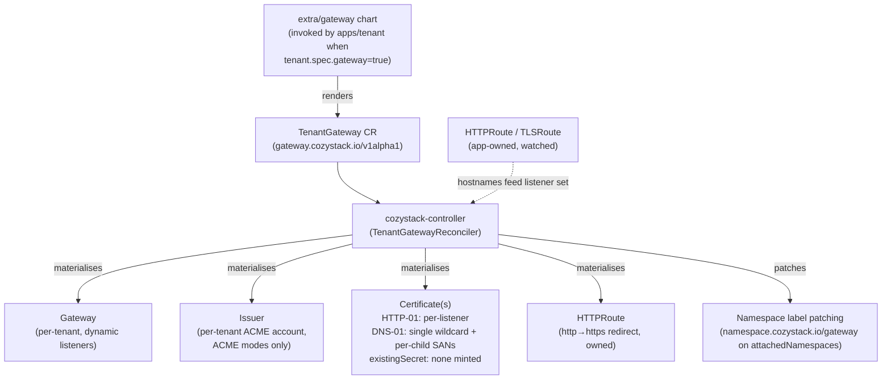
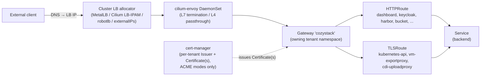
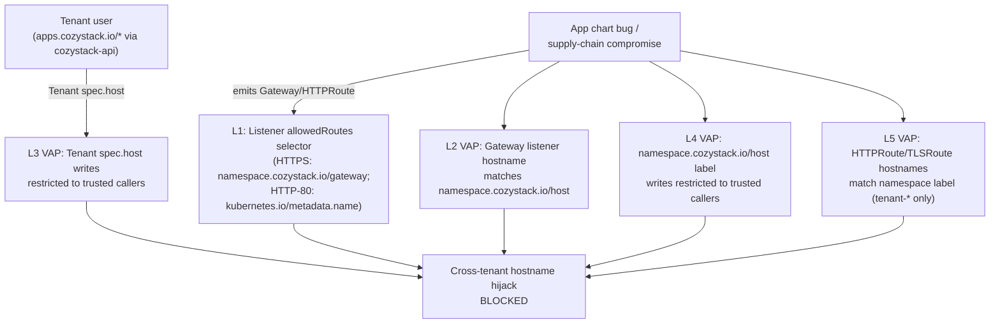

## Обзор

Cozystack ships Gateway API support as an opt-in alternative to ingress-nginx. When enabled, a tenant that explicitly opts in via `tenant.spec.gateway: true` gets its own `Gateway` (own LoadBalancer Service, own LB IP, and — on the ACME cert modes — its own per-tenant Issuer and Certificate) materialised in its own namespace. Every other tenant in the tree publishes through the Gateway of the nearest ancestor that owns one — same shape as the existing `_namespace.ingress` inheritance.

Чарт не рендерит ресурсы `Gateway`, `Issuer` или `Certificate` напрямую. Вместо этого он рендерит один CR `gateway.cozystack.io/v1alpha1 TenantGateway` на каждый включивший опцию тенант, а `cozystack-controller` согласует из него все нижестоящие объекты Gateway API и cert-manager. Это устраняет гонку между Helm и контроллером за `Gateway.spec.listeners`, которую иначе вызывала бы динамическая материализация слушателей на основе маршрутов.

This page documents the architecture, the inheritance model, the cert-mode choice (HTTP-01 default, DNS-01 wildcard opt-in, or an operator-provided wildcard Secret), the two-group security model, and the migration story from ingress-nginx.

Gateway API и ingress-nginx сосуществуют в одном кластере - режимы выбираются для каждого сервиса / тенанта, а не глобально. Существующие кластеры обновляются с `gateway.enabled=false` и не видят изменений в поведении.

### Поверхность API для тенантов

Тенанты в Cozystack взаимодействуют с платформой исключительно через ресурсы `apps.cozystack.io/*`, обслуживаемые `cozystack-api`; RBAC тенанта не даёт права записи в `gateway.networking.k8s.io/*`, базовые `Namespaces` или `cozystack.io/Package`. В разделе [Безопасность](#безопасность) объясняется, как уровни допуска (admission) выстроены с учётом этого ограничения.

## Архитектура

### Поток согласования



Контроллер:

- Materialises the `Gateway`, the redirect HTTPRoute, and — on the ACME cert modes — the per-tenant `Issuer` and the Certificate(s) from `TenantGateway.spec`. In `existingSecret` mode it mints neither, and points the listeners at the operator-supplied Secret instead.
- Watches `HTTPRoute` and `TLSRoute` resources cluster-wide. For each route attached to its Gateway, it picks up the hostnames and (in HTTP-01 mode) appends a per-app HTTPS listener + a per-app `Certificate`.
- In DNS-01 mode, extends the wildcard `Certificate` with `<child-apex>` + `*.<child-apex>` SANs for every tenant inheriting through this Gateway (discovered by listing namespaces with `namespace.cozystack.io/gateway = <owner>` and reading their `namespace.cozystack.io/host`), and adds one `*.<child-apex>` HTTPS listener per inheriting child.
- Patches `namespace.cozystack.io/gateway = <owner>` onto every namespace in `TenantGateway.spec.attachedNamespaces` (the cozy-* system namespaces published through the Gateway). The patch is annotated with `cozystack.io/gateway-attached-by` so the controller knows which labels it wrote and which are owned by the `apps/tenant` chart — labels written by the chart are never touched. Labels written by the controller are garbage-collected when the namespace is removed from `attachedNamespaces`.
- Resolves cross-namespace hostname conflicts: `cozy-*` namespaces (cluster-admin-managed platform services) win over tenant namespaces; the loser receives a `HostnameConflict` condition under the controller's name in `Status.Parents`.
- Refuses to silently take over pre-existing `Gateway`, `Issuer`, `Certificate`, or redirect `HTTPRoute` objects that share the controller-derived name but carry no `OwnerReference` back to the TenantGateway. Operators see an explicit `Ready=False/ReconcileError` condition instead of having their hand-pinned config rewritten.

### Путь трафика



- **`GatewayClass`** is set per TenantGateway via the operator-configurable `gatewayClassName` field on the chart (default `cilium`). Tenants do not hold RBAC to write `TenantGateway` CRs, so they cannot pick a class on their own.
- **One `Gateway` per owning tenant** in that tenant's namespace. Every inheriting child's HTTPRoutes / TLSRoutes attach to the same Gateway via cross-namespace ParentRef; there is no cross-Gateway merge.
- **Envoy** runs as a Cilium DaemonSet (`cilium.envoy.enabled=true`) and handles both TLS termination (HTTPS listeners) and TLS passthrough (dedicated per-service listeners for the kubeapiserver and the KubeVirt VM export / CDI upload proxies). `envoy.enabled=true` is the default for fresh Cozystack installations; operators upgrading an existing cluster where the Cilium values were set explicitly should verify the flag is on before flipping `gateway.enabled`.
- **LoadBalancer IP** is allocated by whichever LB mechanism the cluster admin has configured at the platform layer — same shape as ingress-nginx today. Cozystack ships MetalLB installed but does not render any `IPAddressPool` / `L2Advertisement` / `BGPAdvertisement` / `CiliumLoadBalancerIPPool` from the tenant chart. Admins wire up the allocator that fits their environment (MetalLB pool with L2 / BGP, Cilium LB-IPAM with announcer, [robotlb](https://github.com/aenix-io/robotlb) against a Hetzner Robot fleet, or `Service.spec.externalIPs` as a manual pinning mechanism). The tenant API stays mechanism-agnostic — there is no `gatewayIP` field on the Tenant CR. To pin a specific address, the operator pre-creates the LoadBalancer Service with `loadBalancerIP` set, or hands the tenant a reference to a named admin-managed pool.
- **`externalTrafficPolicy`**: the LoadBalancer Service that backs the Gateway is created by Cilium and uses the Kubernetes default (`Cluster`). Source IPs of external clients are therefore NAT'd to the receiving node. The legacy ingress-nginx path behaves the same way whenever `publishing.externalIPs` is set — the usual bare-metal install — because the host ingress Service is then a `ClusterIP` carrying `spec.externalIPs` with `externalTrafficPolicy: Cluster`. It preserves source IPs only when `publishing.externalIPs` is left empty: the Service is a `LoadBalancer` with `externalTrafficPolicy: Local`, which constrains the LB IP to nodes hosting ingress pods. Operators who need source IP preservation for Gateway-API traffic must patch the Service themselves or front it with a PROXY-protocol-capable upstream LB.

### Раскладка слушателей на Gateway тенанта

Gateway тенанта всегда материализует HTTP-слушатель:

| # | Имя | Протокол | Порт | Имя хоста | Назначение |
| --- | --- | --- | --- | --- | --- |
| 1 | `http` | `HTTP` | 80 | none (wildcard) | ACME `/.well-known/acme-challenge/*` + HTTP→HTTPS redirect HTTPRoute — the HTTP→HTTPS redirect renders in every cert mode; the ACME challenge path is only used on the ACME modes |

Плюс HTTPS-слушатели, зависящие от режима сертификатов:

- **HTTP-01 mode (default):** one HTTPS listener per attached HTTPRoute hostname, named `https-<first-label>-<8-hex>`. The hex suffix is the first 32 bits of `sha256(hostname)` so two different hostnames sharing the same first label (`harbor.foo.example.com` vs `harbor.alice.example.com`) get distinct listener names. Each listener's `tls.certificateRefs` points at a per-listener `Certificate` named `<tgw>-<first-label>-<8-hex>-tls`, also auto-issued.
- **DNS-01 mode (opt-in):** `https` (`*.<owner apex>`) and `https-apex` (`<owner apex>`) listeners consuming a single wildcard Certificate, plus one `https-child-<first-label>-<8-hex>` listener per inheriting child apex (referencing the same wildcard cert, whose dnsNames are extended with `<child-apex>` + `*.<child-apex>` SANs).
- **existingSecret mode (operator-provided wildcard):** the same listener set as DNS-01 — `https` (`*.<owner apex>`), `https-apex` (`<owner apex>`), and one `https-child-<first-label>-<8-hex>` per inheriting child apex — except that every `tls.certificateRefs` points at the operator-supplied Secret named by `publishing.certificates.wildcardSecretName`, and no `Certificate` is issued for any of them.

Плюс по одному дополнительному слушателю на каждый сервис со сквозной передачей TLS (см. [TLSRoute (TLS passthrough)](#tlsroute-tls-passthrough)).

`allowedRoutes.namespaces` слушателей использует два разных селектора в зависимости от роли слушателя:

- **HTTPS-слушатели и слушатели сквозного TLS** сопоставляются по метке `namespace.cozystack.io/gateway` и допускают маршруты из любого пространства имён, чья метка равна имени пространства имён тенанта-владельца (например, `tenant-root`, `tenant-alice` - имя пространства имён, а не «голое» имя тенанта). Это точка опоры наследования - пространство имён каждого наследующего потомка несёт то же значение метки (записанное чартом `apps/tenant`), а системные пространства имён cozy-* из `attachedNamespaces` получают ту же метку от контроллера.
- **Простой HTTP-слушатель (порт 80)** использует строго более узкий белый список по встроенной метке `kubernetes.io/metadata.name` - только само пространство имён тенанта-владельца (где живёт принадлежащий контроллеру HTTPRoute перенаправления) и `cozy-cert-manager` (HTTPRoute для проверок ACME HTTP-01). Поэтому HTTPRoute приложений, прикрепляющиеся к Gateway по имени хоста, не могут привязаться к порту 80 и отдавать незашифрованный трафик.

HTTPS-слушатели дополнительно ограничивают `allowedRoutes.kinds` до `HTTPRoute` (а слушатели сквозного TLS - до `TLSRoute`), не позволяя GRPCRoute / TCPRoute / UDPRoute прикрепляться вне зоны покрытия VAP по именам хостов маршрутов.

## Включение Gateway API

Gateway API включается на двух уровнях. Оба значения по умолчанию остаются `false`; обновления не переключают тенантов незаметно.

### 1. Флаг на уровне платформы

Установите `gateway.enabled: true` в Package `cozystack.cozystack-platform`. Полные таблицы значений `gateway.*` и `publishing.certificates.dns01.*` см. в [справочнике Platform Package]({}).

```yaml
apiVersion: cozystack.io/v1alpha1
kind: Package
metadata:
  name: cozystack.cozystack-platform
spec:
  variant: isp-full
  components:
    platform:
      values:
        publishing:
          host: example.org
        gateway:
          enabled: true
          attachedNamespaces:
            - cozy-cert-manager
            - cozy-dashboard
            - cozy-keycloak
            - cozy-system
            - cozy-harbor
            - cozy-bucket
            - cozy-kubevirt
            - cozy-kubevirt-cdi
            - cozy-monitoring
            - cozy-linstor-gui
            - default
```

Пространство имён `default` включено потому, что `TLSRoute` Kubernetes API (поставляемый пакетом cozystack-api) живёт рядом с сервисом `kubernetes`, на который он указывает, а тот всегда находится в `default`.

Включение `gateway.enabled=true` задействует три вещи:

- `ClusterIssuer.spec.acme.solvers` в cert-manager переключается с `http01.ingress.ingressClassName` на `http01.gatewayHTTPRoute`, прикрепляющийся к Gateway публикующего тенанта.
- Шаблоны публикуемых сервисов (dashboard, keycloak, grafana, alerta) перестают рендерить свой `Ingress` и начинают рендерить свой `HTTPRoute`.
- Сервисы со сквозной передачей TLS (cozystack-api, vm-exportproxy, cdi-uploadproxy) перестают рендерить свой `Ingress` и начинают рендерить `TLSRoute`, прикреплённый к выделенному слушателю Passthrough.

Список `attachedNamespaces` перечисляет системные пространства имён `cozy-*`, маршруты которых должны публиковаться через Gateway тенанта-владельца. Контроллер проставляет `namespace.cozystack.io/gateway = <owner>` на каждую запись, чтобы её маршруты проходили селектор `allowedRoutes` слушателя. Пространства имён тенантов (`tenant-*`) тоже могут быть в списке - они просто получают ту же метку наряду с записями `cozy-*`. Статический список не является вектором межтенантного перехвата; эту роль закрывают уровни 1, 2, 4 и 5 в разделе [Безопасность](#безопасность).

### 2. Gateway для отдельного тенанта

A tenant gets its own `TenantGateway` CR (and through the controller, its own `Gateway`, `LoadBalancer` Service and — on the ACME modes — its own `Issuer` and `Certificate`(s)) only when it explicitly asks via `tenant.spec.gateway: true`. Every other tenant in the tree publishes through the Gateway of the nearest ancestor that owns one — same shape as `_namespace.ingress` inheritance today. The default is `gateway` unset, which resolves to `false` (inherit).

Отдельный Gateway имеет смысл, когда:

- тенанту нужен собственный IP балансировщика (DNS уже закреплён за конкретным адресом, правило межсетевого экрана на этот адрес);
- apex тенанта не выводится из родительского (оператор задал собственный `tenant.spec.host`, например `customer1.example`, а не поддомен - wildcard-сертификат / Issuer предка не может его покрыть);
- тенант хочет собственную учётную запись ACME / Issuer (отдельный бюджет ограничений частоты, отдельный удостоверяющий центр).

В остальных случаях оставьте `gateway` незаданным и наследуйте.

```yaml
# Tenant 'alice' under tenant-root: apex is derived as alice.<parent apex>,
# inherits the parent's Gateway. No separate LB IP, no separate Issuer.
apiVersion: apps.cozystack.io/v1alpha1
kind: Tenant
metadata:
  name: alice
  namespace: tenant-root
spec: {}
```

```yaml
# Tenant 'acme' with a fully independent apex: must opt in to own a
# Gateway, because the parent's cert/Issuer can't cover customer1.example.
apiVersion: apps.cozystack.io/v1alpha1
kind: Tenant
metadata:
  name: acme
  namespace: tenant-root
spec:
  host: customer1.example
  gateway: true
```

```yaml
# Tenant 'bob' under tenant-root: derived apex, but wants its own
# LB IP and ACME account (DNS pinned to a specific address).
apiVersion: apps.cozystack.io/v1alpha1
kind: Tenant
metadata:
  name: bob
  namespace: tenant-root
spec:
  gateway: true
```

Установка собственного значения `tenant.spec.host` зарезервирована за администраторами кластера и сервисными учётными записями cozystack/Flux (обеспечивается во время выполнения политикой `cozystack-tenant-host-policy`, см. [Безопасность](#безопасность)).

### Наследование

Чарт `apps/tenant` записывает `namespace.cozystack.io/gateway: <owner-namespace>` на каждое пространство имён тенанта, где значение - либо имя собственного пространства имён этого тенанта (когда `gatewayEffective` разрешается в `true`), либо имя пространства имён наследуемого предка (при наследовании). То же значение попадает в `_namespace.gateway` внутри секрета `cozystack-values` тенанта, поэтому вендоренные приложения (harbor, bucket, …) рендерят свои HTTPRoute с `parentRefs.namespace`, указывающим на пространство имён владельца.

Чтобы проверить, через какой Gateway сейчас наследуется данное пространство имён тенанта:

```bash
kubectl get namespace <tenant-ns> \
  -o jsonpath='{.metadata.labels.namespace\.cozystack\.io/gateway}{"\n"}'
```

Пустое значение означает, что ни у одного предка в цепочке нет `tenant.spec.gateway: true`, и маршруты в этом пространстве имён не прикрепятся ни к какому Gateway.

Селектор `allowedRoutes.namespaces.selector` слушателя Gateway-владельца сопоставляется ровно с этой меткой, поэтому один и тот же селектор допускает маршруты из каждого пространства имён дерева владельца - как потомков, так и записей cozy-* из `attachedNamespaces`. Отдельного ReferenceGrant на каждого потомка нет: селектор по метке и есть межпространственный шлюз.

В режиме DNS-01 контроллер расширяет wildcard-`Certificate` Gateway-владельца SAN-записями `<child-apex>` + `*.<child-apex>` для каждого наследующего потомка (они обнаруживаются перечислением пространств имён с тем же значением `namespace.cozystack.io/gateway` и чтением их `namespace.cozystack.io/host`) и добавляет HTTPS-слушатель `*.<child-apex>` на каждый apex потомка. Без этого расширения одноуровневый wildcard родителя не может покрыть имя хоста маршрута потомка (`harbor.alice.example.org` на две метки глубже родительского `*.example.org`).

Проверка ACME DNS-01 должна пройти для каждой SAN-записи, а значит, настроенная учётная запись DNS-провайдера должна уметь записывать TXT-записи под каждым уровнем apex, который обслуживает родитель. Для глубоко вложенных наследующих потомков это требует либо делегирования зоны, либо учётных данных провайдера с правами на все уровни apex. Режим HTTP-01 не затронут - каждая проверка на отдельный слушатель выполняется для конкретного имени хоста.

A tenant that opts into its own Gateway becomes a separate boundary: separate `Gateway` and — on the ACME cert modes — a separate `Issuer`, ACME account and `Certificate`(s), its own subset of inheriting descendants. Child tenants under it do not share HTTP-01 challenge state with the grandparent.

## Cert mode: HTTP-01 (default) vs DNS-01 (opt-in) vs existing Secret

`publishing.certificates.solver` controls how the per-tenant Issuer sources TLS certs — but only on the two ACME paths. Setting `publishing.certificates.wildcardSecretName` selects a third mode, `existingSecret`, in which the tenant serves an operator-supplied wildcard Secret and the controller mints no Issuer at all; the solver, DNS-01 provider, and issuer settings are then skipped. See [Certificates](#certificates) below, and the [Platform Package reference]({}) for the full set of `publishing.certificates.dns01.*` provider keys.

### HTTP-01 (по умолчанию)

Работает из коробки, дополнительная настройка не требуется. Контроллер:

- Рендерит ACME `Issuer` в пространстве имён тенанта с солвером `http01.gatewayHTTPRoute`, указывающим на собственный Gateway тенанта / слушатель `http`.
- Наблюдает за HTTPRoute / TLSRoute, прикреплёнными к Gateway (с parentRefs на него). Для каждого нового имени хоста он добавляет HTTPS-слушатель и `Certificate` этого приложения (dnsNames содержит ровно это имя хоста).
- Именование слушателей приложений: `https-<first-label>-<8-hex>` (например, `https-harbor-deadbeef`).
- Именование сертификатов приложений: `<tgw>-<first-label>-<8-hex>-tls`.

Добавление приложения тенанта - будь то под тенантом-владельцем или под любым наследующим потомком - сводится к развёртыванию его HTTPRoute. Правки платформенного Package не нужны. Платформенные сервисы cozy-* (dashboard, keycloak, grafana, alerta, cozystack-api, vm-exportproxy, cdi-uploadproxy) по-прежнему управляются `publishing.exposedServices`, как и в схеме с ingress, - при `gateway.enabled=true` свой HTTPRoute / TLSRoute рендерят только сервисы из этого списка.

### DNS-01 (по выбору)

Установите `publishing.certificates.solver: dns01` и выберите провайдера:

| `publishing.certificates.dns01.provider` | Чарт проверяет заранее | Оператор должен предоставить |
| --- | --- | --- |
| `cloudflare` (по умолчанию) | (ничего - чарт никогда не падает) | Secret с именем из `cloudflare.secretName` (по умолчанию `cloudflare-api-token-secret`), содержащий API-токен Cloudflare под ключом из `cloudflare.secretKey` (по умолчанию `api-token`) |
| `route53` | `route53.region` (чарт падает на рендере, если пусто) | Либо IRSA / instance profile, либо `route53.secretName`, указывающий на Secret с секретным ключом доступа IAM под `route53.secretKey` (по умолчанию `secret-access-key`); опционально `route53.accessKeyID` |
| `digitalocean` | (ничего) | Secret с именем из `digitalocean.secretName` (по умолчанию `digitalocean-api-token-secret`), содержащий API-токен DigitalOcean под `digitalocean.secretKey` (по умолчанию `access-token`) |
| `rfc2136` | `rfc2136.nameserver` (чарт падает на рендере, если пусто) | `rfc2136.tsigKeyName` и `rfc2136.secretName`; Secret содержит материал ключа TSIG под `rfc2136.secretKey` (по умолчанию `tsig-secret-key`); `rfc2136.tsigAlgorithm` по умолчанию `HMACSHA256` |

Чарт вызывает `fail()` на этапе рендера только для ключей из второго столбца; остальное проверяется cert-manager во время проверки ACME, поэтому неправильно настроенный провайдер даёт `Challenge`, застрявший в `Pending`, а не ошибку рендера чарта.

Режим DNS-01 рендерит один wildcard-`Certificate`, покрывающий `<owner apex>` и `*.<owner apex>`, плюс соответствующие слушатели `https` (`*.<owner apex>`) и `https-apex` (`<owner apex>`). Новые приложения, публикуемые под apex, используют существующий wildcard-сертификат без выпуска отдельного сертификата на слушатель. Для каждого наследующего дочернего тенанта контроллер расширяет dnsNames wildcard-сертификата SAN-записями `<child-apex>` + `*.<child-apex>` и добавляет слушатель `*.<child-apex>`.

Платформенный чарт записывает конфигурацию провайдера в ключи `_cluster.dns01-*`, которые используются и чартом gateway отдельного тенанта (рендерящим CR TenantGateway), и общекластерными ClusterIssuer `letsencrypt-prod` / `letsencrypt-stage`, применяемыми в прежней схеме с ingress. Оба пути согласованы в том, какой провайдер активен.

Выбирайте DNS-01, когда вам нужен именно wildcard-сертификат - долгоживущий кластер со множеством приложений под одним apex, глубокие деревья наследования или жёсткие ограничения частоты Let's Encrypt. Gateway API ограничивает `Gateway.spec.listeners` 64 записями; HTTP-01 добавляет по одному HTTPS-слушателю на каждое публикуемое имя хоста (плюс обязательный слушатель `http` и слушатели сквозного TLS), поэтому развёртывание с одним тенантом, приближающееся к 60+ опубликованным приложениям на HTTP-01, упрётся в лимит, и отрендеренный `Gateway` не пройдёт допуск. DNS-01 сворачивает все имена хостов под apex в небольшое фиксированное число слушателей.

### existingSecret (operator-provided wildcard)

Set [`publishing.certificates.wildcardSecretName`]({}) and the tenant leaves ACME entirely: the `TenantGateway` points its listeners at that pre-existing Secret, and the controller mints no `Issuer` and no `Certificate`. The solver, DNS-01 provider and issuer settings are ignored on this path. Listener shape matches DNS-01, so it clears the 64-listener cap the same way.

Pick it when certificates are issued outside the cluster — a corporate CA, an existing wildcard, or a terminating LB that already holds one. Read [Certificates](#certificates) before enabling it: the Secret name reaches every tenant, and on the default ingress path a child tenant with its own ingress controller is left serving a self-signed certificate ([cozystack/cozystack#3296](https://github.com/cozystack/cozystack/issues/3296)).

## Per-service routing

При `gateway.enabled=true` следующие сервисы переключаются с `Ingress` на ресурсы Gateway API. Столбец **Условие рендера** отличает сервисы, которые всегда рендерят свой маршрут при включённом флаге платформы, от тех, которым дополнительно нужна запись в `publishing.exposedServices` (и от приложений тенантов, зависящих от заполненности `_namespace.gateway`).

### HTTPRoute (терминация TLS на Gateway)

| Сервис | Пространство имён | Имя `HTTPRoute` | Бэкенд | Слушатель | Условие рендера |
| --- | --- | --- | --- | --- | --- |
| dashboard | `cozy-dashboard` | `dashboard` | `incloud-web-gatekeeper:8000` | свой `https-dashboard-...` (HTTP-01) или `https` (DNS-01) | `gateway.enabled` И `dashboard` в `publishing.exposedServices` |
| keycloak | `cozy-keycloak` | `keycloak` | `keycloak-http:80` | так же | `gateway.enabled` |
| grafana | `cozy-monitoring` | `grafana` | `grafana-service:3000` | так же | `gateway.enabled` |
| alerta | `cozy-monitoring` | `alerta` | `alerta:80` | так же | `gateway.enabled` |
| harbor | пространство имён тенанта | `<release-name>` | `<release-name>:80` | Gateway тенанта-владельца | задан `_namespace.gateway` (любой предок включил опцию) |
| bucket | пространство имён тенанта | `<bucket-name>-ui` | `<bucket-name>-ui:8080` | Gateway тенанта-владельца | задан `_namespace.gateway` |

Солвер HTTP-01 cert-manager размещает свой короткоживущий `HTTPRoute` на слушателе `http` того же Gateway с сопоставлением по пути `/.well-known/acme-challenge/`. Более специфичное сопоставление пути выигрывает у общего HTTPRoute перенаправления HTTP→HTTPS.

### TLSRoute (TLS passthrough)

Сервисы, которым нужна сквозная передача на основе SNI (клиенты предъявляют сертификаты, TLS терминируется на бэкенде), используют `TLSRoute` на выделенном слушателе Passthrough. По одному слушателю на сервис, имя хоста ограничено FQDN этого сервиса:

| Сервис | Пространство имён | Имя `TLSRoute` | Бэкенд | Слушатель | Условие рендера |
| --- | --- | --- | --- | --- | --- |
| Kubernetes API | `default` | `kubernetes-api` | `kubernetes:443` | `tls-api` | `gateway.enabled` И `api` в `publishing.exposedServices` |
| Экспорт ВМ KubeVirt | `cozy-kubevirt` | `vm-exportproxy` | `vm-exportproxy:443` | `tls-vm-exportproxy` | `gateway.enabled` И `vm-exportproxy` в `publishing.exposedServices` |
| Загрузка CDI KubeVirt | `cozy-kubevirt-cdi` | `cdi-uploadproxy` | `cdi-uploadproxy:443` | `tls-cdi-uploadproxy` | `gateway.enabled` И `cdi-uploadproxy` в `publishing.exposedServices` |

Все три слушателя Passthrough (`tls-api`, `tls-vm-exportproxy`, `tls-cdi-uploadproxy`) рендерятся на Gateway всегда - контроллер материализует по одному на каждую запись в значении чарта `tlsPassthroughServices` (по умолчанию: `[api, vm-exportproxy, cdi-uploadproxy]`). `publishing.exposedServices` на самом деле управляет соответствующим шаблоном `TLSRoute` в каждом вышестоящем чарте: если сервис удалён из `publishing.exposedServices`, его слушатель по-прежнему существует, но к нему ничего не прикрепляется, и трафик не допускается.

`TLSRoute` в v1.5.x поставляется из экспериментального канала Gateway API (CRD `gateway.networking.k8s.io/v1alpha2`). В апстриме он переходит в `v1`; Cozystack последует за переименованием, когда оно выйдет.

## Безопасность

Тенанты в Cozystack взаимодействуют с платформой исключительно через ресурсы `apps.cozystack.io/*` (Tenant, Bucket, Kubernetes, …), обслуживаемые `cozystack-api`. RBAC тенанта (`cozy:tenant:*`, агрегируемый в RoleBinding в собственном пространстве имён тенанта) не даёт права записи в `gateway.networking.k8s.io/*`, базовые `Namespaces` или `cozystack.io/Package`. Описанные ниже защиты делятся на две группы по тому, от кого они защищают: большинство из пяти уровней не защищают от ввода пользователя-тенанта (соответствующий RBAC ему изначально не выдан); они защищают от ошибок в cozystack-controller / Flux, компрометации цепочки поставки чарта приложения и ошибок типа «сбитый с толку помощник» со стороны администратора кластера. Все проверки на этапе допуска работают по принципу fail-closed (`failurePolicy: Fail`, `validationActions: [Deny]`).

**Шлюз для ввода пользователя-тенанта** - уровень 3 (`cozystack-tenant-host-policy`). `Tenant.spec.host` - то самое задаваемое пользователем поле, которое проявляется как граница безопасности на уровне имён хостов; оно проверяется при каждом Create / Update через цепочку допуска `cozystack-api`.

**Эшелонированная защита** - уровни 1, 2, 4, 5. Сегодняшняя модель угроз - ошибки чартов, ошибки контроллера, компрометация цепочки поставки чарта приложения и ошибки администратора кластера; у тенантов нет RBAC для прямой записи Gateway или HTTPRoute. Если этот RBAC когда-нибудь расширится (будущий RoleBinding, агрегированная через CRD роль, включающая `gateway.networking.k8s.io/*`, чарт приложения, выдающий своей ServiceAccount права записи маршрутов), эти уровни продолжат применять те же ограничения имён хостов к новому вызывающему - они не обходятся вводом тенанта, просто сейчас им не задействуются.

Записи `tenant-*` в `gateway.attachedNamespaces` разрешены намеренно: вектор межтенантного перехвата - это селектор меток слушателя (закрытый уровнями 1, 2, 4 и 5), а не статический список прикрепления, поэтому пространства имён `tenant-*` в списке просто получают метку прикрепления к gateway наряду с записями cozy-*.



### Уровень 1 - селектор пространств имён `allowedRoutes` слушателя

Каждый слушатель на Gateway тенанта закрепляет `allowedRoutes.namespaces.from: Selector`. Механика селектора различается по роли слушателя:

- **HTTPS-слушатели и слушатели сквозного TLS** используют `matchLabels: { namespace.cozystack.io/gateway: <owner-namespace> }`. Значение метки - пространство имён TenantGateway: для `tenant-root` это `tenant-root`, для `tenant-alice` - `tenant-alice` (то есть имя пространства имён, а не «голое» имя тенанта). Метку записывает чарт `apps/tenant` на каждое пространство имён тенанта (имя собственного пространства имён при владении Gateway, имя пространства имён наследуемого предка в остальных случаях) и проставляет контроллер на каждое пространство имён из `attachedNamespaces`. Пространства имён без совпадающего значения не могут прикрепить к этим слушателям ни один HTTPRoute / TLSRoute.
- **Простой HTTP-слушатель (порт 80)** использует строго более узкий белый список `matchExpressions` по встроенной метке `kubernetes.io/metadata.name` - только собственное пространство имён тенанта-владельца (где живёт принадлежащий контроллеру HTTPRoute перенаправления) и `cozy-cert-manager` (HTTPRoute проверок ACME HTTP-01). Поэтому HTTPRoute приложений, прикрепляющиеся по имени хоста, не могут привязаться к порту 80 и незаметно отдавать незашифрованный трафик.

HTTPS-слушатели дополнительно ограничивают `allowedRoutes.kinds` до `HTTPRoute` (слушатели сквозного TLS - до `TLSRoute`), не позволяя `GRPCRoute` / `TCPRoute` / `UDPRoute` прикрепляться вне зоны покрытия VAP уровня 5.

### Уровень 2 - `cozystack-gateway-hostname-policy`

`ValidatingAdmissionPolicy`, ограниченная операциями CREATE/UPDATE `Gateway` группы `gateway.networking.k8s.io` в версиях `v1` и `v1beta1` (так что кластер, всё ещё обслуживающий Gateway `v1beta1`, тоже покрыт). CEL читает `namespaceObject.metadata.labels["namespace.cozystack.io/host"]` и отклоняет любой слушатель, чьё имя хоста не равно этому значению и не является его поддоменом. `matchConditions` ограничивают VAP только пространствами имён `tenant-*` - Gateway в посторонних пространствах имён (например, `kube-system`) не затрагиваются.

Поскольку VAP читает метку пространства имён (а не общекластерный ConfigMap), тенант с полностью независимым apex-доменом (например, `customer1.example`, не поддомен apex платформы) валидируется корректно - VAP не предполагает иерархию поддоменов.

### Уровень 3 - `cozystack-tenant-host-policy`

`ValidatingAdmissionPolicy`, ограниченная операциями CREATE/UPDATE `apps.cozystack.io/v1alpha1 Tenant`. Отклоняет установку или изменение `spec.host`, если вызывающий не входит в группу `system:masters` и не является одним из `system:serviceaccounts:cozy-system`, `system:serviceaccounts:cozy-cert-manager`, `system:serviceaccounts:cozy-fluxcd`, `system:serviceaccounts:kube-system`. Тенанты по-прежнему могут создавать тенантов с пустым `spec.host` (обычный поток наследования).

Это закрывает путь, при котором пользователь-тенант создаёт Tenant с `spec.host=dashboard.example.org`, чтобы чарт тенанта записал перехваченную метку в его пространство имён.

`cozystack-api` - это агрегированный APIServer с собственной реализацией. REST-обработчик CR Tenant в `pkg/registry/apps/application/rest.go` явно вызывает колбэки `createValidation` / `updateValidation` / `deleteValidation` в Create / Update / Delete - в отличие от `genericregistry.Store`, пользовательские REST-обработчики должны подключать эти хуки сами. С подключёнными хуками каждая ValidatingAdmissionPolicy и ValidatingWebhook, ограниченная `apps.cozystack.io/*`, срабатывает на всех трёх операциях, как того требует контракт apiserver.

### Уровень 4 - `cozystack-namespace-host-label-policy`

`ValidatingAdmissionPolicy`, ограниченная операциями CREATE/UPDATE базового `v1 Namespace`. Считает `namespace.cozystack.io/host` фактически неизменяемой: отклоняет любое **изменение** значения (включая переход от пустого к заданному, что покрывает первые записи и на CREATE, и на UPDATE), если вызывающий не входит в тот же белый список доверенных вызывающих, что и на уровне 3. Идемпотентные повторные применения **того же** значения разрешены любому вызывающему - фактическое сообщение об ошибке CEL («namespace label namespace.cozystack.io/host is immutable once set») это отражает. Устанавливать или менять значение метки могут только сервисные учётные записи cozystack/Flux (которые применяют чарт тенанта).

В сочетании с уровнем 3 пользователь-тенант не может установить или изменить свой хост ни через CR Tenant, ни через метку пространства имён.

### Уровень 5 - `cozystack-route-hostname-policy` (HTTPRoute) и `cozystack-route-hostname-policy-tls` (TLSRoute)

Пара объектов `ValidatingAdmissionPolicy` с одинаковым CEL-выражением. `cozystack-route-hostname-policy` нацелена на CREATE/UPDATE `HTTPRoute` группы `gateway.networking.k8s.io` (`v1` и `v1beta1`); `cozystack-route-hostname-policy-tls` - на `TLSRoute` в `v1alpha2`. Обе ограничены пространствами имён `tenant-*` (cozy-* управляются администратором кластера, и им доверено публиковаться под любым apex) и отклоняют любую запись `spec.hostnames`, которая не равна метке `namespace.cozystack.io/host` пространства имён и не является её поддоменом. **Fail-closed при отсутствии метки** - пространство имён `tenant-*` без `namespace.cozystack.io/host` отклоняется, а не молча пропускается. Операторы, выполняющие `kubectl get validatingadmissionpolicy`, увидят оба объекта.

Это эшелонированная защита от ошибки чарта приложения или компрометации цепочки поставки, генерирующей ресурсы Gateway API вне apex тенанта, - тенанты в Cozystack по замыслу не имеют RBAC `gateway.networking.k8s.io/*`, так что это не защита от пользователя-тенанта. Внутриapex-ный межпространственный случай (чарт тенанта, претендующий на имя хоста, принадлежащее приложению `cozy-*`) обрабатывается контроллером на этапе согласования - см. [Разрешение HostnameConflict](#разрешение-hostnameconflict) ниже.

Допустимый суффикс хоста - всегда значение метки `namespace.cozystack.io/host` самого пространства имён: у уровня 5 нет особого случая для `tenant-root` и нет жёстко заданного правила выведения. Что бы чарт apps/tenant ни записал в эту метку (выведенное `<name>.<parent apex>` для наследующих потомков, `publishing.host` кластера для `tenant-root`, заданный оператором `tenant.spec.host` для тенантов с собственным apex), - именно этим должен оканчиваться каждый маршрут в этом пространстве имён. Тенант с независимым apex (`customer1.example` вместо поддомена) обрабатывается корректно, потому что VAP читает метку, а не предполагает иерархию поддоменов.

### Разрешение HostnameConflict

Когда два маршрута из разных пространств имён претендуют на одно имя хоста, контроллер выбирает победителя детерминированно:

- Маршрут из пространства имён `cozy-*` (платформенный сервис под управлением администратора кластера) выигрывает у маршрута из любого другого пространства имён.
- В пределах одного приоритетного уровня выигрывает маршрут с лексикографически наименьшей парой `<namespace>/<name>`.

Проигравший маршрут получает `Accepted=False` с `Reason=HostnameConflict` в `Status.Parents` под именем контроллера (`gateway.cozystack.io/tenantgateway-controller`). Записи статуса других контроллеров (Cilium и т.д.) не затрагиваются.

### Защита от захвата чужих объектов

Шесть путей согласования отказываются молча перезаписывать или присваивать уже существующее состояние, которое носит выведенное контроллером имя / аннотацию, но не происходит от этого `TenantGateway`:

- `Gateway` (named after the TenantGateway)
- redirect `HTTPRoute` (`<tgw>-http-redirect`)
- per-tenant `Issuer` (`<tgw>-gateway`, ACME cert modes only)
- wildcard `Certificate` (`<tgw>-gateway-tls`, DNS-01 mode)
- per-listener `Certificate` (`<tgw>-<first-label>-<8-hex>-tls`, HTTP-01 mode)
- Namespace label `namespace.cozystack.io/gateway` — the controller only writes or strips this label on namespaces it annotates with `cozystack.io/gateway-attached-by`. Labels written by the `apps/tenant` chart (no annotation) are never touched, so inheritance for tenant namespaces survives every reconcile.

Для путей с именованными объектами оператор, вручную закрепивший Certificate или Issuer под выведенным контроллером именем (частный УЦ, ручное закрепление сертификата, внутренний ACME), получает явное условие `Ready=False/ReconcileError` на TenantGateway вместо молчаливого уничтожения его конфигурации и перевыпуска ресурса из другой учётной записи ACME. Сообщение об ошибке указывает на конфликтующий объект, чтобы оператор мог либо удалить его (передав владение контроллеру), либо переименовать.

### От чего это НЕ защищает

Эти остаточные риски - осознанные проектные решения, а не пробелы в реализации:

- **Cluster-admin credentials.** Anyone in `system:masters` or with a matching cozystack/Flux SA can set any host. Gateway API isolation is not the weakest link at that trust level.
- **DNS control.** A tenant whose VAP-allowed hostname does not resolve to the cluster's LB IP cannot complete ACME HTTP-01. No Certificate is issued; no hijack even if admission somehow admitted the Gateway. ACME's DNS-based identity proof is the last line. This layer does not exist in `existingSecret` mode — nothing is issued, so nothing proves domain control; the operator's Secret is trusted as supplied.
- **Shared LB allocator.** Multiple owning tenants drawing from the same admin-managed pool (MetalLB, Cilium LB-IPAM, etc.) compete for addresses via that allocator's rules. Per-Service IP uniqueness is the allocator's responsibility — same as for any other LoadBalancer Service in the cluster.

## Сертификаты

On the two ACME modes, every tenant with `spec.gateway: true` gets its own cert-manager `Issuer` (namespace-scoped, not `ClusterIssuer`) named `<tgw>-gateway`. The Issuer carries its own ACME account via `privateKeySecretRef: <tgw>-acme-account`. Certificates reference `issuerRef.kind: Issuer, name: <tgw>-gateway`.

В **режиме HTTP-01** - по одному Certificate на имя хоста опубликованного приложения (с именем `<tgw>-<first-label>-<8-hex>-tls`). В **режиме DNS-01** один wildcard-Certificate (с именем `<tgw>-gateway-tls`) покрывает `<owner apex>` и `*.<owner apex>`, плюс SAN-записи на apex каждого потомка (`<child-apex>` и `*.<child-apex>`) для каждого наследующего тенанта.

Both of the above are ACME modes. Setting [`publishing.certificates.wildcardSecretName`]({}) selects a third mode, **existingSecret**: the `TenantGateway` references the operator-provided Secret directly, and the controller mints no per-tenant `Issuer` and no `Certificate` — the solver, DNS-01 provider, and issuer settings are skipped on this path, and any `Issuer` or `Certificate` it previously owned is garbage-collected. The ACME account private key (`<tgw>-acme-account`) is NOT removed on a mode switch — only the `Issuer` referencing it is. Nothing in this release garbage-collects that Secret; delete it by hand if the account key should not outlive the mode. The cluster-wide `letsencrypt-prod` / `letsencrypt-stage` `ClusterIssuer`s are unaffected: they are rendered from `publishing.certificates.solver` regardless, and still validate their DNS-01 provider settings at render time. The listener shape matches DNS-01: one `*.<apex>` listener, one `<apex>` listener, and one `*.<child-apex>` listener per inheriting child, all pointing at that one Secret.

Certificate coverage for children then splits into three cases, with different failure modes and different remedies. The first two apply on the Gateway path; the third applies on the default ingress-nginx path and is an open bug, not a constraint you can configure around:

- **Inheriting children** (the default, no `spec.gateway`) have no Gateway of their own. Their `*.<child-apex>` listener is rendered on the owner's Gateway and bound to the Secret in the *owner's* namespace, so coverage depends entirely on that Secret's SAN list — a bare `*.<apex>` does not match `*.<child-apex>`, and clients of the child subdomain are served the owner's certificate and see a hostname mismatch. Replicating the Secret into the child's namespace fixes nothing here, because no listener reads it; the SANs must cover each child apex.
- **Children that own a Gateway** (`spec.gateway: true`) render their own `TenantGateway`, inherit the Secret *name* through the cluster values channel, and resolve it in **their own** namespace. Gateway API does allow a listener to reference a Secret in another namespace, via a `ReferenceGrant`, but the controller does not use that route: it renders `certificateRefs` without a namespace and issues no `ReferenceGrant`, so the reference is always local. There the Secret does have to be replicated, or the tenant is left without a certificate.
- **Children on the ingress-nginx path** (`gateway.enabled=false`, the default) are hit hardest. The Secret name reaches every tenant, and the app and system ingress templates drop their per-host ACME annotation as soon as it is non-empty — but the ingress chart passes `default-ssl-certificate` only to the *publishing* controller. A child running its own ingress controller (`ingress: true`) therefore ends up with neither: its apps have no certificate of their own, and its controller has no default one, so ingress-nginx serves its built-in self-signed certificate for every host in that tenant. Replicating the Secret does not help — the flag is gated on the namespace, not on the Secret. This is tracked as [cozystack/cozystack#3296](https://github.com/cozystack/cozystack/issues/3296); until it is fixed, do not set `wildcardSecretName` on a cluster whose child tenants run their own ingress controllers.

This is why the mode is *supported* for the root tenant only. Nothing enforces that scope: the Secret name reaches every tenant through the same values channel, so enabling it on a cluster that already has gateway-owning children flips those children onto `existingSecret` too.

Two ACME servers are supported out of the box:

- `publishing.certificates.issuerName: letsencrypt-prod` → `https://acme-v02.api.letsencrypt.org/directory`
- `publishing.certificates.issuerName: letsencrypt-stage` → `https://acme-staging-v02.api.letsencrypt.org/directory`

Любое другое значение приводит к ошибке рендера чарта. Чтобы поддержать нового провайдера ACME: добавьте константу `letsencrypt*Server` (или аналогичную) рядом с существующими в `internal/controller/tenantgateway/reconciler.go`, затем добавьте ветку в `acmeServerForIssuer` в `internal/controller/tenantgateway/renderers.go`, сопоставляющую имя издателя с этой константой.

### Ограничения частоты

Let's Encrypt применяет квоты на учётную запись и на зарегистрированный домен:

- 50 новых сертификатов на зарегистрированный домен в неделю
- 5 дублирующих сертификатов в неделю для одного и того же набора имён хостов
- 300 новых заказов на учётную запись за 3 часа

Setting `publishing.certificates.wildcardSecretName` sidesteps the quotas entirely — that mode issues no ACME certificates at all — at the cost of the caveats in [Certificates](#certificates). A cluster where many tenants share the same apex domain can exhaust these quickly, especially in HTTP-01 mode where each published app contributes one certificate. Mitigations:

- `publishing.certificates.issuerName: letsencrypt-stage` для непроизводственных кластеров (квоты staging не влияют на prod).
- `tenant.spec.resourceQuotas.count/certificates.cert-manager.io`, чтобы ограничить создание сертификатов на тенанта.
- Переход на DNS-01, чтобы объединить приложения каждого тенанта под одним wildcard-сертификатом (сокращает количество сертификатов с N приложений до 1 на тенанта-владельца; наследующие потомки сворачиваются в wildcard родителя через расширение SAN).
- Для изолированных развёртываний используйте поставляемый `selfsigned-cluster-issuer` или внутренний сервер ACME.

Рекомендуемая квота на уровне тенанта, сдерживающая тенанта, ведущего себя некорректно:

```yaml
apiVersion: apps.cozystack.io/v1alpha1
kind: Tenant
spec:
  gateway: true
  resourceQuotas:
    count/certificates.cert-manager.io: "10"
```

## Миграция с ingress-nginx

Два режима сосуществуют. Переключение выполняется на уровне кластера (`gateway.enabled`) и на уровне тенанта (`tenant.spec.gateway`), а не глобально.

### Для нового кластера

Установите `gateway.enabled: true` при установке. Ingress-nginx можно полностью отключить, когда каждый тенант-владелец получит `spec.gateway: true` и каждое опубликованное приложение под этими тенантами мигрирует.

Тенанты-владельцы затем объявляют `spec.gateway: true` при создании. Их потомки наследуют через метку пространства имён без явного включения.

### Для существующего кластера

Order matters — flipping `gateway.enabled: true` before any Gateway exists causes a live outage on the platform-managed exposed services. The cozy-* HTTPRoutes start rendering and the matching Ingresses are deleted, but the Gateway they ParentRef does not yet exist, so external traffic to dashboard / keycloak / Kubernetes API / VM export / CDI upload is dropped until both the Gateway is `Programmed` and — on the ACME cert modes — its Certificates are `Ready`. Do the per-tenant opt-in **first**, the platform flip **second**.

Every per-tenant TenantGateway, its rendered Gateway, and (on the ACME cert modes) its Issuer and — in DNS-01 mode — its wildcard Certificate are derived from a fixed name — the chart hardcodes the `TenantGateway` to `cozystack`, and the controller derives `cozystack-gateway` (Issuer), `cozystack-gateway-tls` (DNS-01 wildcard cert), and `cozystack-http-redirect` (HTTP→HTTPS redirect route) from it. Every kubectl command below uses those literal names regardless of which tenant owns the Gateway.

1. For each tenant that should own a Gateway (typically at least `tenant-root`), set `tenant.spec.gateway: true`. The tenant chart materialises the `TenantGateway` CR and the controller reconciles the Gateway and, on the ACME cert modes, the Issuer and Certificate(s). Descendants of an owning tenant pick up the parent's Gateway automatically via the namespace label.
2. Wait for the Gateway, and for the Certificates on the ACME cert modes. The Gateway is always named `cozystack`:

   ```bash
   kubectl -n <owner-tenant-ns> wait gateway/cozystack --for=condition=Programmed --timeout=5m
   ```

   `Programmed` proves less than it looks. Cilium sets it once the Gateway has been assigned an address **and** at least one listener was accepted — it is not a per-listener check. A listener that cannot resolve its certificate is marked `ResolvedRefs=False`, drops out of the accepted set, and the Gateway stays `Programmed` as long as any listener remains — and the plain `http` listener on port 80 always does. So `Programmed=True` tells you the load balancer handed the Gateway an address; it says nothing about whether any HTTPS listener found its Secret.

   The `TenantGateway`'s own `Ready` condition is the aggregate one: it is computed from every listener and reports `ListenersNotReady` when a `certificateRefs` target is missing.

   ```bash
   kubectl -n <owner-tenant-ns> get tenantgateway cozystack -o jsonpath='{.status.conditions[?(@.type=="Ready")]}'
   ```

   To see which listener is unhappy, read the `TenantGateway`'s own per-listener status. The controller derives it from each listener's `Accepted` and `Programmed` conditions and records the reason, so it is the one place that already answers the question:

   ```bash
   kubectl -n <owner-tenant-ns> get tenantgateway cozystack \
     -o jsonpath='{range .status.listeners[*]}{.name}{"\t"}{.ready}{"\t"}{.reason}{"\n"}{end}'
   ```

   In **existingSecret mode** there is no `Certificate` at all, so skip the certificate wait below — `kubectl wait` does not block on a missing object, it fails immediately with `NotFound`, which is a confusing way to learn that the mode never creates one. Check the operator-supplied Secret instead. Cilium does not look at the Secret's `type`; it requires only that `tls.crt` and `tls.key` parse as PEM, so verify the material rather than the label:

   ```bash
   kubectl -n <owner-tenant-ns> get secret <wildcardSecretName> \
     -o jsonpath='{.data.tls\.crt}' | base64 -d | openssl x509 -noout -subject -dates
   ```

   In **DNS-01 mode** there is one wildcard cert named `cozystack-gateway-tls`:

   ```bash
   kubectl -n <owner-tenant-ns> wait certificate/cozystack-gateway-tls --for=condition=Ready --timeout=10m
   ```

   В **режиме HTTP-01** каждый Certificate на слушатель несёт метку `cozystack.io/per-listener-cert=true` (проставляется контроллером), поэтому их можно ждать как набор:

   ```bash
   kubectl -n <owner-tenant-ns> wait certificate \
     --selector cozystack.io/per-listener-cert=true \
     --for=condition=Ready --timeout=10m
   ```

3. Включите `gateway.enabled: true` в Package платформы. Это перерендеривает ClusterIssuer cert-manager и шаблоны публикуемых сервисов. Существующие объекты `Ingress` для dashboard / keycloak / grafana / alerta / cozystack-api (Kubernetes API) / vm-exportproxy / cdi-uploadproxy удаляются Flux по мере замены на `HTTPRoute` / `TLSRoute`, которые теперь прикрепляются к уже готовому (`Programmed`) Gateway без окна простоя.
4. Когда все деревья тенантов мигрируют, ingress-nginx больше не нужен для сервисов, встроенных в Cozystack. Механизм отключения источника пакета `cozystack.ingress-application` на уровне платформы отслеживается отдельно; сегодня бандл всё ещё рендерит его, и контроллер может оставаться установленным вхолостую для тенантов, которые ещё не мигрировали.

Приложения из вендоренных вышестоящих чартов (harbor, bucket) прикрепляются к Gateway своего тенанта-владельца через `_namespace.gateway`, который чарт тенанта заполняет автоматически, как только владелец устанавливает `spec.gateway: true` (и распространяет на наследующих потомков).

#### Откат

To revert during the migration window, flip `gateway.enabled` back to `false` on the platform Package. The cozy-* HTTPRoutes / TLSRoutes stop rendering and Flux deletes them; the original `Ingress` objects for dashboard / keycloak / grafana / alerta / cozystack-api / vm-exportproxy / cdi-uploadproxy are re-rendered by the same charts on the next reconcile, and ingress-nginx picks them up. There is the same kind of outage window as the forward path for the cozy-* services — the HTTPRoute is gone before the Ingress is back — so expect a brief drop, plus whatever time Flux takes to reconcile. The per-tenant TenantGateway and Gateway left behind by `tenant.spec.gateway: true` — plus, on the ACME cert modes, the Issuer and Certificates — do not interfere with the ingress-nginx path and can be left in place; to fully unwind a tenant, also set `tenant.spec.gateway: false` and the chart drops the gateway HelmRelease (the controller cleans up the Gateway, and the Issuer too where it owns one).

## Известные ограничения

- **`existingSecret` cert mode is root-tenant only, and nothing enforces it.** The Secret name rides the cluster values channel to every tenant, so enabling it also switches gateway-owning children onto the mode (they need the Secret replicated into their own namespace) and, on the default ingress path, leaves a child running its own ingress controller with no certificate at all — ingress-nginx serves its built-in self-signed one. That last case is an open bug, [cozystack/cozystack#3296](https://github.com/cozystack/cozystack/issues/3296).
- **Multi-tenant shared LB IP.** Multiple owning tenants cannot share a single LB IP on current Cilium: each owning tenant Gateway claims `443/TCP` and `lbipam.cilium.io/sharing-key` is inactive on port collision ([cilium#21270](https://github.com/cilium/cilium/issues/21270), [cilium#42756](https://github.com/cilium/cilium/issues/42756)). Each owning Gateway therefore needs its own LB IP from the admin-managed allocator until Cilium ships ListenerSet. Within a single Gateway, inheritance (parent + all inheriting children sharing one IP) works today.
- **TLSRoute v1alpha2.** Gateway API v1.5 ships TLSRoute at `v1alpha2`. It graduates to `v1` upstream; Cozystack will follow the rename when it lands.
- **DNS-01 wildcards require DNS provider access for every apex level.** When a deeply nested tenant tree (e.g. `tenant-root` → `alice` → `alice-bob`) inherits DNS-01 mode through the root, the parent's `*.alice.example.org` SAN requires the parent's ACME challenge to write a TXT record under `_acme-challenge.alice.example.org`. If the operator hasn't delegated that subzone to the parent's DNS provider account, cert issuance for the grandchild apex stalls. HTTP-01 mode is unaffected.
- **Supported ACME issuers.** `publishing.certificates.issuerName` must be `letsencrypt-prod` or `letsencrypt-stage` (the controller maps those to ACME server URLs). To support another ACME provider, extend the controller's renderer with an additional branch.
- **`tenant.spec.host` enforcement.** A tenant cannot set their own host (runtime-blocked), but a cluster-admin who misconfigures it produces a tenant publishing a hostname they do not own. On the ACME cert modes ACME will fail (no DNS control), so no cert is issued and no hijack materialises — though the diagnostics stop at "Certificate stuck in Pending". In `existingSecret` mode that safety net is absent: nothing is issued, so nothing proves domain control, the Gateway goes `Programmed`, and the operator Secret is served with whatever SANs it happens to carry.
- **Upstream application features.** Some chart-level features in harbor / bucket still rely on ingress-nginx annotations upstream. Cozystack tracks those as upstream PRs; they remain the reason some ops teams will keep ingress-nginx alongside Gateway API for a while.
- **cert-manager namespace is hardcoded** for ACME HTTP-01. The port-80 listener's `allowedRoutes` whitelist names `cozy-cert-manager` explicitly. Operators running cert-manager in a non-default namespace cannot use HTTP-01 with Gateway API today — the ACME challenge HTTPRoute will be rejected with no obvious diagnostic. DNS-01 mode is unaffected (no in-cluster challenge HTTPRoute is involved).

## Устранение неполадок

### Начните отсюда: выведите список TenantGateway

```bash
kubectl get tenantgateway --all-namespaces
# or, using the short name
kubectl get tgw --all-namespaces
```

TenantGateway тенанта-владельца появляется здесь после согласования `tenant.spec.gateway: true`. Отсутствие строки означает, что чарт apps/tenant ещё не отрендерил CR (проверьте `tenant.spec.gateway` и что HelmRelease gateway в пространстве имён тенанта в состоянии Ready); существующая строка с `Ready=False` - отправная точка для рецептов ниже.

### TenantGateway застрял в `Ready=False` с `ReconcileError`

```bash
kubectl -n <tenant-ns> describe tenantgateway cozystack
```

Сообщение условия статуса называет неудавшийся шаг. Типичные случаи:

- `gateway <ns>/cozystack exists but is not owned by TenantGateway ...` - найден уже существующий Gateway с выведенным контроллером именем, и он был отвергнут. Переименуйте или удалите чужой Gateway либо вручную установите его `OwnerReference` на TenantGateway, если намерены передать владение.
- `issuer <ns>/<tgw>-gateway exists but is not owned ...` - то же самое для чужого Issuer.
- `certificate <ns>/... exists but is not owned ...` - то же для чужого Certificate.

### Gateway застрял в `Programmed=False`

```bash
kubectl -n cozy-cilium logs deploy/cilium-operator --tail=100 | grep -i gateway
```

A missing certificate Secret does **not** land here — the Gateway keeps its address and its `http` listener, so it stays `Programmed`. For that failure read the `TenantGateway`'s per-listener status (`.status.listeners[*].ready` / `.reason`), or its aggregate `Ready` condition. Real causes of `Programmed=False`: the LoadBalancer Service has no address yet (`AddressNotAssigned` — by far the most common), a `gatewayClassName` typo (must be exactly `cilium`), a listener that collides with another (same port + protocol + hostname), or every listener failing at once.

### HTTPS broken or serving the wrong certificate in `existingSecret` mode

No `Certificate` object exists in this mode, so there is nothing to `describe`. The usual failures:

- **Secret absent or misnamed.** Every HTTPS listener fails validation (`InvalidCertificateRef`) and stops being `Accepted`. The port stays open — Cilium translates the Envoy config from the Gateway *spec*, not from the accepted subset, and the certificate is served through an SDS reference — so clients still connect on 443 and then fail the TLS handshake (reset or empty reply), rather than getting a refused connection. The Gateway itself stays `Programmed`; the `TenantGateway` reports `ListenersNotReady`.
- **Secret present, material unusable.** A Secret missing `tls.crt` or `tls.key`, or holding something that is not PEM under them, fails validation — `PEM format error in TLS Certificate` for the certificate, `PEM format error in TLS Key` for the key. Note that Cilium validates the material, not the label: it never reads the Secret's `type`. Create the Secret as `kubernetes.io/tls` anyway — that is what the platform expects — but do not go looking at `type` when diagnosing, because nothing in the chain reads it.
- **Secret fine, SANs too narrow.** TLS completes and the client sees a hostname mismatch. A bare `*.<apex>` does not cover `*.<child-apex>`.

The `TenantGateway` tells you WHICH listener is unready (`reason: NotAccepted`); it does not carry Cilium's message. For the reason strings quoted above, read the listener conditions on the raw `Gateway` (`.status.listeners[*].conditions[*].message`) or the `cilium-operator` log.

```bash
kubectl -n <owner-tenant-ns> get tenantgateway cozystack \
  -o jsonpath='{range .status.listeners[*]}{.name}{"\t"}{.ready}{"\t"}{.reason}{"\n"}{end}'
kubectl -n <owner-tenant-ns> get secret <wildcardSecretName> \
  -o jsonpath='{.data.tls\.crt}' | base64 -d | openssl x509 -noout -text | grep -A1 'Subject Alternative Name'
```

### Certificate застрял в `Ready=False`

```bash
kubectl -n <tenant-ns> describe certificate <cert-name>
kubectl -n <tenant-ns> describe challenge
```

Если у `HTTPRoute` проверки `Accepted=False`, белый список `allowedRoutes` HTTP-слушателя не включает пространство имён проверки - ожидается `cozy-cert-manager`, всегда неявно входящий в список. Если проверка сообщает об ошибках сервера ACME, проверьте DNS: `<host>` (HTTP-01) либо `<apex>`, `*.<apex>` и SAN-записи потомков (DNS-01) должны резолвиться в IP балансировщика Gateway / обслуживаться настроенным провайдером DNS-01.

### HTTPRoute отклонён с `HostnameConflict`

```bash
kubectl -n <tenant-ns> describe httproute <route-name>
```

Найдите в `Status.Parents` запись с `controllerName: gateway.cozystack.io/tenantgateway-controller` и `Reason: HostnameConflict`. Сообщение называет конфликтующие имена хостов и маршрут, который ими владеет. Конфликты внутри одного apex разрешаются с приоритетом `cozy-*`; проигравший должен использовать другое имя хоста.

### Отказ допуска: «Gateway listener hostname must equal...»

Уровень 2 (`cozystack-gateway-hostname-policy`) отклонил Gateway, потому что имя хоста слушателя не соответствует `namespace.cozystack.io/host` пространства имён Gateway. Исправьте имя хоста слушателя или (если метка пространства имён неверна) обновите `spec.host` тенанта через доверенного вызывающего.

### Отказ допуска: «HTTPRoute hostnames must equal...»

Уровень 5 (`cozystack-route-hostname-policy`) отклонил HTTPRoute или TLSRoute, потому что имя хоста выходит за пределы apex метки `namespace.cozystack.io/host` пространства имён. Либо измените имя хоста так, чтобы оно находилось под apex, либо перенесите маршрут в пространство имён, чья метка покрывает нужное имя хоста.

### Отказ допуска: «tenant.spec.host can only be set...»

Недоверенный вызывающий попытался задать `tenant.spec.host`. Используйте пустой `spec.host` (наследование от родителя) или попросите администратора кластера применить Tenant.

### HTTPRoute наследующего потомка не принят на Gateway родителя

```bash
kubectl get namespace <child-tenant-ns> -o jsonpath='{.metadata.labels.namespace\.cozystack\.io/gateway}{"\n"}'
kubectl -n <owner-tenant-ns> describe gateway cozystack
```

Если метка `namespace.cozystack.io/gateway` пространства имён потомка пуста или не совпадает с именем пространства имён тенанта-владельца (например, `tenant-root`, `tenant-alice` - пространство имён, а не «голое» имя тенанта), селектор `allowedRoutes` слушателя не допустит маршрут. Метку записывает чарт `apps/tenant`; убедитесь, что ресурс тенанта существует, чарт согласован и у родителя (или любого предка выше) задан `spec.gateway: true`.

### У сервиса Gateway IP LoadBalancer в состоянии `<pending>`

Автоматически создаваемый сервис LoadBalancer Gateway тенанта получает IP из того аллокатора, который настроил администратор кластера. Состояние `<pending>` означает, что аллокатор не назначил адрес. Типичные причины:

- В кластере не подключён аллокатор (нет пула MetalLB, нет пула Cilium LB-IPAM, нет предварительного закрепления externalIP). Cozystack не рендерит манифесты аллокатора автоматически - ожидается, что оператор настроит его на уровне платформы.
- Аллокатор подключён, но исчерпан (все адреса пула уже заняты).
- Сервис запросил конкретный адрес (`loadBalancerIP`, заданный оператором), которым аллокатор не управляет.

`kubectl -n <tenant-ns> describe svc cilium-gateway-cozystack` показывает события; используемый аллокатор записывает туда свои решения.

## См. также

- Спецификация Gateway API: [gateway-api.sigs.k8s.io](https://gateway-api.sigs.k8s.io/)
- Документация Cilium по Gateway API: [docs.cilium.io/.../gateway-api](https://docs.cilium.io/en/stable/network/servicemesh/gateway-api/gateway-api/)
- Ключи совместного использования Cilium LB-IPAM: [docs.cilium.io/.../lb-ipam](https://docs.cilium.io/en/stable/network/lb-ipam/#sharing-keys)
- KEP-5707 (устаревание `Service.spec.externalIPs`): [kubernetes/enhancements#5707](https://github.com/kubernetes/enhancements/issues/5707)
- Ограничения частоты Let's Encrypt: [letsencrypt.org/docs/rate-limits](https://letsencrypt.org/docs/rate-limits/)
