## Overview

Cozystack uses a multi-layered networking stack designed for bare-metal Kubernetes clusters. The architecture combines several components, each responsible for a specific layer of the network:

| Layer | Component | Purpose |
| --- | --- | --- |
| External load balancing | MetalLB | Publishing services to external networks |
| Service load balancing | Cilium eBPF | kube-proxy replacement, in-kernel DNAT |
| Network policies | Cilium eBPF | Tenant isolation and security enforcement |
| Pod networking (CNI) | Kube-OVN | Centralized IPAM, overlay networking |
| VM IP passthrough | [cozy-proxy](https://github.com/cozystack/cozy-proxy/) | Passing through external IPs into virtual machines |
| VM secondary interfaces | [Multus CNI](https://github.com/k8snetworkplumbingwg/multus-cni) | Attaching secondary L2 interfaces to virtual machines |
| Observability | Hubble (optional) | Network traffic visibility (disabled by default) |

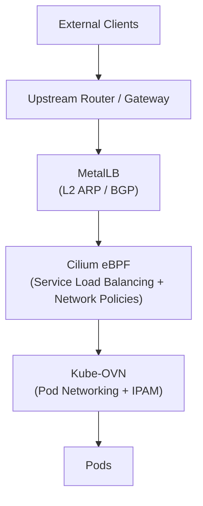

## Cluster Network Configuration

| Parameter | Default Value |
| --- | --- |
| Pod CIDR | 10.244.0.0/16 |
| Service CIDR | 10.96.0.0/16 |
| Join CIDR | 100.64.0.0/16 |
| Cluster domain | cozy.local |
| Overlay type | GENEVE |
| CNI | Kube-OVN |
| kube-proxy replacement | Cilium eBPF |

### Networking Stack Variants

Cozystack supports several networking stack variants to accommodate different
cluster types. The variant is selected via `bundles.system.variant` in the
platform configuration.

| Variant | Components | Target Platform |
| --- | --- | --- |
| `kubeovn-cilium` | Kube-OVN + Cilium (default) | Talos Linux |
| `kubeovn-cilium-generic` | Kube-OVN + Cilium | kubeadm, k3s, RKE2 |
| `cilium` | Cilium only | Talos Linux |
| `cilium-generic` | Cilium only | kubeadm, k3s, RKE2 |
| `cilium-kilo` | Cilium + Kilo | Talos Linux |
| `noop` | None (bring your own CNI) | Any |

In Kube-OVN variants, Cilium operates as a chained CNI (`generic-veth` mode):
Kube-OVN handles pod networking and IPAM, while Cilium provides service load
balancing, network policy enforcement, and optional observability via Hubble.

In Cilium-only variants, Cilium serves as both the CNI and the service load
balancer.

{}
The rest of this document describes the default `kubeovn-cilium` variant.
{}

### Pod CIDR Allocation (Kube-OVN)

Kube-OVN uses a **shared Pod CIDR** model:

- All pods draw from a single shared IP pool (10.244.0.0/16)
- IP addresses are allocated centrally through Kube-OVN's IPAM
- There is no per-node CIDR splitting (unlike Calico or Flannel)
- Because IPs are not tied to node-specific CIDR blocks, pods can be rescheduled to different nodes while retaining their addresses
- Inter-node pod communication uses GENEVE tunnels (Join CIDR: 100.64.0.0/16)

## External Traffic Ingress with MetalLB

MetalLB is a load balancer implementation for bare-metal Kubernetes clusters. It assigns external IP addresses to Services of type `LoadBalancer`, allowing external traffic to reach the cluster.

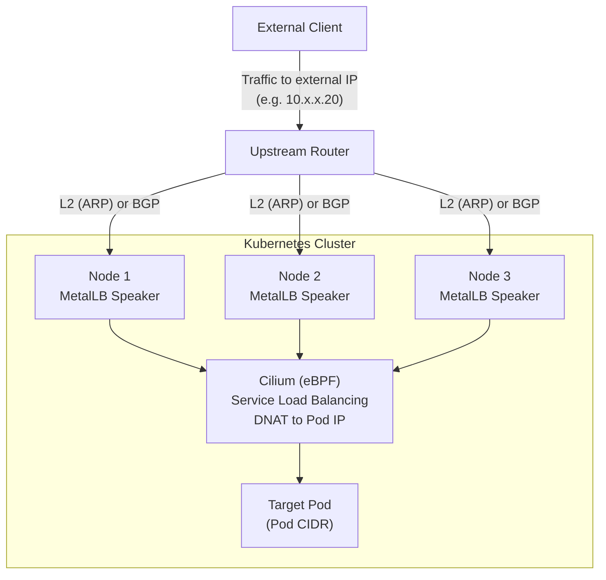

### Layer 2 Mode (ARP)

In L2 mode, MetalLB responds to ARP requests for the Service's external IP. A single node becomes the "leader" for that IP and receives all traffic.

How it works:

1. A MetalLB speaker on one node claims the external IP
2. The speaker responds to ARP requests: "IP X is at MAC aa:bb:cc:dd:ee:ff"
3. All traffic for that IP goes to the leader node
4. Cilium on the node performs DNAT to the actual pod

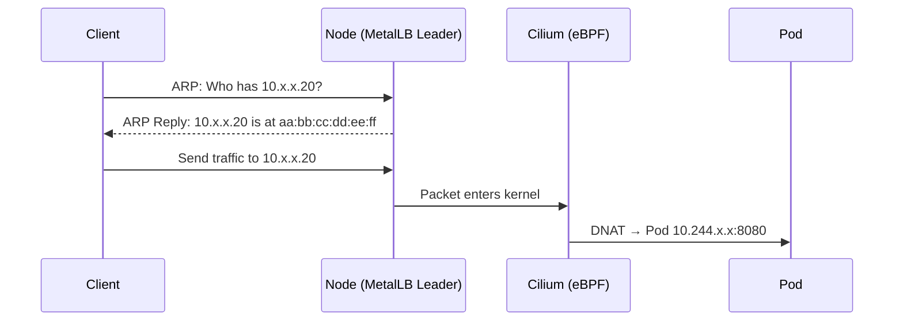

{}
In L2 mode, only one node handles traffic for a given Service IP. Failover occurs if the leader node goes down, but there is no true load balancing across nodes for a single Service.
{}

### BGP Mode

In BGP mode, MetalLB establishes BGP sessions with upstream routers and announces /32 routes for Service IPs. This enables true ECMP load balancing across nodes.

How it works:

1. MetalLB speakers establish BGP sessions with the upstream router(s)
2. Each speaker announces the Service IP as a /32 route
3. The router has multiple next-hops for the same prefix
4. ECMP distributes traffic across nodes
5. Cilium on the receiving node performs DNAT to the actual pod

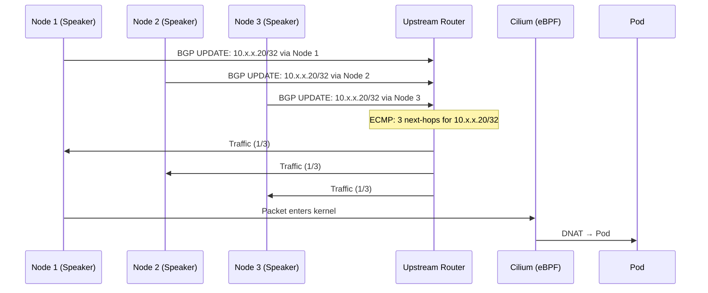

### VLAN Integration for External Traffic

External traffic can be delivered to the cluster through additional VLANs (client VLANs, DMZ, public networks, etc.) which are then routed to services via MetalLB and Cilium.

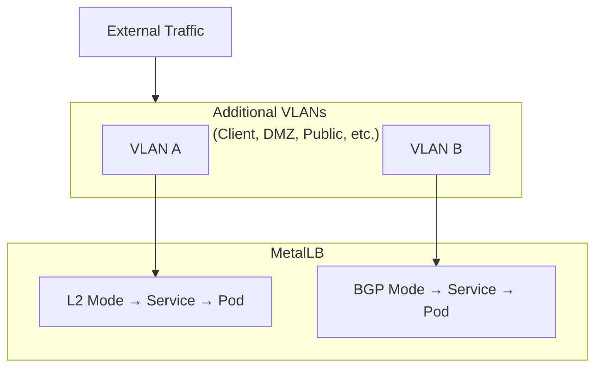

## Cilium as kube-proxy Replacement

Cilium replaces kube-proxy by attaching eBPF programs directly in the Linux kernel. This provides more efficient packet processing and advanced capabilities.

### Traditional kube-proxy (iptables) vs Cilium eBPF

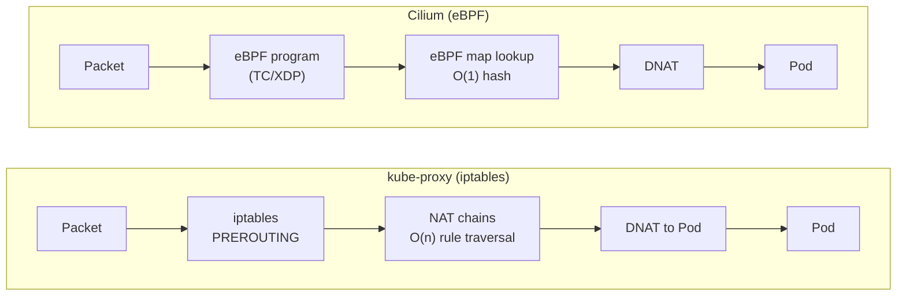

Key differences:

| Aspect | kube-proxy (iptables) | Cilium (eBPF) |
| --- | --- | --- |
| Lookup complexity | O(n) rule traversal | O(1) hash-based lookup |
| Execution context | Userspace overhead | Native in-kernel |
| Context switches | Required | None |
| Scalability | Degrades with service count | Constant performance |

### eBPF Architecture

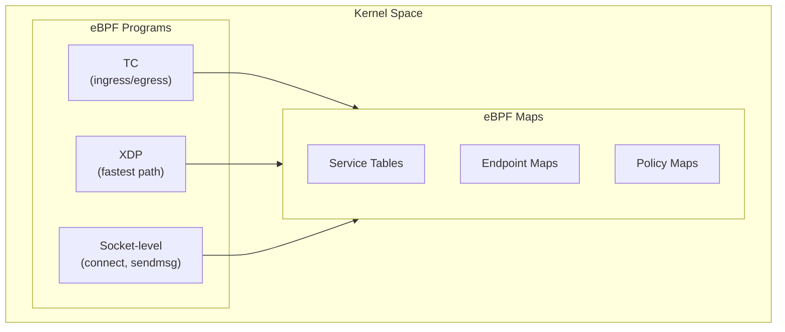

## Tenant Isolation with Kube-OVN and Cilium

In a multi-tenant Cozystack cluster, all tenants share the same Pod CIDR. This is secure because isolation is enforced by Cilium eBPF policies at the kernel level, not by network segmentation. Tenants cannot communicate even though they share the same IP pool. Kube-OVN allocates IPs from this shared pool centrally, without per-node CIDR splitting.

### CNI Architecture

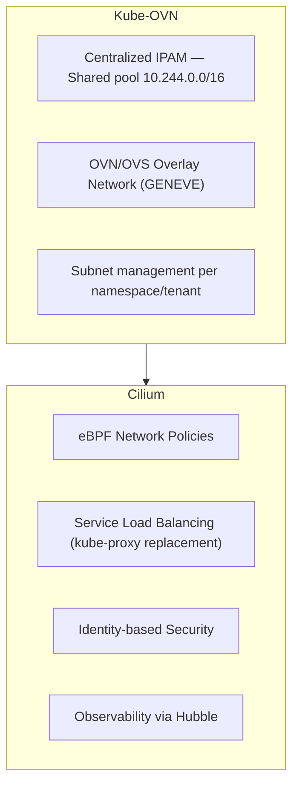

Kube-OVN provides the primary CNI plugin for pod networking and IPAM. Kube-OVN's
own network policy engine is disabled (`ENABLE_NP: false`), and all policy
enforcement is delegated to Cilium. Cilium operates as a chained CNI component
(`generic-veth` mode) that enforces network policies via eBPF and replaces
kube-proxy for service load balancing.

### Tenant Isolation Model

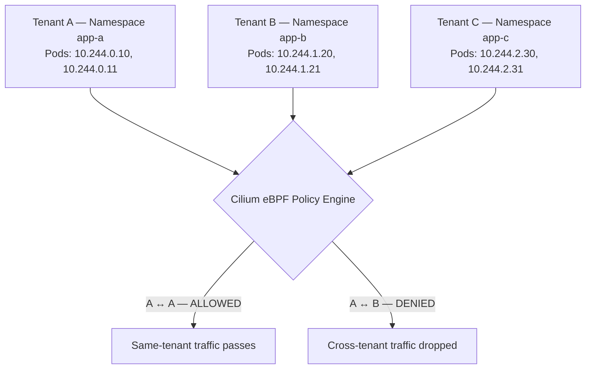

### Identity-based Security

Cilium assigns each endpoint (pod) a **security identity** based on its labels. Policies are enforced using these identities rather than IP addresses.

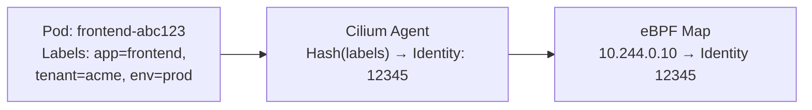

### Policy Enforcement in Kernel

When a packet is sent between pods, Cilium enforces policies entirely within kernel space:

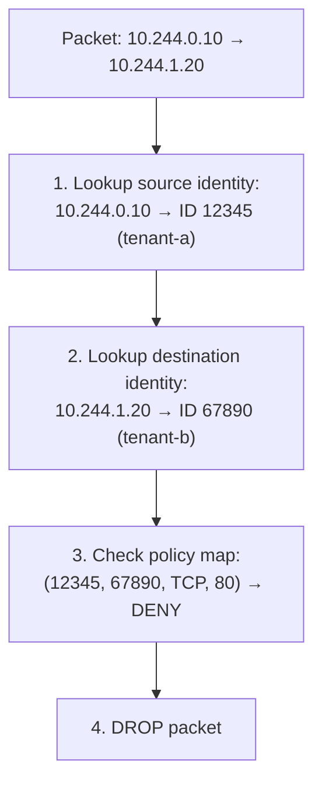

All of this happens in kernel space in approximately 100 nanoseconds.

### Why eBPF Enforcement is Secure

| Property | Description |
| --- | --- |
| **Verifier** | eBPF programs are verified before loading — no crashes, no infinite loops |
| **Isolation** | Programs run in a restricted kernel context |
| **No userspace bypass** | All network traffic must pass through eBPF hooks |
| **Atomic updates** | Policy changes are atomic — no race conditions |
| **In-kernel** | No context switches needed, faster than userspace |

### Kernel-level Enforcement

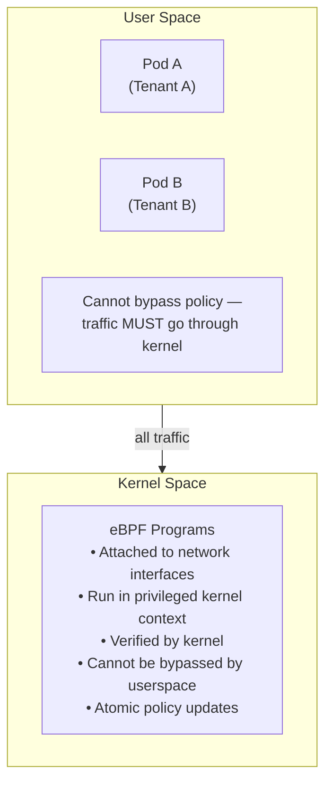

### Default Deny with Namespace Isolation

{}
By default, Kubernetes allows all pod-to-pod traffic. Cozystack applies
CiliumNetworkPolicy and CiliumClusterwideNetworkPolicy resources automatically
when a tenant is created. These policies enforce namespace-level isolation and
restrict access to system ports (etcd, kubelet, controllers).
{}

Cozystack uses hierarchical tenant labels for isolation. Policies match on
`tenant.cozystack.io/*` namespace labels, which allows parent tenants to
include sub-tenant namespaces. Example:

```yaml
apiVersion: cilium.io/v2
kind: CiliumNetworkPolicy
metadata:
  name: allow-internal-communication
  namespace: tenant-example
spec:
  endpointSelector: {}
  ingress:
    - fromEndpoints:
        - matchLabels:
            k8s:io.cilium.k8s.namespace.labels.tenant.cozystack.io/tenant-example: ""
  egress:
    - toEndpoints:
        - matchLabels:
            k8s:io.cilium.k8s.namespace.labels.tenant.cozystack.io/tenant-example: ""
    - toEntities:
        - kube-apiserver
        - cluster
```

## Observability with Hubble

Hubble provides network traffic visibility for the Cilium data plane. It is
included in the Cozystack networking stack but **disabled by default** to
minimize resource usage.

When enabled, Hubble provides:

- Real-time flow logs for all pod-to-pod and external traffic
- DNS query visibility
- HTTP/gRPC request-level metrics
- Prometheus metrics integration
- Web UI for traffic visualization

To enable Hubble, set the following in the Cilium configuration:

```yaml
cilium:
  hubble:
    enabled: true
    relay:
      enabled: true
    ui:
      enabled: true
```

See [Enabling Hubble](https://docs.cilium.io/en/stable/observability/hubble/) for full configuration details.

## Traffic Flow Summary

### External Access

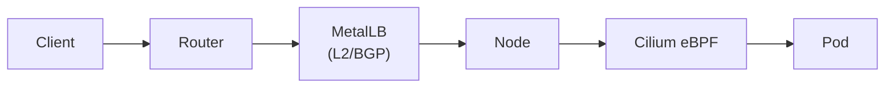

### Tenant Isolation

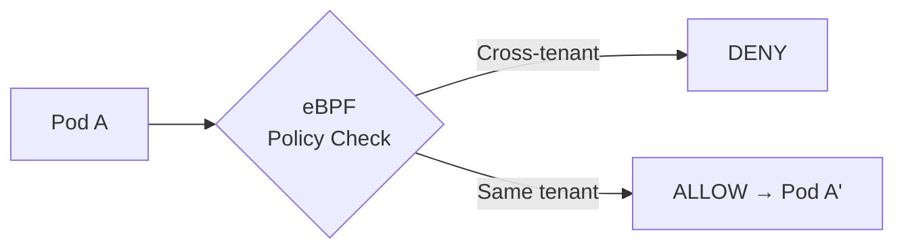
