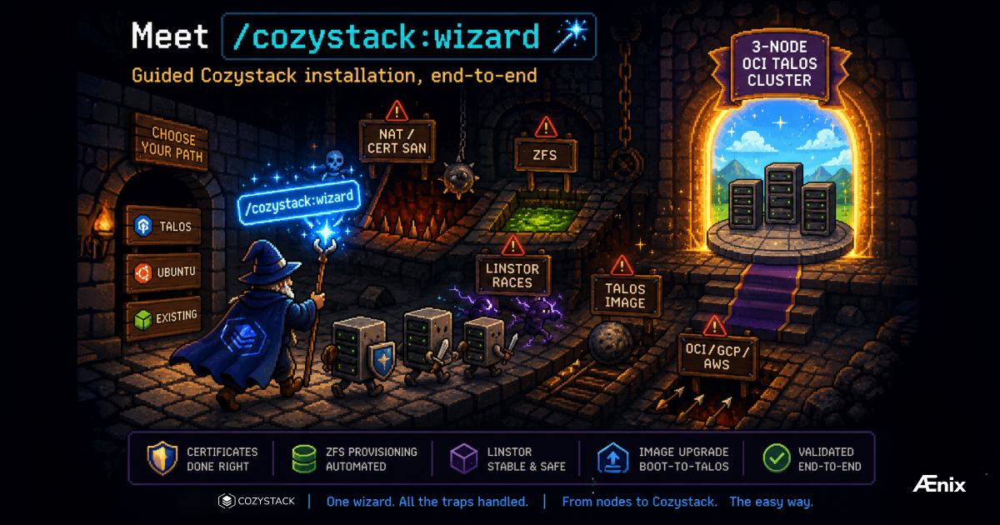

我们发布了 **`/cozystack:wizard`** —— 一款引导式 Cozystack 安装器。

只需告诉它 `Talos`、`Ubuntu` 或 `Existing`，它便会端到端地编排整个流程。它能处理 NAT 云（OCI、GCP、AWS）中的 cert-SAN 陷阱、Talos 上的 ZFS 置备、LINSTOR 注册竞态，以及我们在真实安装测试中遇到的十多个其他陷阱。

Boot-to-Talos 同样适用：如果节点已经以基础 Talos 启动，向导会将它们升级为针对 Cozystack 调优的镜像。端到端路径已在 OCI 上的 3 节点 Talos 集群中得到验证。

## Breaking change：插件整合

我们将五个插件整合为两个——`cozystack` 和 `linstor`——并重命名了技能（skills）。如果你装有旧插件，请卸载之前的版本并重新安装：

```bash
/plugin install cozystack@cozystack-claude-plugins
/plugin install linstor@cozystack-claude-plugins
```

然后运行：

```bash
/cozystack:wizard
```

## 试用并反馈

该向导旨在带你从一组全新节点（或现有集群）抵达一个可运行的 Cozystack，而无需手动追查冗长的边缘情况。我们已在上述配置上对它进行了压力测试，但它见过的环境越多，就会变得越好。

请试用一下，并告诉我们哪些有效、哪些出错，以及哪些令人困惑。

---

## 加入社区

- GitHub：[github.com/cozystack/cozystack](https://github.com/cozystack/cozystack)
- Telegram 社区：[t.me/cozystack](https://t.me/cozystack/)
- Kubernetes Slack 中的 Cozystack：[#cozystack](https://kubernetes.slack.com/archives/C06L3CPRVN1)（需要邀请？[slack.kubernetes.io](https://slack.kubernetes.io)）
- 社区会议日历：[cozystack.io/community](https://cozystack.io/community/)
